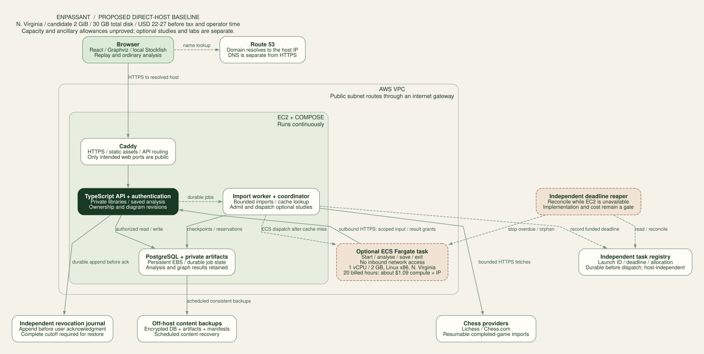

# Enpassant platform design

**Accepted direction: a small AWS EC2 host runs the public app, application authentication, PostgreSQL and bounded imports. Keep browser Stockfish and persist reusable analysis and diagrams; introduce optional ECS Fargate tasks for selected deeper studies. Target roughly $25/month for the baseline, with server analysis and learning labs budgeted separately.**

This is a proposed architecture, not deployed infrastructure. It is intended for open registration, with bounded storage and compute allowances. The initial product should let anyone create an account, import completed games, build a personal archive, explore a lifetime opening map, and request selected deeper studies, delivered in the phases below. Public registration does not make a person's library, annotations or profile public.

The design was checked against the current worktree and official provider documentation on 9 September 2026. The starting code has no backend, database, authentication or infrastructure configuration. The Tal collection changes remain independent of this proposal.

## Read the design

The [adversarial platform investigation](research/platform-investigation.md) tests the assumptions behind this plan with current provider sources and local cache/diagram experiments. Its findings and unresolved deployment gates take precedence over an unsupported premise in these earlier drafts. The hosted platform remains proposed.

| Document                                                      | Decisions it makes                                                                                  |
| ------------------------------------------------------------- | --------------------------------------------------------------------------------------------------- |
| [AWS baseline](aws-baseline.md)                               | Accepted hosting direction, itemized $22–$27 model, optional Fargate, caching and learning sequence |
| [Dedicated VPS comparison](vps-first.md)                      | Lower-cost hosting alternatives and shared public-security/recovery requirements                    |
| This document                                                 | Product boundary, recommended stack, alternatives, frontend, migration path                         |
| [Identity and access](identity-and-access.md)                 | Sign-in, users, profiles, verified connections, Chess.com limitations, permissions, deletion        |
| [Data and analysis](data-and-analysis.md)                     | Relational model, game identity, imports, jobs, engine provenance, lifetime graphs, API contracts   |
| [Infrastructure and delivery](infrastructure-and-delivery.md) | Terraform ownership, environments, deployment, backups, monitoring, capacity, costs                 |
| [Validation and decisions](validation-and-decisions.md)       | Requirement coverage, adversarial scenarios, implementation gates, remaining decisions              |
| [Source register](sources.md)                                 | Current official references and the claims they support                                             |

The [AWS baseline](aws-baseline.md) is the current recommendation after the cost research and the decision to learn AWS through Enpassant. Its host uses Compose; the optional analysis tasks use ECS Fargate. The [dedicated VPS comparison](vps-first.md) and [managed-service budgets](ci-cd-and-costs.md) remain alternatives. [Repository strategy](repository-strategy.md) is independent of hosting.

The [earlier managed runtime diagram](diagrams/runtime.svg) describes the Render/Supabase alternative. In both designs PostgreSQL is the job-state authority; engine workers use scoped API grants without direct database or OAuth access. [Editable AWS DOT source](diagrams/aws-runtime.dot) and the other diagrams are regenerated with `node scripts/render-platform-diagrams.mjs`.

## What deserves to remain

The app's strongest asset is already a client application: legal replay, a board linked to the graph, quiet-path unfolding, alternative exploration and fixed coordinates during replay. None requires a server render on each move. The platform should make those interactions easier to save, revisit and compare.

The current implementation provides useful seams:

| Current code                                                  | Platform role                                                                                            |
| ------------------------------------------------------------- | -------------------------------------------------------------------------------------------------------- |
| [App.tsx](../../src/App.tsx)                                  | Replace pathname checks and single remembered PGN with explicit routes and a library; retain guest entry |
| [games.ts](../../src/lib/games.ts)                            | Shared standard-chess parser and complete move-history contract, used on both sides                      |
| [importers.ts](../../src/lib/importers.ts)                    | Guest import adapter; extract provider logic for durable server import workers                           |
| [engine.ts](../../src/lib/engine.ts)                          | Browser engine adapter; preserve it alongside a native worker adapter                                    |
| [useAnalysis.ts](../../src/lib/useAnalysis.ts)                | Separate scheduling, persistence and view publication; subscribe to either local or server results       |
| [evolution.ts](../../src/lib/evolution.ts)                    | Shared occurrence construction, candidate retention and provenance                                       |
| [evolutionLayout.ts](../../src/lib/evolutionLayout.ts)        | Versioned layout policy; browser-sized maps and bounded server layout jobs                               |
| [EvolutionMarks.tsx](../../src/components/EvolutionMarks.tsx) | Shared visual grammar, regardless of where an analysis originated                                        |

The present cache is browser-local and bounded to 3,000 searches. The current 32-bit game hash is a UI identity, not a durable database key. Full histories already matter to engine caching, repetition and route selection. A position that looks identical on the board must not erase the path by which it was reached.

The recovered `/paper` view stays a separately attributed reference. Its source geometry is not a cloud analysis fixture. The Tal and Deep Blue frozen searches become regression inputs when extracting packages; server compute must not silently change paper-inspired mark semantics.

## The product boundary

The core product is a **personal chess archive with inspectable analysis and navigable diagrams**. It has three related views:

1. **Game:** replay one game and inspect engine alternatives. This is today's workbench.
2. **Lifetime:** explore moves actually played across a selected set of games, grouped by colour, opening, time control and period. Edge counts and outcomes describe that selected archive.
3. **Study:** save an exploration, pinned positions and annotations; selectively add engine continuations to an archive region or game.

An archive branch means “this move occurred in these games.” An engine branch means “this continuation was retained from this search.” They can share visual conventions but need distinct provenance and legends. Archive line weight represents frequency; game-analysis weight represents comparable candidate quality. The two meanings must never be blended into one unexplained thickness.

Importing 10,000 games should yield an opening map before 10,000 games have been deeply analyzed. The first useful result comes from played moves and metadata. Analysis enriches selected positions after that. This sequencing is both the product's fastest route to value and its main protection against unbounded compute spending.

## Stack choice

| Option                                                       | Fit and tradeoff                                                                                                  | Decision                                                                                                                 |
| ------------------------------------------------------------ | ----------------------------------------------------------------------------------------------------------------- | ------------------------------------------------------------------------------------------------------------------------ |
| **EC2 + Compose; optional ECS Fargate jobs**                 | Direct AWS networking/IAM experience, ordinary containers and local Postgres; we own host and database operations | **Accepted baseline: roughly $25/month, optional engine usage separate; [cost model](aws-baseline.md#recurring-budget)** |
| **AWS Lightsail**                                            | Same Compose application with bundled disk, IPv4 and transfer; fewer directly managed networking components       | Lower-cost AWS alternative: 2 GB at $12/month, modeled $14–$17 with backup/domain allowances                             |
| **Dedicated non-AWS VPS**                                    | Matches Torry's operating pattern and can buy more RAM/storage per dollar; provider availability varies           | Cost-first alternative, previously targeted $10–$15/month                                                                |
| **Always-on Fargate + ALB + RDS**                            | Managed app compute, ingress and database introduce recurring charges even with little traffic                    | Deferred: roughly $85–$100/month in the researched small configuration; use temporary learning labs first                |
| **Render + Supabase**                                        | Managed identity, database and ordinary container services across two vendors                                     | Retain the $49 lean managed-service alternative if outsourcing operations becomes worthwhile                             |
| **Cloudflare Workers + managed Postgres + external compute** | Lightweight edge API; native Stockfish still needs a suitable compute service                                     | Alternative host, no current requirement to introduce it                                                                 |

For the retained managed alternative, Render supports continuously running background workers and an official Terraform provider. Supabase offers managed Postgres, Auth and Storage together. These capabilities support the proposed split without introducing Redis, a graph database or Kubernetes at launch.[^render-workers][^render-tf][^supabase-pricing]

Cloudflare Workers currently have a 128 MB isolate memory limit and a paid CPU limit up to five minutes. Those limits are compatible with many API tasks; they are an awkward default for heavy native analysis and large layout work. This observation concerns the Workers isolate, not every Cloudflare compute product.[^cf-limits]

Phase 0 must validate the selected AWS region, ARM64 image compatibility, small-host memory and CPU credits, application auth, local Postgres pool and restore procedure. A failed sizing or latency gate changes the host or budget before users depend on it. It does not require a rewrite of the domain model.

## Backend structure

Start with a modular monolith: one repository, one versioned application API and separately deployed worker processes built from the same commit. Modules are identity, library, integrations, analysis, atlas, sharing and operations. Modules have explicit interfaces and tests; they are not independent network services.

Use Node 24, TypeScript and Fastify for the HTTP service. Define request/response schemas once, generate an OpenAPI contract and a typed client, and validate both incoming requests and external provider payloads at runtime. Use PostgreSQL transactions directly through a typed query layer such as Kysely. Prefer inspectable SQL migrations over automatic production schema synchronization. Pin supported library/runtime releases during the spike; these tools are recommendations, not new dependencies already installed in the app.[^backend-libraries]

The API authenticates requests, checks ownership, enforces quotas, creates durable jobs and returns small resources. It never waits for a complete archive or game analysis inside a request. Import and analysis workers execute those jobs. A small coordinator schedules due imports, reclaims expired work and publishes completed snapshots. Begin with PostgreSQL-backed queuing, with idempotent effects even when work is retried.[^pgboss]

The browser talks to the API for application data. Application tables live in an unexposed schema on local Postgres; no database port is public. In the managed alternative, the Supabase data API has no grants to them. This creates one consistent place for business authorization. RLS remains a second boundary against forgotten ownership filters, using a restricted database role rather than the database owner.

## Frontend and navigation

Keep Vite and React. Add a route layer and server-state cache; React Router and TanStack Query are suitable choices to verify in the implementation spike.[^frontend-libraries] There is no present requirement that justifies converting the workbench to Next.js. Public landing/profile pages can gain prerendering later without moving graph interaction to the server.

Proposed routes:

| Route                   | Experience                                                              |
| ----------------------- | ----------------------------------------------------------------------- |
| `/`                     | A useful guest demo and entry to the workbench                          |
| `/library`              | Personal games, filters, import progress and incomplete/skipped records |
| `/games/:libraryGameId` | Current workbench, saved replay state and analysis selector             |
| `/atlas`                | Lifetime view with explicit player perspective, filters and coverage    |
| `/studies/:id`          | Saved analysis selections, pins and notes                               |
| `/settings/connections` | Lichess verified connection, Chess.com public source, sync health       |
| `/settings/account`     | Profile visibility, sessions, export, deletion and usage                |
| `/u/:handle`            | Explicitly published profile only                                       |
| `/s/:token`             | Revocable read-only share snapshot                                      |
| `/paper`                | Independent paper reference                                             |

The backend can initially serve the built React files and `/api/v1` from one origin. Hashed static assets get immutable caching; authenticated responses and callbacks get `private, no-store`. A CDN can sit in front of static paths without caching sessions. Production API and graph payloads should be compressed, versioned and paginated.

Keep three frontend state categories separate: server resources in the query cache; immediate camera, hover and play state in component state; local engine/layout jobs in Web Workers. Persist bookmarks, selected occurrence, filters and replay cursor with debounced writes. Never POST on every animation frame. An explicit study snapshot records which analysis and graph policy were used.

For job progress, begin with authenticated polling with jitter and backoff: two seconds while visible, increasing while backgrounded, stop after terminal state. Cursor-based progress responses avoid resending the graph. SSE can replace polling when connection scale or responsiveness justifies it; no WebSocket service is required for the first public release.

The lifetime map needs semantic zoom: opening regions, bounded neighbourhoods, a breadcrumb trail, a minimap and “show these games.” Do not ask Graphviz to lay out every occurrence in a lifetime archive at once. On small screens show the selected branch and its immediate alternatives; keep the board and details in a switchable lower panel. Keyboard users need an equivalent move/branch list, not hundreds of tab stops inside an SVG.

## Runtime boundaries

The API and import worker need network access to providers. The engine worker needs game/search input and permission to publish only its assigned results; it does not need OAuth credentials. A layout job needs legal occurrence data and a policy version, not an authentication token. The browser receives sanitized game and analysis data, never provider credentials or a privileged database key.

Stockfish is a CPU engine. A GPU on a friend's machine is not a reason to select a GPU plan for these workers. Native CPU throughput, memory, thread count and isolation are the relevant starting measurements. A different GPU-oriented chess engine would be a separate provider with separate scoring provenance.[^stockfish-faq]

A deeper search can change which branches survive. Engine version, requested resources, achieved depth, returned continuation and rendering policy must stay inspectable. Replay pins one published graph revision so a background job cannot move the user's current diagram halfway through a game.

## Delivery sequence

Before the hosted phases, build the [local saved-study slice](research/r2-minimal-design.md#slice-1--a-saved-view-that-opens-immediately): versioned results and placement, atomic saving and lazy restoration. The six-state local experiment supports that seam; safe browser restoration and editable builder recovery still need implementation. This gives a useful improvement without waiting for cloud infrastructure.

| Phase                          | User-visible result                                                        | Exit condition                                                                                        |
| ------------------------------ | -------------------------------------------------------------------------- | ----------------------------------------------------------------------------------------------------- |
| **0. Prove the boundaries**    | Internal staging only                                                      | Auth/logout, isolation, provider linking, EC2/Compose rebuild, sizing and restore verified            |
| **1. Public personal library** | Anyone can sign up; saved games; completed-game imports; local analysis    | Durable library, quotas, resumable imports, data export/deletion, backup restore and abuse gates pass |
| **2. Lifetime map**            | Played-game opening branches, filters, outcome counts, links back to games | Correct denominators, deduplication, perspective and repeated-position handling on large fixtures     |
| **3. Server studies**          | Selected deep analysis continues after the browser closes                  | Fair scheduling, metered reservations, crash recovery, immutable results and worker isolation pass    |
| **4. Sharing and insights**    | Revocable studies and cautious pattern summaries                           | Privacy revocation, minimum sample sizes, analysis coverage and publication checks pass               |

Do not gate an archive import on server analysis. Do not make “unlimited deep analysis” a public promise. Paid plans and payments can be added after measured costs; the quota ledger and entitlements exist from the beginning even if every initial user is on one free allowance.

Extract code gradually into `apps/web`, `apps/api`, `apps/worker`, `packages/chess-core`, `packages/diagram`, `packages/contracts` and `packages/db`. The existing app remains runnable during this migration. A shared package must not import React into the native engine adapter or Node-only APIs into the browser bundle.

If confidential platform development is chosen, keep the visualizer package/research public and place the hosted service in a private repository consuming pinned releases. That changes source ownership and release coordination, not the modular-monolith runtime recommendation. Keep the current repository public until that choice is explicit.

[^render-workers]: Render, [Background Workers](https://render.com/docs/background-workers), checked 9 September 2026.

[^render-tf]: Render, [Terraform Provider](https://render.com/docs/terraform-provider), checked 9 September 2026.

[^supabase-pricing]: Supabase, [Pricing and included platform services](https://supabase.com/pricing), checked 9 September 2026.

[^cf-limits]: Cloudflare, [Workers limits](https://developers.cloudflare.com/workers/platform/limits/), checked 9 September 2026.

[^pgboss]: pg-boss maintainers, [Project documentation](https://github.com/timgit/pg-boss), checked 9 September 2026. Transactional delivery does not make external side effects exactly once under retries.

[^stockfish-faq]: Stockfish, [Frequently Asked Questions](https://official-stockfish.github.io/docs/stockfish-wiki/Stockfish-FAQ.html), checked 9 September 2026.

[^backend-libraries]: Fastify, [Long Term Support](https://fastify.dev/docs/latest/Reference/LTS/), and Kysely, [Typed SQL query builder](https://kysely.dev/), checked 9 September 2026.

[^frontend-libraries]: React Router, [Picking a Mode](https://reactrouter.com/start/modes), and TanStack Query, [React overview](https://tanstack.com/query/latest/docs/framework/react/overview?from=reactQueryV3), checked 9 September 2026.
