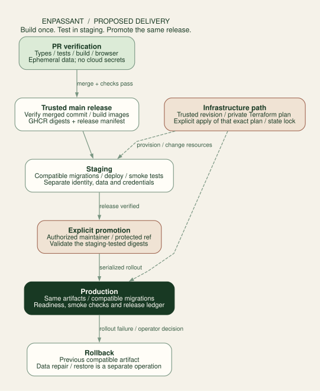

# CI/CD and the operating budget

**Current launch baseline:** [EC2 with optional Fargate analysis](aws-baseline.md). The itemized recurring model is $22–$27/month, with roughly $25 as the target. Server studies and temporary learning environments are separate usage allowances. Render/Supabase prices below are retained alternatives.

**Keep GitHub Actions for verification, build each release once, deploy it to staging, and explicitly promote that same release to production. Budget for the whole service—including staging, delivery tooling and idle compute.** This extends the platform proposal; it does not enable deployments or purchase services.

Prices and plan capabilities were checked on 9 September 2026. Dollar amounts are USD, before tax and currency conversion. Examples are planning scenarios, not an account billing report. No existing subscription, credit balance or remaining account-wide Actions allowance was assumed.

## What already exists

The checked-in [Verify workflow](../../.github/workflows/ci.yml) runs on pull requests, pushes to `main`, and manual dispatch. It uses Node 24, a pinned pnpm version and action commit SHAs; installs from the lockfile; runs types, lint, formatting, unit tests, the production build and Chromium browser tests. It has read-only repository permissions, a 15-minute timeout, cancellation of superseded verification runs and seven-day failure-artifact retention.

The five available recent runs all succeeded. The [latest main run](https://github.com/jeanluciradukunda/enpassant/actions/runs/34139961727) verified commit `e87e8a73b9857e022daefab150023a7a6a6be374` on 7 September 2026. Its single `verify` job ran from 15:46:01 to 15:48:10 UTC: **129 seconds**. This predates the uncommitted Tal/platform work. It is evidence about the current public-repo workflow, not a forecast for a private runner or a future backend test suite.

There is no deployment workflow today. Keep the current verification as the starting point; add deployment jobs only when the platform services and staging gates exist.

## Delivery pipeline

| Stage                     | Trigger and work                                                                                                                | Credential boundary / release condition                                                                                                     |
| ------------------------- | ------------------------------------------------------------------------------------------------------------------------------- | ------------------------------------------------------------------------------------------------------------------------------------------- |
| **PR verification**       | Check source, frozen diagram regressions, API contracts, migrations and actual Postgres tenant isolation; bounded browser tests | Ephemeral test services and fake providers; no cloud, real-account or production secrets                                                    |
| **Build release**         | Successful verification of the merged commit; build web/API/worker artifacts and push OCI images to GHCR                        | Registry write permission in this job only; record image digests, commit, schema contracts and engine manifests                             |
| **Staging deployment**    | Deploy the built release; apply additive staging migrations; exercise sign-in, imports, cancellation and source/download access | Staging-only credentials and a stable staging OAuth hostname                                                                                |
| **Production promotion**  | Authorized maintainer explicitly selects a staging-tested release                                                               | Verify protected source ref, successful checks and exact digests; apply compatible migrations, deploy, smoke-check, then record the release |
| **Rollback**              | Failed rollout or operator decision                                                                                             | Restore the previous compatible artifact; repair/restore data through its separate runbook                                                  |
| **Infrastructure change** | Reviewed infrastructure commit, live plan, then explicit apply                                                                  | Privileged trusted workflow; private plan/state; serialize applies and bind approval to the exact saved plan                                |

Caddy serves the React build and proxies `/api/v1` to the API on EC2. Record both in one release manifest, with separate worker artifacts where useful. Different staging/production origins must use runtime configuration or same-origin paths; do not rebuild the frontend with different secrets or environment values during promotion. Record an explicit compatibility manifest for services deployed at different times.

Pin releases by digest, not mutable `latest` tags. Publish source/license bundles alongside distributed GPL components. Engine URLs need a content hash or complete versioned release path: the current `/engine/stockfish-18-lite-single.wasm` name alone cannot distinguish a future package patch. Retain old assets long enough for open browser sessions and rollback, with a deliberate upgrade path.

Run deep native-engine benchmarks separately with a bounded budget. Ordinary PR verification should mostly use frozen, legal engine inputs plus short adapter smoke tests. A Tal diagram layout change should not silently trigger hours of fresh Stockfish searches.

### Workflow permissions and production controls

Treat PR code, dependencies, workflow inputs and artifacts as untrusted. Do not combine `pull_request_target`, privileged credentials and checkout/execution of a PR head. Do not give a persistent production or friend's machine runner to public PRs. Use disposable GitHub-hosted runners for those jobs. Restrict caches by lockfile/toolchain and trust context; a privileged release must not execute artifacts selected only by an untrusted name. GitHub documents these workflow trust boundaries.[^actions-security]

For a private repository, GitHub Pro/Team supports environment secrets and deployment branch restrictions, but **required environment reviewers and wait timers are not available on those plans for private repos**. Those controls must not be assumed merely because an environment named `production` exists. GitHub Free also loses environment configuration on conversion to private.[^environments]

The lean private-repo default is a manual production workflow restricted to protected `main`, with an explicit authorized-actor check, environment-scoped credentials and validation of the chosen release's successful checks. A dispatcher cannot select arbitrary branch workflow code, registry paths or shell commands. This is an intentional maintainer action, not independent two-person approval. If independent approval is required, select a plan or external deployment system that actually enforces it. Required PR review is a different control from required deployment review.

Keep `contents: read` as the default. Give `packages: write` to image publication and `id-token: write` only where a specific supported OIDC exchange needs it. AWS deployment uses short-lived credentials through the repository/environment-specific OIDC trust policy described in the [AWS baseline](aws-baseline.md#delivery-and-learning-sequence). Private GHCR pulls outside Actions may require a narrowly scoped classic token with `read:packages`; verify host and Fargate registry authentication separately. AWS OIDC does not automatically grant registry access. Render/Supabase management tokens apply only to that alternative.[^ghcr]

Cancel superseded PR checks; **do not cancel an in-flight production migration or Terraform apply**. Serialize production promotions. GitHub concurrency can replace pending runs, so the release ledger must show what was superseded; it is not a guaranteed FIFO deployment queue. Staging success does not permit deploying a different commit or rebuilding a different image under the same release label.

### Terraform is a separate privileged path

On an untrusted PR, run formatting and validation without a real backend or cloud credentials. A live plan can execute provider/plugin or external-data code and access sensitive state; run it only for a trusted reviewed revision. Publish a safe summary and a restricted plan link, not raw state or a secret-bearing plan in a public PR artifact.

Apply the exact saved plan for the reviewed commit and environment, under a state lock. If the state or approved inputs changed, expire it and produce a new plan. Keep runtime image promotion owned by the deployment workflow, with Terraform ignoring only the selected image-digest field if necessary; Terraform still owns resources, sizes and configuration. Terraform and Compose/release tooling must have distinct resource and image-promotion ownership; a Render alternative must also avoid duplicate Blueprint ownership.

Before production exists, exercise: failed migration, failed readiness, worker draining, rollback after an additive migration, stale plan rejection and restore into isolated staging. A workflow YAML file alone does not establish recoverability.

## Costs by launch phase

### Accepted AWS baseline

The [itemized EC2 budget](aws-baseline.md#recurring-budget) has $18.85/month of priced compute, EBS, IPv4 and DNS, plus $3–$8 in backup, domain, logging/storage and operating allowances: **$22–$27/month**, with roughly $25 as the target. It is a low-traffic model before tax, not a bill cap. A failed 2 GiB sizing test changes the budget.

Normal browser analysis has no server-engine charge. The later [Fargate model](aws-baseline.md#optional-fargate-analysis) prices 20 billed hours at 1 vCPU/2 GB at about **$1.09 for task compute and public IP**, with logging, storage, transfer and watchdog costs separate. Completed analysis is retained, and cache hits launch no task. Optional usage does not erase the recurring EC2 allocation.

Keep learning labs and temporary staging as separate allocations. The researched always-on Fargate/ALB/RDS option was roughly $85–$100/month with basic WAF and small ancillary allowances in N. Virginia. It is deferred. See the component pricing for [Fargate](https://aws.amazon.com/fargate/pricing/), [ALB](https://aws.amazon.com/elasticloadbalancing/pricing/), [RDS PostgreSQL](https://aws.amazon.com/rds/postgresql/pricing/) and [WAF](https://aws.amazon.com/waf/pricing/). A full cost comparison must include idle networking/database charges; it must not compare only the Fargate CPU price with the EC2 host's full bill.

The [non-AWS VPS and Lightsail comparison](vps-first.md#evidence-and-budget) remains the cheaper alternative. All Render/Supabase allocations below are historical alternatives.

### Earlier managed-service revision: lean public beta

This was the first cost revision, superseded by the current AWS EC2 baseline. **Managed-service alternative: $45–$60/month**, with a modeled allocation of **$49**, rather than purchasing the fuller operating setup below immediately. This keeps public registration, private saved games, durable imports, lifetime diagrams and browser Stockfish. Server analysis remains a later optional phase.

| Lean monthly item                                                          | Allocation |
| -------------------------------------------------------------------------- | ---------: |
| Supabase Pro production project: DB, Auth, Storage and daily DB backups    |        $25 |
| Small paid Render API/frontend service                                     |         $7 |
| Small paid Render import/coordinator service                               |         $7 |
| Render Hobby workspace, public GitHub CI, HCP Terraform within free limits |         $0 |
| SMTP within free caps; basic logs and free-tier monitoring                 |         $0 |
| Independent object backup and recovery-journal allowance                   |         $3 |
| Domain allowance, annual fee amortized                                     |         $2 |
| Temporary hosted staging allowance                                         |         $5 |
| **Modeled allocation**                                                     |    **$49** |

Use local/CI disposable databases for routine tests. A separate hosted staging environment still exercises real OAuth, migration and deployment behavior before release, but is provisioned for those sessions rather than left running all month. Keep synthetic staging data disposable and retain test evidence. The $5 staging allowance is a hypothesis: verify actual compute, retained-project and storage billing, plus hostname/callback cleanup. If safe temporary provisioning is not practical, budget an ongoing staging project explicitly. Do not point tests at production to save money.

The $7 services have only 512 MB RAM. Stream import records, bound parser memory, keep Graphviz and Stockfish in browser workers, and prove API responsiveness plus importer peak memory under the intended beta limits. If either service needs the $25 size, the allocation rises by $18 for that service; measure before promising the lower price. No demonstrated capacity is implied by selecting a cheap plan.[^render-prices]

The savings come from service sizes and optional paid tiers: no $25 Pro workspace, no paid SMTP until needed, no permanent staging pair, no paid monitoring subscription initially, and no hosted engine. Hobby's single-operator and network-feature limits remain explicit. Use separate credentials/projects and public-CI deployment controls; do not claim Pro-only isolation. Add a bounded health/error check and an operator response route before launch, even on a free monitoring tier.

Free SMTP still needs a verified domain, configured delivery and signup throttles. The current Resend example permits 3,000 emails/month and 100/day; pause or clearly defer email flows before exhaustion. Backups, tenant isolation, deletion, durable jobs and release verification remain launch requirements.[^resend]

For simply sharing **today's guest visualizer**, a free static hosting tier is a separate near-zero-cost option within bandwidth/build limits, with an optional domain. That is the existing browser experience; it does not provide the proposed account/library backend. Render static hosting has no compute-instance charge, while transfer/build usage remains metered under the workspace allowance.[^render-static]

### Fuller operating configurations for later

The following is an explicit monthly allocation. It includes a private personal-repo GitHub Pro allowance for comparison; while the repo stays public that $4 need not be added solely for CI. An existing personal plan may make its incremental cost zero. An organization using GitHub Team has a per-seat subscription instead.[^github-plans]

| Monthly item                                           | Solo with permanent staging | Fuller public library | Public library + one server-study worker |
| ------------------------------------------------------ | --------------------------: | --------------------: | ---------------------------------------: |
| Supabase Pro: production Micro project                 |                         $25 |                   $25 |                                      $25 |
| Second Supabase Micro project for staging              |                         $10 |                   $10 |                                      $10 |
| Render workspace                                       |                    $0 Hobby |               $25 Pro |                                  $25 Pro |
| Production API + frontend, 1 CPU / 2 GB                |                         $25 |                   $25 |                                      $25 |
| Production import/coordinator, small instance          |                          $7 |                    $7 |                                       $7 |
| Staging API + import worker, two small instances       |                         $14 |                   $14 |                                      $14 |
| Production native engine, 1 CPU / 2 GB                 |                          $0 |                    $0 |                                      $25 |
| SMTP                                                   |         $0 within free caps |                   $20 |                                      $20 |
| Independent object backup + recovery journal allowance |                          $5 |                    $5 |                                       $5 |
| Monitoring allowance                                   |                         $10 |                   $10 |                                      $10 |
| GitHub Pro planning allowance                          |                          $4 |                    $4 |                                       $4 |
| Domain allowance, annual cost amortized                |                          $2 |                    $2 |                                       $2 |
| HCP Terraform Free + GHCR, within applicable terms     |                          $0 |                    $0 |                                       $0 |
| **Planned allocation before variable overages**        |                    **$102** |              **$147** |                                 **$172** |
| **Working budget with headroom**                       |               **$100–$130** |         **$150–$200** |                            **$175–$250** |

These columns are alternatives, not costs to add together. The first working range is rounded; its modeled allocation is $102. Monitoring, backup and domain rows are allowances to validate, not selected vendor quotes. Domain payment is normally annual. Temporary native staging runs and occasional load tests use the headroom; a permanently running staging engine adds another service charge.

**These $100–$250 configurations are later operating options, not the launch recommendation after the user's cost feedback.** They retain permanent hosted staging and more paid services. The $49 allocation is the smaller managed-service alternative. All estimates exclude tax, people/on-call time, AI coding subscriptions, paid security products, payment processing and stronger recovery or redundancy. The product currently needs no runtime LLM API subscription.

### What the price rows actually buy

- **Supabase:** Pro starts at $25 with a credit covering one Micro; a second Micro adds about $10. Auth, Postgres and private Storage are parts of that plan, not three separate $25 subscriptions. Larger compute, storage, egress, MAUs and recovery features are additional dimensions. The two projects share plan allowances where applicable.[^supabase]
- **Render:** compute is separate from the workspace subscription. The current service examples are $7 for 512 MB / less than one CPU, and $25 for 2 GB / one CPU. An idle always-running worker still incurs its service allocation. Stopping queue admission does not stop that invoice.[^render-prices]
- **Workspace features:** Hobby has one member and limited services. The public-budget Pro row buys the collaboration and environment-isolation tier; it does not buy all service compute. Pro is $25 flat per workspace, not $25 per developer.[^render-features][^render-update]
- **SMTP:** Resend is an illustrative compatible SMTP option: Free allows 3,000 emails/month with a 100/day cap; Pro is $20/month for 50,000. A public signup spike can hit the daily cap long before the monthly allowance. Configure delivery, bounce handling and abuse limits; free email is not unlimited onboarding.[^resend]
- **Independent backups:** R2 Standard is one possible separate store at $0.015/GB-month plus operations, with a free allowance and no R2 internet-egress charge. Source-provider egress still counts. The $5 row must cover the retained copies and minimal journal actually measured; avoid full daily duplicates of immutable objects.[^r2]
- **Terraform/registry:** HCP Terraform's Free plan allows up to 500 managed resources, subject to its regional/plan terms. State is sensitive even when hosting it costs zero. GitHub currently makes GHCR container image storage and bandwidth free; do not generalize that to all Actions artifacts or Packages.[^hcp][^packages]

The solo column assumes manual scaling, modest traffic and free SMTP caps. It must not claim Pro-only network isolation or unlimited workspace members. The fuller public column funds a stronger operating baseline while retaining one API and one importer. Two app instances, a larger database, contractual availability and PITR require a new budget. Supabase currently advertises PITR from $100/month; it can also require a larger compute tier, so the add-on is not the full upgrade price.[^supabase]

## CI, build and storage charges

Standard GitHub-hosted runners are free for public repos. Private repos draw from an **owner-wide** allowance: Free 2,000 minutes/month; Pro and Team 3,000. Standard Linux 2-core overage is currently $0.006/minute. Sum runner time across jobs, including failed/retried jobs and rounding; parallel jobs shorten elapsed time but do not make runner usage disappear. The current 129-second job is only one baseline observation.[^actions-billing][^included]

Illustrative future workloads, assuming the entire 3,000-minute allowance is available and every billed job uses that Linux rate:

| Scenario                                           |                                                         Estimated total job-minutes | Overage calculation                   |
| -------------------------------------------------- | ----------------------------------------------------------------------------------: | ------------------------------------- |
| Light development                                  |  200 PR runs × 6 + 40 merge/release runs × 10 + 30 scheduled checks × 4 = **1,720** | **$0** in minute overage              |
| Busy development                                   | 500 PR runs × 8 + 100 merge/release runs × 12 + 30 scheduled checks × 4 = **5,320** | (5,320 − 3,000) × $0.006 = **$13.92** |
| Busy development, allowance already used elsewhere |                                                                           **5,320** | 5,320 × $0.006 = **$31.92**           |

These are estimated sums of job-minutes per run, not measured future durations. Storage and subscriptions are separate. Public/private runner allocations can differ; do not assume the public run's speed survives a visibility change.

Keep failure traces/screenshots for seven days and cap uploaded evidence; exclude secrets and private PGNs. Keep caches bounded at the included repository allowance. Actions artifact storage accrues over time even if no workflow is running. Use GHCR for versioned release images and retain currently deployed/rollback images plus their required source bundles; avoid uploading a complete image as a workflow artifact on every PR.[^actions-billing][^packages]

Build OCI images in GitHub Actions and deploy the exact tested digests on EC2 and, later, Fargate. Verify ARM64 host and x86 engine artifacts separately. For the retained Render alternative, this also avoids rebuilding on both systems; Render can still bill applicable pre-deploy pipeline usage. Its Pro workspace includes 1,000 standard pipeline minutes and charges $5 per additional 1,000. Keep one authoritative build, migration and promotion path.[^render-update]

## Traffic, analysis and budget enforcement

Bandwidth needs a separate estimate because Enpassant ships a browser engine. The currently prepared WASM file is **7,295,411 bytes before HTTP compression**. Ten thousand full downloads of that file alone are about **72.95 decimal GB**, excluding the app, graphs, exports and repeat visits. Content-addressed caching and lazy engine download reduce unnecessary transfer; measure actual compressed edge egress before projecting a bill.

Render's current allowance is 5 GB on Hobby or 25 GB on Pro, then $0.15/GB. Under an intentionally uncompressed engine-only scenario, 72.95 GB through Pro would contribute approximately **$7.19** above its allowance. That is a sizing example, not observed traffic. Add all service egress billed by the provider. A response proxied from Supabase through Render may consume bandwidth at both providers; authorized direct artifact downloads avoid that second hop where appropriate.[^render-update]

Supabase currently includes 250 GB uncached egress, then $0.09/GB, and 100 GB object storage, then $0.0213/GB-month. Those allowances also serve backup/export activity and other applicable projects. User counts alone cannot predict cost: one large game archive or a large graph export can outweigh many lightweight logins.[^supabase]

Keep the [engine admission model](data-and-analysis.md#jobs-retries-and-budgets): reserve per root and per attempt, cap automatic retries, and enforce per-user and global budgets. The optional Fargate worker is billed by allocated resources and task duration. Include startup, idle time, fallback searches, retries and termination lag in reservations. The $25 Render worker in the alternative is a separate always-on capacity allocation, not the current baseline.

Initial operating rules:

1. Use the EC2 baseline’s roughly $25 working monthly target, subject to region, sizing and recovery checks. Optional server compute, labs and growth need separate allocations. Review alerts at 50%, 75% and 90%; these are proposed thresholds, not configured alarms or a universal AWS billing cap.
2. Start with server analysis disabled. When enabled, start with one Fargate task at a time and the proposed 20 billed task-hour monthly envelope. Enforce transactional cost reservations, a task deadline and an independent orphan reaper; the earlier ten-CPU-hours/day example is not a launch allowance.
3. Keep standard public-repo CI within its included service terms. If paid Actions usage is enabled later, choose an explicit separate budget with stop-usage enabled where supported; the earlier $25 overage example is not an accepted recurring allowance. Exhaustion can block CI/deployments, so preserve an operator recovery route. Private-repo included minutes are shared with other repositories.[^included]
4. Track all invoice dimensions. A Supabase spend cap or an application CPU quota is not a universal cap on workspace subscriptions, upgraded compute, backup egress, email and storage.
5. Bound imports, object retention, export size and provider concurrency. Admit useful library reads/local analysis when engine admission is paused. Data backups must remain funded even if optional studies stop.
6. Recheck the allocation before a second worker, second API replica, permanent preview environment, additional paid service or stricter recovery objective is enabled.

## Implementation acceptance

Before CI/CD is considered ready: show a PR cannot obtain deployment credentials; a non-approved ref cannot promote; the staging-tested digest is the production digest; wrong-owner tests execute against real Postgres roles; migrations serialize; a failed deploy rolls back safely; stale Terraform plans are rejected; and budget exhaustion stops the intended optional work without deleting durable data. Run one release and rollback through the actual chosen GitHub plan and AWS EC2/Compose configuration; test the optional Fargate path before Phase 3.

This document and its calculations were reviewed locally. None of those cloud deployment experiments has been executed by writing this design.

[^actions-security]: GitHub, [Secure use reference](https://docs.github.com/en/actions/reference/security/secure-use), checked 9 September 2026.

[^environments]: GitHub, [Managing environments](https://docs.github.com/en/actions/how-tos/deploy/configure-and-manage-deployments/manage-environments), checked 9 September 2026.

[^ghcr]: GitHub, [Working with the Container registry](https://docs.github.com/en/packages/working-with-a-github-packages-registry/working-with-the-container-registry), checked 9 September 2026.

[^github-plans]: GitHub, [Plans](https://github.com/pricing) and [Pro price in the plans FAQ](https://docs.github.com/en/get-started/learning-about-github/faq-about-changes-to-githubs-plans). The FAQ describes the 2020 change; confirm the personal checkout price and existing entitlement before purchase.

[^supabase]: Supabase, [Pricing](https://supabase.com/pricing), checked 9 September 2026.

[^render-prices]: Render, [Workspace and compute prices](https://render.com/pricing), checked 9 September 2026. The current indexed pricing table identifies `0.5c-512mb` and `1c-2g`; verify Terraform's corresponding plan values when implementing.

[^render-features]: Render, [Platform features by plan](https://render.com/docs/platform-features-by-plan), checked 9 September 2026.

[^render-update]: Render, [2026 workspace pricing](https://render.com/blog/better-pricing-for-fast-growing-teams), 23 April 2026, updated to confirm rollout by 1 August; checked 9 September 2026.

[^resend]: Resend, [Transactional email pricing](https://resend.com/pricing), checked 9 September 2026.

[^r2]: Cloudflare, [R2 pricing](https://developers.cloudflare.com/r2/pricing/), checked 9 September 2026.

[^hcp]: HashiCorp, [HCP Terraform subscription plans](https://developer.hashicorp.com/terraform/cloud-docs/overview), checked 9 September 2026.

[^packages]: GitHub, [Packages and Container registry billing](https://docs.github.com/en/billing/concepts/product-billing/github-packages), checked 9 September 2026.

[^actions-billing]: GitHub, [Actions billing and rates](https://docs.github.com/en/billing/concepts/product-billing/github-actions), checked 9 September 2026.

[^included]: GitHub, [Included usage and budget controls](https://docs.github.com/en/billing/reference/product-usage-included), checked 9 September 2026.

[^render-static]: Render, [Pricing](https://render.com/pricing) and [compute plans: static sites](https://render.com/docs/compute-plans), checked 9 September 2026.
