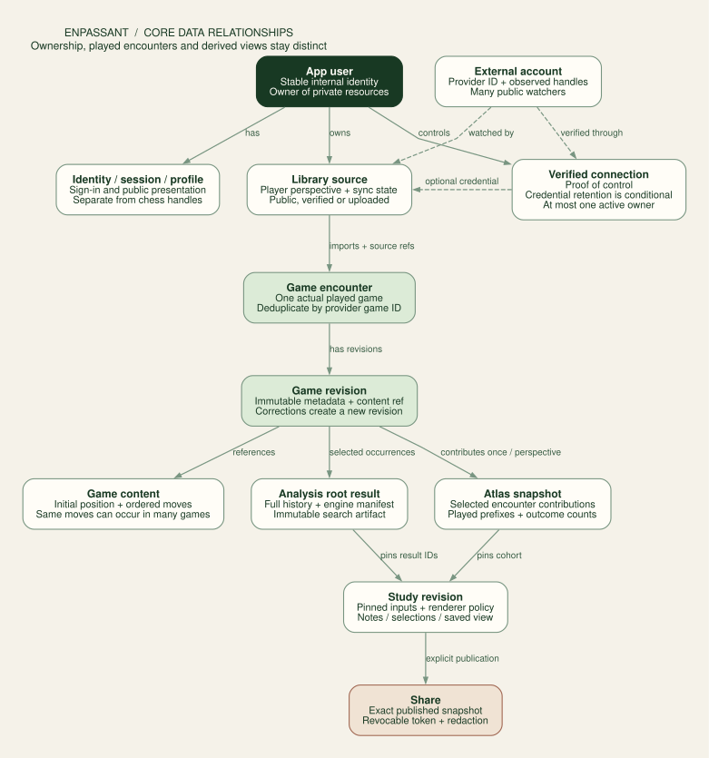
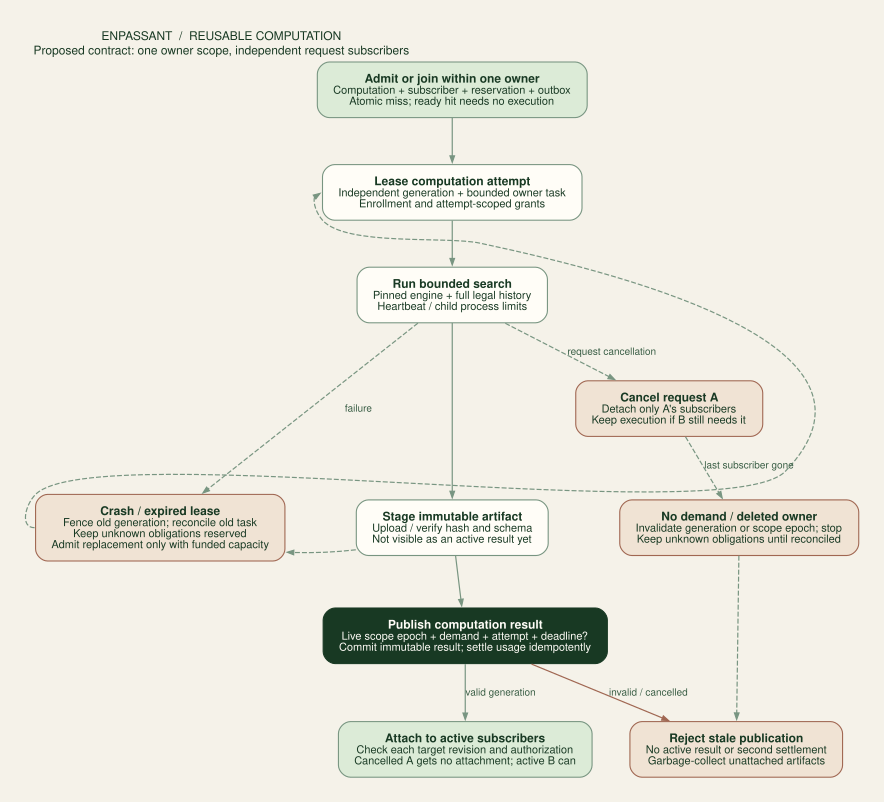

# Data, analysis and lifetime diagrams

**PostgreSQL is the system of record. Private object storage holds raw imports and large immutable artifacts. A diagram is a versioned projection of game and analysis data, not the database's primary representation.** No graph database is required to represent chess branches or serve bounded neighbourhoods.

The [EC2 baseline](aws-baseline.md) keeps this logical model on local Postgres and permits a private filesystem artifact adapter alongside S3. The session schema follows the selected auth library; Supabase session IDs and encrypted Supabase refresh material are only fields of the managed alternative. The [serverless counterproposal](research/r1-aws-economics.md#the-serverless-fork-deserves-a-fair-trial) would need an equivalent implementation of these ownership and transaction contracts before replacing this SQL design.

The diagram shows core relationships rather than every table or foreign key. All private descendants retain explicit ownership; supporting entities and constraints are listed below. Solid arrows trace application records and derived views; dashed arrows distinguish provider identity and optional connection relationships.

## Relational model

This is a logical schema for implementation, not an applied migration. Use UUID primary keys, UTC timestamps, explicit status constraints and schema-versioned JSON only where a relational shape would add little value. Private child tables include `owner_id` and composite parent foreign keys; ownership is not inferred from an object-storage path alone.

| Entity                                | Important fields and constraints                                                                                                                                     |
| ------------------------------------- | -------------------------------------------------------------------------------------------------------------------------------------------------------------------- |
| `app_user`                            | `id`, status, created/deleting timestamps, entitlements; server-controlled suspension                                                                                |
| `auth_identity`                       | user, trusted issuer, subject; unique `(issuer, subject)`                                                                                                            |
| `app_session`                         | user, selected library's session reference/schema, expiry and revocation; hashed opaque bridge and encrypted Supabase refresh fields only in the managed alternative |
| `profile`                             | user PK, normalized handle unique, display name, bio, visibility, moderation state                                                                                   |
| `external_account`                    | provider, provider account ID when known, canonical handle, observed aliases; resolved identity separate from ownership                                              |
| `connection`                          | owner, external account, verification method/time, consent, status, encrypted credential reference; unique active verified owner per provider identity               |
| `library_source`                      | owner, external account or upload source, linked connection if verified, selected player perspective, sync enabled/status, coverage and next-run time                |
| `import_run`                          | owner, source, requested time range, fixed upper bound, lease/fencing generation, cursor, counts, errors, status                                                     |
| `source_fetch`                        | source, endpoint/time window, ETag/Last-Modified, raw artifact, fetched time and complete/incomplete status                                                          |
| `game_content`                        | owner, variant, initial FEN, ordered UCI moves, SHA-256 of canonical content; deduplicate content within the owner                                                   |
| `game`                                | owner, current revision, library status, perspective choice; represents one played encounter, not merely one move sequence                                           |
| `game_revision`                       | owner, game, revision, content, result, source timestamps, player/rating/time-control metadata, raw artifact; immutable                                              |
| `game_source_ref`                     | owner, provider and external game key, game; unique `(owner, provider, external_game_key)`                                                                           |
| `game_ply`                            | owner, content, ply, legal position key, prefix key; optional indexed projection for archive queries                                                                 |
| `data_scope`                          | owner or operator-curation scope, lifecycle epoch, active/deleting/deleted state; sponsor and privacy boundary                                                       |
| `analysis_request`                    | scope, preset, targets, priority, cancellation revision, idempotency key/body digest and summary progress                                                            |
| `computation`                         | scope, exact work key, execution trust, sponsor, generation, state, active attempt and immutable ready result; unique nonterminal key within scope                   |
| `computation_subscriber`              | scope, request/target, computation, input authorization, target revision and active/detached state; request cancellation detaches only its subscriptions             |
| `execution_attempt`                   | computation, monotonic attempt/generation, task, deadline, usage and staging artifact; publication does not depend on the first request                              |
| `worker_task` / `task_launch_attempt` | homogeneous scope, bounded plan, allocation/deadline, exact encrypted launch payload and idempotency token, returned ARN and reconciliation state                    |
| `worker_enrollment` / `worker_grant`  | hashed bounded bearer capabilities, generation, epoch, audience, expiry and revocation; engine child receives no credentials                                         |
| `analysis_root_result`                | owner/cache scope, full search key, immutable result ID, engine manifest, achieved metrics, candidate artifact, completion status                                    |
| `analysis_target`                     | scope, request, full legal occurrence path, target revision, subscriber/result reference and status; unique request + target                                         |
| `study` / `study_revision`            | owner, game/cohort, selected analysis result IDs, graph-policy version, notes/pins, immutable published revision                                                     |
| `atlas_snapshot`                      | owner, subject, normalized filters, corpus revision, policy version, coverage, manifest, build state                                                                 |
| `atlas_game_contribution`             | snapshot, game revision, perspective, visited prefixes and result; unique contribution per encounter/perspective                                                     |
| `atlas_prefix` / `atlas_edge`         | snapshot, path prefix, next move, distinct-game outcome counts, child summaries and representative position                                                          |
| `artifact`                            | owner/privacy scope, opaque key, content hash, media type, byte count, schema version, retention, ready state                                                        |
| `share`                               | owner, study revision, token hash, expiry, revoked time, explicitly included fields                                                                                  |
| `quota_reservation` / `usage_entry`   | sponsor scope, attempt/task, unit/window, reserved and settled values, idempotent settlement; retain unknown obligations until reconciled                            |
| `outbox_event` / `audit_event`        | transactional work notification or minimal security history; no raw tokens or PGNs                                                                                   |

Separate the roles of `game_content` and `game`. Two real blitz games can have exactly the same moves and result. Sharing a content blob saves storage; merging the two encounters would corrupt a lifetime win rate. Provider game IDs deduplicate encounters. Move hashes do not prove that two imports refer to the same encounter.

For PGN uploads, the file checksum and record index make retrying that upload idempotent. An embedded recognized provider URL can resolve to an existing encounter only after validation. For unrelated files without reliable encounter identity, show a possible-duplicate group using players, date/time, result and moves; do not silently discard one. Preserve source references and allow the owner to resolve ambiguity. Unsupported variants and malformed games are recorded as skipped entries with reasons rather than causing silent data loss.

Keep imported raw bytes, normalized legal content and user annotations separate. A later provider correction creates a game revision and invalidates its derived contributions. It does not overwrite private notes. Headers such as dates and player names can be uncertain; preserve that uncertainty instead of inventing a timestamp or identifying a person from a display name.

Initial useful indexes are `(owner_id, played_at DESC, id)` for library pagination, owner/subject/colour/time-class/date for cohort selection, unique source keys, prefix lookup within a snapshot, `(status, next_run_at)` for due work, and job owner/status/creation time. Measure representative `EXPLAIN ANALYZE` plans before adding broad indexes. Partition large contribution/result tables only after size and vacuum behaviour justify it.

## Private object storage

Store raw PGN/NDJSON uploads, frozen candidate arrays, graph chunks, snapshot manifests and exports in private buckets. Use unpredictable object keys and authorized artifact IDs in the API. Content hashes verify integrity but are not download credentials. Large result arrays need not become millions of database rows; keep indexed summaries and checkpoint references in Postgres, with immutable compressed payloads in storage.

Publishing an artifact is a small protocol: upload to an attempt-specific pending key, verify size/hash, insert or update metadata transactionally, then attach it to the current job generation. Failed uploads or stale attempts cannot publish a ready result. A sweeper removes abandoned pending objects after a grace period. Readers see only ready artifacts. This handles the absence of a transaction spanning Postgres and object storage.

Do not globally deduplicate private input or analysis at launch. A later public cache must contain independently public or explicitly contributed material, with a separate namespace and no private notes, source identities or query-presence endpoint. Curated Tal fixtures can remain public without changing the privacy of personal imports.

## Durable imports

Creating a source and starting its import are separate actions. The user first chooses the player perspective, date range and applicable quota. The API fixes an upper bound and creates an `import_run`; new games arriving afterwards belong to the next sync. Progress reports discovered, imported, unchanged, skipped and failed counts separately, along with the time range actually covered.

### Chess.com

Read the archive list, then fetch complete monthly archives serially. At launch use one active Chess.com HTTP request across the application egress, not one per user. A database-backed provider lease coordinates every import worker. Include a recognizable, contact-bearing user agent. Honour cache headers, ETags and 304s; on 429 release work into delayed retry rather than holding an engine slot.[^chesscom]

The docs contain both twelve-hour and twenty-four-hour freshness statements. Therefore display the last successful fetch and honour actual response cache metadata; do not promise instant post-game updates. Keep a per-month completed checkpoint. Current and previous months are revisited on periodic sync; older months get conditional validation on a slower schedule or manual refresh. Provider deletion/410 is not equivalent to a transient fetch failure.

Use provider UUID when present or a validated canonical game URL as the external game key. Resolve account renames using profile identity. All fetched URLs are constructed from approved endpoint templates; never trust an archive URL or redirect as an unrestricted fetch instruction. Cap response sizes, stream where possible, validate redirects and reject internal/private destinations. Do not accept a general-purpose proxy URL.

### Lichess

Use the official user export API in NDJSON mode with `pgnInJson=true`, `ongoing=false`, `finished=true` and bounded `since`/`until` windows. The current specification defines `/api/games/user/{username}`, ascending or descending date sort, and authenticated/anonymous streaming rates. Follow the current contract rather than copying a historical endpoint name from a blog.[^lichess-export]

Stream one record at a time into bounded batches. Commit imported records and a completed-window checkpoint together. For interruption, rerun the incomplete window and deduplicate by provider game ID. Do not advance a “last seen timestamp + 1” cursor: games sharing a timestamp could be lost. For very large windows split by time, retain overlap and prove each window exhausted. If many records share the smallest possible window, finish that bounded stream without a `max` truncation or mark the source incomplete rather than falsely complete.

A resumed import can have a high-water mark for scheduling, but it also needs a ledger of unfinished windows. Revisit an overlap near the high-water mark for new games and corrections. Lichess advises one request at a time and backing off after 429; the coordinator enforces this across users sharing the egress identity. Slow provider throughput is a visible `waiting_provider` state, not a failed engine analysis.[^lichess-limits]

### Shared import rules

Provider imports contain completed games only. User-authored partial studies remain a separate explicitly labelled input type and do not enter lifetime outcome statistics. Standard chess is the initial supported variant. Keep today's 600-ply per-game bound until larger games are tested; a 10,000-game archive is streamed as many small records rather than rejected by the browser's 100-game collection limit.

Parsing is resource-limited and isolated from the API event loop. Cap upload bytes, decompressed bytes, game count, per-record bytes, token lengths and nesting/annotation depth. Store a sanitized error per bad record. Uploads are never executed and PGN comments are never inserted as HTML. Preserve clocks and provider metadata in raw data, but do not pretend existing imported analysis was generated by Enpassant's current engine.

An import lease also records the source's cancellation generation. Unlinking, disabling sync or deleting the owner increments that generation. Check it before each fetch and each batch commit; an already-running HTTP request may finish, but its response cannot publish after cancellation. A later manual public import is a new explicit source action.

## Analysis as an immutable computation

`AnalysisProvider` is the shared conceptual interface: analyze an initial position plus the full legal UCI path under an explicit preset, emit bounded progress, return an immutable result, and support cancellation. Browser WASM and server-native Stockfish implement the interface independently. An engine worker launches a pinned binary with structured arguments and UCI messages; no shell interpolation of PGNs, moves or engine options.

The search key includes the initial FEN, complete UCI history, variant/rules version, engine binary and NNUE hashes, engine flavour, architecture/configuration, threads, hash memory, MultiPV, depth/node/time limits, root restriction, played-move coverage and normalization schema. The display key additionally includes retained result IDs, candidate/compression/merging policy and Graphviz/renderer versions. A native result and browser-lite result do not share a cache key just because both are called Stockfish 18.

Record requested resources separately from actual elapsed time, achieved depth, searched nodes and returned PV length. The current browser values—400 ms preview, depth-20 target with a 60-second study ceiling, eight candidates and a 20-ply display horizon—are different dimensions. Higher resource limits do not prove depth 20 was reached. Fixed node limits can improve budget comparability but still do not promise bit-for-bit repeated searches across engines or parallel hardware.[^stockfish-uci]

Keep the current candidate-retention and same-depth comparison rules. A separately searched played move has unknown exact rank beyond the top eight. Legal mate endpoints remain different from mate-valued evaluations with a truncated PV. Repetition and fifty-move state use the complete path. Do not key a search by the four board fields used to draw a transposition junction.

Browser results can be uploaded as **device-generated**, after legal validation, to preserve private work. Do not promote them into a trusted shared cache or charge them as server compute. A forged browser evaluation can be legal chess but a false score. Public shared studies must identify result provenance, and any trusted analysis/insight must use a verified server result or a clearly disclosed device source.

## Persistent analysis and diagram reuse

The current [engine adapter](../../src/lib/engine.ts) stores exact-key searches in browser IndexedDB, capped at 3,000 entries. The [analysis hook](../../src/lib/useAnalysis.ts) reconstructs the graph on reopening, creates the engine worker even when results are cached, and forces a fresh search for explicit exploration. Quick and study budgets form different keys. These code paths explain why progress can reappear without proving that every search reran; no browser profiling of the reported session was performed.

For the hosted platform, preserve three independently versioned representations:

| Representation | Durable contents and identity                                                                                                          | Reuse behaviour                                                                  |
| -------------- | -------------------------------------------------------------------------------------------------------------------------------------- | -------------------------------------------------------------------------------- |
| Engine result  | Canonical input/search manifest above, actual depth, candidate lines/scores, completion state and execution trust; immutable result ID | Reopening matching work reads the result without an engine search                |
| Semantic graph | Retained result IDs, occurrence histories, annotations/revisions, candidate retention and compression/merging policy                   | Rebuild after semantic-rule changes without discarding engine results            |
| Placed diagram | Semantic graph revision, Graphviz/layout version, layout options and any pinned coordinates/expansion state affecting placement        | Restore node positions and edge curves; replay only changes visibility/selection |

Initially Postgres can hold compact result JSON and metadata. Larger immutable payloads can use private filesystem/S3 storage with checksum manifests. Store authoritative results outside an evictable hot cache. Keep owner/private and curated-public namespaces separate, along with `device`, `external_worker` and `managed_server` execution tiers. Authorization applies before cache lookup or artifact delivery; a cache key is not an access token.

Hash a canonical, schema-versioned manifest, retaining that manifest for inspection. A request for depth 20 that stopped at depth 13 is a reusable partial result, not completed depth-20 analysis. Return its actual coverage and offer a bounded upgrade; never label it complete to manufacture a cache hit. Reusing a result obtained under a different budget requires an explicit compatibility policy and disclosed provenance. A deeper result is not evidence of what a shallower search would have returned. Engine/NNUE changes invalidate engine compatibility; diagram-policy changes only invalidate derived representations.

Before launching a job, look up a compatible authorized durable result. On a miss, use a transaction and a unique nonterminal computation key to attach matching same-owner subscribers or create one computation, reservation and outbox event. The key includes scope and execution trust. A Redis lock is not the publication authority. Private active work never joins across owners in the initial design. Curated public studies run under an operator scope and budget; visitors reuse deliberately published completed revisions. They do not sponsor an active public computation implicitly. Revocation/deletion removes access and private references regardless of cache retention.

Publish result and diagram references atomically only after their payloads are durable. An expired Redis entry, failed task or interrupted browser must not lose the only saved analysis. Garbage collection respects active studies, shares and retention/deletion policy; immutable does not mean retained forever. Diagram downloads remain private unless explicitly published.

Expose distinct progress states for loading saved analysis, searching a position and arranging a diagram. Record cache-hit rates by layer, requests joined to active work, new search time and graph-layout time. Redis/Valkey is a later optimization if these measurements show a storage-read bottleneck; it is not required to avoid repeated Stockfish runs. Its [separate AWS cost](aws-baseline.md#cache-the-work-and-its-presentation-separately) is excluded from the baseline.

## Jobs, retries and budgets

The diagram separates reusable computation from request subscribers. Dashed paths show cancellation and retry. Cancelling request A leaves same-owner subscriber B alive; owner deletion or loss of all demand invalidates computation publication. [The complete constructive contract](research/r2-minimal-design.md#slice-2--durable-computation-belongs-to-the-owner-not-the-first-request) defines the proposed records and race tests.

The logical states are `queued → leased → running → succeeded`, with `retry_wait`, `failed`, `cancel_requested` and `cancelled`. A parent request may finish `partial` when some roots succeed and others exhaust their budget. Request cancellation is not the same operation as revoking a share or deleting an account.

For a miss requiring execution, atomically create the computation, subscriber, conservative reservation and outbox event. A compatible result hit or active same-owner join creates no second execution obligation. The dispatcher delivers opaque IDs and an approved policy. A worker uses a short lease and monotonic attempt/generation. The broker first commits a durable result only when the scope epoch, computation generation, active attempt, deadline and authorized demand still match. It then attaches that result independently to each still-authorized subscriber's current target revision. The first request is never the computation's publication authority. Repeated delivery and interrupted attachments are idempotent.

Use pg-boss for delivery/retry primitives where its pinned version supports the needed contract. Keep the domain state and result-commit rules outside queue internals. Exactly-once effects are not inferred from a queue's delivery claim: crashes after upload, after database commit or before acknowledgement all need idempotent result publication and usage settlement.[^pgboss]

Each task targets a frozen bounded group of one owner's roots. Start with one engine thread per slot and memory/CPU/wall/process limits. Cancelling one request detaches only its subscribers. When no authorized demand remains, mark the computation stopping, invalidate its publication generation and stop its execution; late output remains quarantined. Owner deletion revokes the whole scope epoch. A stopping computation keeps its unique active key and financial obligation until reconciled; a new request cannot revive that generation. Settle once, keeping unknown usage reserved rather than treating cancellation as immediate cost release.

Reserve the maximum cost of both the sibling search and possible played-move fallback. With a 60-second ceiling and one thread, one root can reserve up to 120 CPU-seconds before overhead. A 94-root game can therefore reserve 188 CPU-minutes at that ceiling; it is not a free “one job” action. Validate presets server-side and reject client requests to raise threads, hash memory or depth outside entitlements. For Fargate, also reserve against allocated vCPU/RAM and billable wall duration, including startup, idle time, retries and termination lag. CPU seconds alone cannot enforce its invoice envelope; use the [task admission and orphan-recovery design](aws-baseline.md#optional-fargate-analysis).

Use round-robin fairness across users within priority classes: interactive exploration, selected studies, then background enrichment. Prevent one user's backfill from monopolizing slots. Proposed initial guardrails are one running analysis per user, two pending requests per user, four roots per free request, twenty reserved CPU-minutes per user per day, and a global admission cap. These are configurable launch hypotheses, not a paid-plan promise. The capacity model in [infrastructure and delivery](infrastructure-and-delivery.md) determines the global budget and queue bound.

Begin with one owner per task, one global task slot, at most four pre-admitted roots and a measured wall quantum (180 seconds is a test setting). Never wait to fill a batch or append work beyond that quantum. Start a root only when its full fallback/stop envelope fits. Atomically transfer conservative standalone root reservations into a single funded task-allocation reservation before releasing duplicated startup headroom. Sponsor scope, attempt CPU and task allocation are distinct accounting records. Measure queue delay, useful engine time and cancellation waste separately.

Managed-worker enrollment initially uses a short-lived one-use bearer capability delivered by the trusted launch adapter, bound to scope epoch, plan and launch generation. It is not task attestation: ECS task descriptions/control-plane access can expose an environment override. Restrict that access, encrypt the exact retryable launch payload, sanitize the engine child's environment and redact logs. A lost enrollment response fails closed and reconciles its funded attempt before any replacement. IAM-authenticated enrollment remains a separate fork. [Bootstrap, failure windows and acceptance tests](research/r2-minimal-design.md#minimal-bootstrap-is-a-bearer-capability-not-task-attestation).

The same launch token is not permanent deduplication. The bootstrap contract records the provider's finite idempotency window and fixes cluster/region. If the window may have expired while the launch is unresolved, stop automatic launch replay and reconcile; do not manufacture a safe retry by retaining the old token.

Budget reservations are released or converted to usage through a unique settlement key per attempt. Retried delivery of the same attempt cannot create a second reservation. A genuinely new execution attempt must settle or retain the old attempt's worst-case obligation and atomically reserve additional capacity within the remaining user/global allowance; retry is deferred or refused when it would exceed either cap. Failed attempts that consumed CPU are still accounted for. Start with at most two automatic retries per target. If a worker dies with no final usage report, settle conservatively up to the granted lease/deadline, then reconcile. A UI budget counter is not enforcement: the transaction admitting the job is.

An external worker, including a friend's server, authenticates as a worker identity and pulls explicitly assigned work through the broker. It receives a short-lived job grant for input and output, with job ID, generation, audience and expiry. It never receives the database password, Auth service credential or provider tokens. Unmanaged machines are restricted to public/explicitly contributed inputs in a separate pool; a short-lived token cannot make an untrusted machine safe for private PGNs.

Record a separate execution trust tier: `managed_server`, `external_worker` or `device`. An external worker can misreport its binary hash or scores; legal PV validation proves legality, not honest engine execution. Its results remain attributed external studies and cannot enter the trusted engine cache or aggregate insights without recomputation on managed infrastructure. Transport authentication proves which worker submitted a result, not that its evaluation is correct.

## Lifetime graph construction

Build an owner-scoped corpus snapshot from game revisions, selected external-account perspective, colour, variant, date, rated/casual flag and time-control filters. Ratings belong to their source pool and date; do not compare Chess.com and Lichess ratings as one calibrated scale. Unknown metadata stays an explicit filter category.

Aggregate **played move prefixes** first. A prefix key includes the initial position and ordered moves, so it preserves how the position was reached. Distinct prefixes may link visually as transpositions through a separately normalized legal board key. Do not collapse repetition loops into extra wins or apply an engine score to every occurrence of a shared board.

The statistics denominator is distinct encounters in the selected cohort. Node and edge counts describe the distinct games passing through that prefix; visit counts, if useful, are separate. A game can pass through the same board more than once. Self-play between two linked accounts is excluded from “my win rate” by default and available as an explicit cohort. White/Black views determine the result perspective before aggregation.

Record a per-game contribution so corrections, imports and deletion can be applied exactly once. A snapshot is published only after all its contribution batches and manifest agree. Late engine results enrich a newer revision or a study overlay; they do not silently alter the archive's game-outcome counts.

Use three levels of detail: opening family summaries, a selected prefix neighbourhood, and an individual game/study. Proposed initial response limits are 250 visible graph nodes and 100 library rows; collapsed branches carry exact full-cohort counts. A breadth budget changes what is drawn, not the denominator. Initial atlas precomputation can index the first 24 plies; expanding farther queries deeper stored moves and creates an additional chunk. The limit is not a claim that the remainder of a career disappeared.

Graphviz lays out bounded chunks, preserving selected anchors across expansion. Keep public policy and semantic metadata outside DOT and map DOM identifiers to authorized occurrence IDs. Stable snapshot/chunk IDs preserve navigation and support cache invalidation. Never put the whole archive into one SVG just because the source diagrams use SVG.

For pattern summaries, distinguish outcomes from engine judgement. “Won 18 of 30 games after this move” is descriptive archive data. “This move costs me games” is a causal claim the data does not establish. Show sample count, date range, time control, opponent context and the number of games actually analyzed. Use a minimum sample threshold before ranking openings; hide or label sparse samples. Mate scores must not be averaged as arbitrary centipawn values, and different engine configurations must not share one accuracy metric without calibration.

## API contract sketch

All private endpoints sit under `/api/v1`, derive owner identity from the session and use schema-validated JSON. List cursors bind filters and ordering; they are opaque to the client. Mutations support `Idempotency-Key`, scoped by owner and operation, storing a body hash so key reuse with different input returns a conflict. Optimistic edits require a revision or `If-Match` token.

| Method and path                            | Contract                                                                               |
| ------------------------------------------ | -------------------------------------------------------------------------------------- |
| `GET /me` / `PATCH /me/profile`            | Current profile, settings, capabilities and usage; reject role/owner fields            |
| `POST /connections/lichess/start`          | Create session-bound attempt and return an allowed authorization URL                   |
| `GET /connections/lichess/callback`        | Validate state and exchange server-side; redirect to a fixed settings page             |
| `DELETE /connections/:id`                  | Stop sync and revoke credential; return durable operation status                       |
| `POST /sources`                            | Add an approved provider/public subject or uploaded PGN source                         |
| `POST /sources/:id/imports`                | `202` with import ID and status URL; fixed window and quota reservation                |
| `GET /imports/:id`                         | Counts, completed ranges, waiting/error state and next cursor                          |
| `GET /games` / `GET /games/:id`            | Paginated authorized library and exact revision metadata                               |
| `GET /games/:id/content`                   | Authorized canonical moves or short-lived owner download                               |
| `POST /analysis-requests`                  | Preset + legal targets; reserve resources; return `202` and requested/available budget |
| `GET /analysis-requests/:id`               | Progress since version, ready result references, achieved metrics                      |
| `POST /analysis-requests/:id/cancel`       | Idempotent cancellation request; partial results remain identified                     |
| `POST /atlas-snapshots`                    | Canonical cohort/filter request; reuse exact ready revision or return build status     |
| `GET /atlas-snapshots/:id/chunks/:key`     | Bounded neighbourhood, exact aggregates, coverage and continuation cursors             |
| `POST /studies` / `PATCH /studies/:id`     | Owned revisioned pins/notes/result selections                                          |
| `POST /studies/:id/shares`                 | Publish an explicit immutable projection; returns token once                           |
| `DELETE /shares/:id`                       | Immediate grant revocation                                                             |
| `POST /account/export` / `DELETE /account` | Recent auth; asynchronous operation with a durable receipt                             |

An analysis target is a game revision plus a verified occurrence path, not a freely supplied FEN trusted as that game's history. The API legally reconstructs it and checks that the owner can access the revision. Requests may select an initial custom-FEN study, but that is a separately owned content record.

Use `401` for missing sessions, a consistent `404` for inaccessible private resources, `409` for identity/idempotency/revision conflicts, `422` for invalid chess or unsupported input, and `429` with retry timing for admission limits. Return a request ID and safe error code, never raw provider tokens, SQL text or a stack trace. Failed provider sync and exhausted engine depth are distinct UI states.

[^chesscom]: Chess.com, [Published-Data API](https://www.chess.com/news/view/published-data-api), checked 9 September 2026. Endpoint cache headers are the operative freshness input.

[^lichess-export]: Lichess, [User export specification](https://github.com/lichess-org/api/blob/master/doc/specs/tags/games/api-games-user-username.yaml), checked 9 September 2026.

[^lichess-limits]: Lichess, [API introduction and rate-limit guidance](https://github.com/lichess-org/api/blob/master/doc/specs/lichess-api.yaml), checked 9 September 2026.

[^stockfish-uci]: Stockfish, [UCI protocol and commands](https://official-stockfish.github.io/docs/stockfish-wiki/UCI-Protocol-and-Stockfish-Commands.html). The versioned search-key design is Enpassant's proposed contract.

[^pgboss]: pg-boss maintainers, [Project documentation](https://github.com/timgit/pg-boss), checked 9 September 2026.
