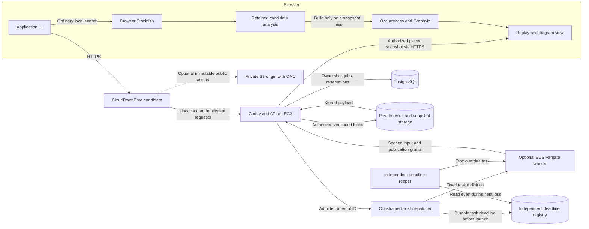
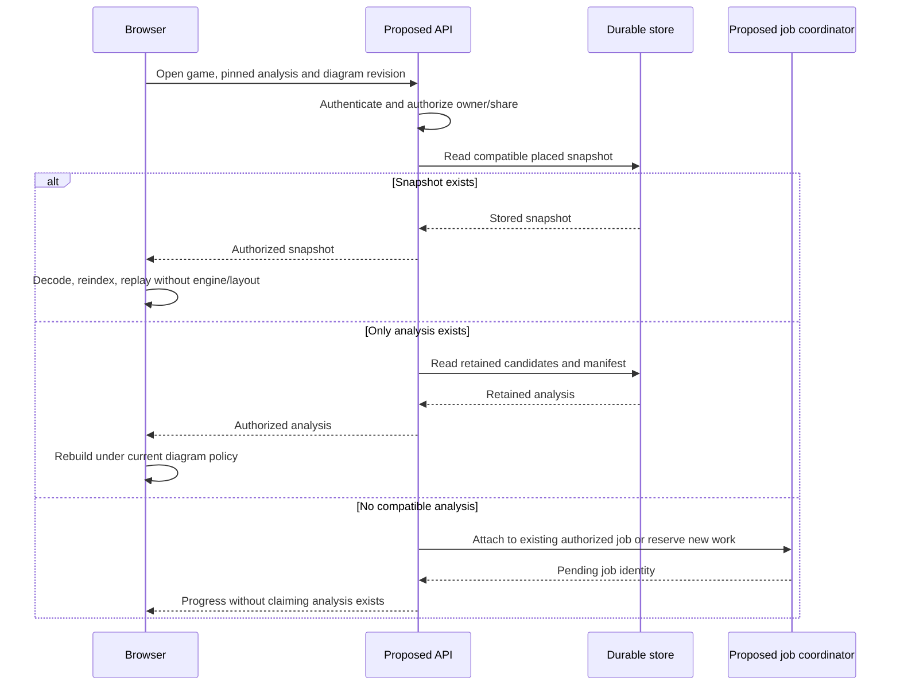
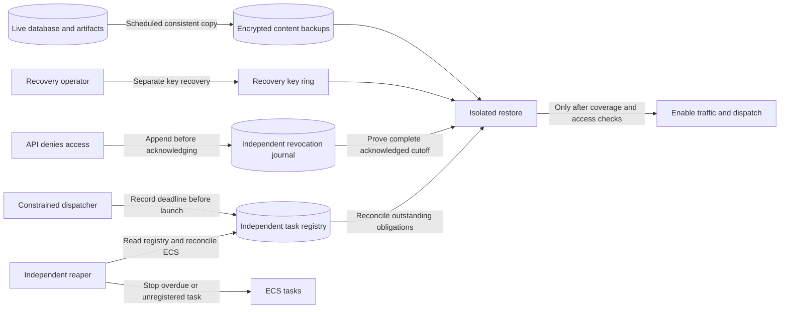

# Enpassant platform investigation

**Keep the modest EC2 direction and build saved studies first.** Local measurements support making reuse more precise: save engine results and placed diagrams independently, analyze selected events, and treat startup and retries as billable work. Ordinary analysis stays in the browser; optional Fargate studies remain a later bounded service. The proposed backend and AWS deployment do not exist yet.

The strongest completed local experiment restores the Botvinnik–Tal diagram from a saved snapshot with **identical SVG output in six replay/focus states**, without running Stockfish or Graphviz. Restoring its gzip payload, parsing it and rebuilding the occurrence index took about **16 ms**, compared with about **4.0 seconds of graph construction plus 0.4 seconds of layout** in that single Mac run. This proves a useful serialization seam, not browser latency, cloud capacity or safe handling of untrusted snapshots. [Experiment and limitations](evidence/diagram-snapshot.json).

The financial premise also needs a correction. CloudFront now has a **$0 flat-rate plan** that includes a limited WAF/CDN bundle. It is worth testing as the public entry point to the modest host, rather than assuming every WAF addition requires the earlier paid managed stack. Account eligibility, exact policy acceptance, origin protection and renewal remain launch gates.[^1]

## Decision forks

| Fork                     | Working recommendation                                                    | Alternative and trigger                                                                       | Status                                                                  |
| ------------------------ | ------------------------------------------------------------------------- | --------------------------------------------------------------------------------------------- | ----------------------------------------------------------------------- |
| Hosting                  | EC2 + Compose + local Postgres; benchmark 2 GiB                           | Lightsail for simpler billing; larger/non-burstable host if measured load requires it         | Accepted direction; size and region `[experiment]`                      |
| Region                   | Price N. Virginia and Cape Town, then measure from South Africa           | Choose latency/jurisdiction over the cheapest reference if requirements demand it             | `[decision]`; no region selected                                        |
| Low-idle-cost API        | Keep accepted SQL/EC2 contracts for the first hosted spike                | Compare Cognito/Lambda/DynamoDB through an equivalent reservation/library/recovery slice      | Survives as counterproposal; `[experiment]`                             |
| Public entry             | Test CloudFront Free with uncached private API and protected HTTPS origin | Retain direct-host cost model if ineligible; separately evaluate paid protection if required  | Proposed; `[live-data]` eligibility and `[experiment]` configuration    |
| Subscription ownership   | Explicit separate bootstrap if building before Terraform support ships    | Pin and test a released provider supporting the subscription                                  | `[decision]`; v6.63.0 lacks it, upstream PRs open                       |
| Authentication           | Better Auth + local Postgres; pinned database-backed session contract     | Managed auth if measured implementation/operations effort justifies its complete cost         | `[experiment]`; no auth integration installed                           |
| Reopening a diagram      | Restore a versioned placed snapshot; retain compact analysis separately   | Rebuild from analysis on policy mismatch or snapshot eviction                                 | Local restoration verified; hosted format `[experiment]`                |
| Editable restoration     | Store full source paths and a versioned builder checkpoint                | Explicitly rebuild editing state from proven retained paths; view-only fallback if impossible | `[experiment]`; view snapshot alone is insufficient                     |
| Optional server searches | Bounded Fargate batches for selected studies                              | Browser remains ordinary path; compare Lambda with equivalent native work before rejecting it | Proposed; throughput/startup `[experiment]`                             |
| Worker enrollment        | One-use bearer capability from trusted launcher, restricted control plane | IAM-authenticated broker endpoint if that control-plane trust is unacceptable                 | `[decision]` + `[experiment]`; additional service cost must be repriced |
| Active computation       | Same-owner independent computation and subscribers; operator public work  | Cross-owner active sharing only after sponsor/privacy/fairness contracts are proved           | Proposed first scope; `[experiment]` races                              |
| Database and hot cache   | Postgres owns relational state and durable results; no Redis initially    | Add a hot cache only for a measured read/coordination bottleneck                              | Design recommendation; load `[experiment]`                              |
| Diagram enrichment       | Frozen, capped event frontier; preserve uncertainty and existing cues     | Uniform deepening at equal allocation; choose by reader tasks and candidate stability         | `[experiment]`; no quality win claimed                                  |
| Lifetime graph           | Aggregate played prefixes first; inspect bounded neighborhoods            | Selected deep studies enrich a region later                                                   | Proposed product; archive-scale `[experiment]`                          |
| Repository ownership     | Preserve current visibility during planning                               | Private service repo or current repo privacy after an explicit choice and GPL review          | `[decision]`; no visibility change                                      |

## Hosting cost and the strongest alternative

✅ The [economics evidence](r1-aws-economics.md) independently reproduces the direct-host estimate: **$18.85/month priced core**, plus **$3–$8 of planning allowances**, or about **$22–$27**. This uses N. Virginia, 730 hours, 30 GB total disk and one public IPv4; taxes and operator time are excluded. Cape Town's checked core is **$23.17**, giving **$26–$31** with those same unmeasured allowances. N. Virginia is a pricing reference, not the selected region. [Meter records and dates](evidence/economics/aws-price-feed-records.json).

The host size remains a test candidate. Both `t4g.small` and `t4g.medium` earn 24 CPU credits/hour, equivalent to 0.4 sustained vCPU in aggregate. The medium upgrade adds RAM without increasing that baseline. Test authentication, imports, database queries, backups and deployment overlap after credit depletion; do not extrapolate from an idle host. The [baseline document](../aws-baseline.md) now includes this correction.[^8]

Storage occupancy matters as much as the instance price. One measured Botvinnik–Tal placed snapshot plus its compressed analysis is **433,095 bytes**. At that fixture size, these are decimal GB sensitivities, not representative per-game forecasts:

| Retained snapshot/analysis pairs | Payload only | Consequence for the 30 GB total-disk model                   |
| -------------------------------- | -----------: | ------------------------------------------------------------ |
| 1,000                            |     0.433 GB | Leaves room to measure the other disk consumers              |
| 10,000                           |     4.331 GB | Material data allocation; revisions and checkpoints add more |
| 100,000                          |    43.310 GB | Exceeds the entire modeled disk before database/OS overhead  |

For the first hosted sizing fixture, separate **100,000 imported encounters**, **10,000 saved studies** (a 10% trial fraction), **at most two retained placed revisions per study**, and their unique referenced analysis results. Conservatively charging two complete fixture-sized pairs per study is **8.662 GB** before checkpoints, games, indexes and WAL; deduplication can reduce analysis duplication but is not assumed here. These are test settings, not retention entitlements or silent eviction rules. Reserve **8 GB root**, **at least 6 GB data-volume headroom** for WAL, staging/atomic-save overlap and restore, leaving at most **16 GB** for retained application data in this initial model. Measure every category, refuse new saves clearly when funded capacity is unavailable, and reprice if the corpus fails to fit. Independent backups and journal storage are additional retained bytes.

**Counterproposal that survives R1:** CloudFront/S3, Cognito, a Lambda API, DynamoDB manifests and optional Fargate can remove idle EC2 charges. One deliberately small API/database scenario in the economics report totals **$2.59**, but excludes several application costs and replaces the planned SQL/RLS/queue contracts. It is not a $2.59 public-app quote. A vertical slice must prove atomic reservations, ownership, deletion, filtered library access and recovery before that stack can replace the accepted direction. Lower service charges deserve consideration; existing domain assumptions deserve equal scrutiny.

Lambda also remains a candidate for bounded engine work. Its CPU allocation is tied to memory (one vCPU equivalent at 1,769 MB), and one invocation is limited to 900 seconds. A whole-game request exceeding that ceiling can be partitioned; the limit alone does not disqualify it. Compare the same engine build, history, search budget, startup and publication work against Fargate, not a 512 MB lightweight API example against a one-vCPU engine task.[^9][^10]

## Proposed data flow

This is a **logical data-flow view** of proposed application mechanisms. The replay view and local workers belong to the browser; origin HTTPS responses return through the configured edge. The local experiment verifies only the saved-snapshot-to-diagram portion. The current browser still runs local Stockfish and reconstructs diagrams; the backend remains unbuilt.



S3 for static assets is an optional refinement; private analysis can start on retained EBS with off-host backups. The CDN would use a public, restricted HTTPS origin because private VPC origins are outside its Free tier. DNS resolves the application domain to CloudFront; it is not a request-processing hop. Proposed origin defenses combine a CloudFront source restriction with a distribution-specific secret header and certificate renewal that does not require opening the origin to everyone.[^1][^2]

## Cache findings and the restoration experiment

✅ The real browser IndexedDB probe, with deterministic mocked UCI output, reproduced four distinct behaviors: an exact cache hit initializes a worker but sends no engine search; changing the played move repeats the sibling search; simultaneous identical requests through two Engine instances each search; and key-ordered eviction can remove the entry just written. Explicit refresh searches again by design. Direct simultaneous calls to one Engine also exposed an unsettled promise, but the current UI hook serializes requests, so this is an API-contract stress result rather than a demonstrated UI failure. [Probe](evidence/engine/cache-probe.json), [production engine](../../../src/lib/engine.ts).

These are separate issues. Moving the lookup before worker initialization avoids startup on hits. An in-flight registry coalesces compatible misses. A sibling-search record can be separate from the played-move fallback so a different played move does not force the same sibling search. Eviction requires explicit access/retention metadata. Each proposed fix needs its own correctness check; installing Redis does not implement any of these contracts.

The snapshot experiment deliberately retained all path-specific occurrences, full histories, display aliases, edge splines and continuation paths. It removed only the derived `byId` Map from JSON, then rebuilt that index on restore. The compressed placed snapshot is **407,659 bytes**, versus **25,436 bytes** for the compressed original analysis. Six comparisons cover opening and middle replay, overview, an isolated played root, an isolated alternative, and the assessed-check detail mode. All produced byte-identical SVG, and continuation-focus sets matched. [Executable experiment](../../../scripts/research-diagram-snapshot.mjs).

This is a good first implementation boundary: use a placed snapshot for viewing and retain analysis as the smaller, durable source for rebuilding. It does not restore the private mutable state inside `EvolutionBuilder`; adding new searches may rebuild that state separately. A compact indexed encoding can come later if transfer or memory measurements justify it. Shipping a raw arbitrary JSON blob without schema limits, ownership checks and version checks would not follow from this experiment.



This sequence concerns hosted reopening. The proposed dispatcher must check retained results before reserving compute and check again while claiming a job, so competing requests do not turn one miss into several tasks. Cancellation removes one subscriber; only an unneeded task is stopped. A late worker may not publish against a revoked owner grant or an obsolete job generation.

## Diagram quality and selective analysis

✅ Replaying frozen candidates through the production builder changes the diagram without new engine work. For Botvinnik–Tal, changing display merging to same-ply positions changes height from **802.3 to 471.8** diagram units; increasing the retained display horizon from 20 to 30 yields **1,352 rather than 1,315 glyphs**, yet height falls to **660.8**. More nodes, greater search depth and a more sprawling layout are different variables. [Frozen-input comparisons](evidence/engine/graph-probe.json).

The distinction between a check being present and a check being locally assessed matters. In the Botvinnik–Tal default graph, 390 display glyphs contain a checking occurrence, but only 14 contain locally supported check evidence; 373 contain an unassessed check. Merged glyphs can contain different occurrence qualities, so these are overlapping memberships, not a mutually exclusive pie chart. Even the retained Deep Blue depth-20 fixture leaves many interior checks unassessed. Deeper searches at played roots do not automatically provide comparable sibling evidence at every position inside a continuation.

**Proposal:** spend optional compute on the events the diagram cannot yet explain, especially selected unassessed checks and decision points, instead of assigning the same depth to every imported position. Preserve the distinction between retained and assessed marks and pin the graph revision during replay. Whether event-directed work produces more useful diagrams per billed second needs a native-engine comparison; no quality improvement is claimed from these layout-only experiments.

## Worker economics

✅ The [sensitivity calculator](../../../scripts/research-worker-economics.mjs) checks minimum billing, tail batches, complete cache reuse and retry accounting. It models 80,000 requested roots, one vCPU with 2 GB, and a hypothetical 20-second startup. These are scenario inputs, not observed traffic or Fargate startup. The Linux one-minute minimum makes one cheap root per task an expensive scheduling choice.[^3]

| Synthetic scenario    | Batch size | Compatible hit rate | Billed task-hours | Compute + modeled IPv4 allowance |
| --------------------- | ---------: | ------------------: | ----------------: | -------------------------------: |
| 0.4 seconds work/root |          1 |                  0% |          1,333.33 |                           $72.49 |
| 0.4 seconds work/root |         16 |                  0% |             83.33 |                            $4.53 |
| 0.4 seconds work/root |         16 |                 90% |              8.33 |                            $0.45 |
| 60 seconds work/root  |         16 |                 90% |            136.11 |                            $7.40 |

The last row still exceeds the proposed **20 billed task-hour** study envelope despite its modest dollar amount. The envelope is an admission policy, not a promise to analyze a certain number of games. Sixteen-root batching is a sensitivity scenario, not the recommended initial scheduler: begin with at most four pre-admitted roots from one owner, a bounded wall quantum and no wait to fill a batch. Admit a root only if its full search/fallback/stop envelope fits. Logs, transfer, storage, reaping, taxes and failures beyond the modeled attempts remain outside these amounts. [All 80 scenarios and assumptions](evidence/worker-economics.json).

No 90% shared-cache success rate is assumed. In the four-game Tal/control sample there are 262 played roots and 261 distinct current search keys, or 258 when excluding the played-move augmentation. Reopening the same game can reuse work; extrapolating large cross-game savings from this small corpus would be unjustified.

## CloudFront candidate and its conditions

✅ The Free pricing matrix lists 1 million requests, 100 GB transfer, five WAF rules and a 5 GB S3 Standard storage credit. It excludes private VPC origins, access/WAF request logs and custom cache policies. The developer guide allows managed policies and an eligible attached Route 53 zone; allowances are not hard cutoffs, and sustained excess can reduce delivery performance. Historical usage and the account's Free Tier state can prevent enrollment. These are plan terms, not a guarantee that this account or proposed configuration qualifies.[^1][^4]

The attached DNS zone can return to pay-as-you-go after excessive DNS usage and notification. Cancelling the Free subscription immediately returns associated resources to their normal metering. Reconciliation must check current tier, attachments and cancellation/zone drift; retain the direct-host DNS charge in the fallback budget.[^4]

Use **CachingDisabled** for the default behavior and authenticated paths, with a managed origin-request policy forwarding the necessary cookies, headers and query parameters. Cache only deliberately public immutable paths. This avoids relying on `private, no-store` alone: a positive minimum TTL can override those origin directives. Set security headers at the application origin, avoiding a dependency on a paid custom response-header policy. These are proposed settings, pending an actual configuration and two-account cache-isolation test.[^5][^6]

Origin custom headers are an origin configuration field, separate from custom origin-request policies. CloudFront overwrites the configured header if supplied by a viewer. Combining that feature with a source restriction is a defensible design candidate, but documentation alone does not prove our Caddy configuration, secret rotation or DNS-based certificate renewal.[^2]

The subscription API is separate from a distribution's ordinary configuration. A release must verify the intended subscription is active and the required resources are attached before treating their charges as bundled. R2 checked the complete relevant registration and schema surfaces in AWS provider **v6.63.0**: no released subscription resource exists there. Open upstream PRs **49233/49235** add it. This resolves the code question while leaving an implementation fork: explicitly own subscription bootstrap separately, or wait for and test a supporting release. Paid subscription approval stays outside the ordinary application deploy role. [Pinned provider evidence and PR sweep](r2-verification.md#terraform-released-capability-and-upstream-work-are-different-evidence). Nothing has been subscribed or provisioned.[^7]

## Identity, ownership and operational boundaries

The [security evidence lane](r1-platform-security.md) found actionable design gaps rather than a reason to buy more infrastructure. Compose does not assign an AWS task role per container. Application containers need tested denial of metadata access, while the SSM agent and a narrowly constrained dispatcher retain the host operations they need. A deployment role permitted to run arbitrary SSM shell commands is effectively trusted with the host; specifying a fixed root-owned script and immutable release parameters is part of the design. [AWS metadata controls](https://docs.aws.amazon.com/AWSEC2/latest/UserGuide/instance-metadata-limiting-access.html), [SSM privilege boundary](https://docs.aws.amazon.com/systems-manager/latest/userguide/ssm-agent-restrict-root-level-commands.html).

Better Auth with local Postgres is a viable candidate, pending a real integration. The initial configuration should use fresh database-backed session checks, explicit provider-linking policy, protected OAuth/OTP storage and a deletion route that cannot bypass the domain's durable revocation journal. Authorization remains in the API; RLS under a restricted runtime role provides a second boundary against forgotten owner filters. That does not make a fully compromised API incapable of selecting another owner context. [Session behavior](https://better-auth.com/docs/concepts/session-management), [account defaults](https://better-auth.com/docs/concepts/users-accounts), [PostgreSQL RLS limits](https://www.postgresql.org/docs/current/ddl-rowsecurity.html).

**Recommendation for the first server-study version:** coalesce private work only within one owner, using a computation object with its own sponsor, subscriber lifecycle and publication fence. That object is necessary even when two requests belong to the same person: cancelling the first request must not revoke work the second still needs. Curated public studies use a separate operator budget and share completed results. Defer cross-owner active computation. The [R2 constructive contract](r2-minimal-design.md#slice-2--durable-computation-belongs-to-the-owner-not-the-first-request) specifies atomic admission, two-stage publication, bounded owner tasks and a one-use bearer enrollment mechanism. These are implementation hypotheses with explicit race and recovery tests.

Provider linking and import access are different. Chess.com public data does not establish ownership of an account. Lichess has an authenticated ownership route; an optional public-only import design could discard its token after verification, but that changes ongoing proof and sync behavior. A user's private library and analysis stay owner-scoped regardless of whether the underlying moves came from public archives. Live provider consent and account-specific entitlements were not exercised.

Uber's PostgreSQL-to-MySQL article is useful evidence about update patterns and replication under its historical workload. It supplies no Enpassant database comparison. The relevant local experiment will exercise job heartbeat/status updates, import progress and library queries while measuring WAL, dead tuples, autovacuum and memory. Keeping large immutable results separate from frequently changed counters follows directly from that concern. No PostgreSQL capacity claim has passed a deployment test.

## Recovery authorities

Scheduled content backups and acknowledged revocations have different durability requirements. The proposed 24-hour content RPO permits losing recent ordinary content; it permits **no loss of acknowledged revocation coverage**. These logical authorities must be assigned physical stores, restricted principals, retention and measured costs before the hosted slice. They are explicitly outside the EC2 failure domain.



| Authority              | Writer / reader / destructive access                                                                                                                             | Required recovery proof                                                                                                                                                                                |
| ---------------------- | ---------------------------------------------------------------------------------------------------------------------------------------------------------------- | ------------------------------------------------------------------------------------------------------------------------------------------------------------------------------------------------------ |
| Revocation journal     | Narrow append service; restore reads; retention deletion belongs to a separate operator role, never the ordinary API/deploy role                                 | Durable idempotent receipt before acknowledgment; complete monotonic cutoff/epoch coverage from the oldest retained backup through all acknowledged operations. Missing coverage keeps service closed. |
| Content backup         | Backup principal writes immutable manifests/payload copies; recovery reads; retention operator prunes                                                            | Manifest references every required object/version and key, with a tested consistent database cutoff; scheduled backups do not substitute for the revocation journal.                                   |
| Key recovery           | Separately administered key custodian provisions/version-controls recovery access; app may use active keys without deleting the recovery copy                    | Retained key versions decrypt the complete restore set; key loss is a failed recovery gate.                                                                                                            |
| Task deadline registry | Constrained dispatcher records launch ID, fixed cluster/definition, deadline and allocation before dispatch; independent reaper reads and records reconciliation | Discover tasks after uncertain launch and host loss, reject/stop missing or expired deadline records, retain unknown budget obligations; the deadline source must remain available while EC2 is down.  |

`[decision]` Select these stores and principals during the hosted feasibility slice and add their requests, retention, key and scheduler costs to the allowance. A proposed independent S3/DynamoDB-backed authority and scheduled Lambda reaper must be priced as the actual selected configuration; neither is silently included by calling ordinary backups “independent.” No hosted rollout passes while these entries are unspecified. Native Stockfish is initially trusted release code inside its coordinator/container boundary: sanitizing a child environment reduces credential exposure but does not prove a sandbox against a hostile process in that container.

## Experiments that decide launch readiness

These are proposed acceptance fixtures, not measured capacity or entitlements. The existing broader target of 1,000 monthly active users and 100,000 stored games is a load-test envelope; it is not evidence that the small host supports that audience.

| Gate               | Concrete workload or negative test                                                                                                                                                                                                       | Evidence required and failure response                                                                                                                                                                                                                                      |
| ------------------ | ---------------------------------------------------------------------------------------------------------------------------------------------------------------------------------------------------------------------------------------- | --------------------------------------------------------------------------------------------------------------------------------------------------------------------------------------------------------------------------------------------------------------------------- |
| Small host         | A 100,000-encounter corpus including a 10,000-game owner; ten simultaneous sessions each making one library request every five seconds; one bounded importer; deployment and backup overlap; a separate burst of 20 sign-ins in a minute | At least one hour after credit depletion; no OOM, sustained swap churn or disk exhaustion; library server p95 under the existing 300 ms target; record memory/disk/CPU peaks. If it fails, reduce admission or change size/compute family and reprice before public use.    |
| Storage and abuse  | Exhaust retained-byte/object quotas, import queue, input/decompression limits and email allowance independently of engine allowance                                                                                                      | Admission stops the relevant optional work without deleting retained user data or borrowing required backup capacity. Record rejected work and recovery behavior. Numeric limits come from the measured fixture and chosen beta budget.                                     |
| Same-owner sharing | A starts, B joins, A cancels; repeat with B cancelling, both cancelling, owner deletion and late worker completion                                                                                                                       | One independent computation/attempt obligation; only still-authorized subscribers attach the result; unknown execution obligations are retained until reconciled.                                                                                                           |
| Task fairness      | Slow study followed by another owner's quick request, fallback near deadline, cancellation during pull/startup and uncertain launch response                                                                                             | Report queue wait as well as cost. Begin with one owner per task, bounded root/wall limits and no wait-to-fill rule; never extend a running task indefinitely to improve utilization.                                                                                       |
| CloudFront         | Default uncached routing, private success/error/redirect responses for two accounts, query/cookie forwarding, direct-origin and second-distribution attempts, TLS renewal                                                                | Exact accepted Free configuration, active subscription and resource attachments; no private cache replay or origin bypass. Failed eligibility leaves a priced decision, not an automatic paid upgrade.                                                                      |
| Saved study        | Replay, focus, unfolding, keyboard/camera navigation and further exploration after restore in three browser engines and on constrained hardware                                                                                          | Validate schema/digest/byte limits and reference consistency first; measure end-to-end latency and peak memory separately from decode. Retain a reconstruction/checkpoint strategy for editable studies.                                                                    |
| Selective analysis | Freeze an event frontier from a study revision, cap its events and reserved budget, compare with uniform deepening at equal allocation                                                                                                   | New checks from the run never automatically expand its own queue. Compare quiet as well as tactical positions, retained uncertainty, reader tasks and candidate stability. Do not treat the 50 cp competitiveness proxy as the paper's complete effective-check classifier. |
| Recovery           | Restore a pre-revocation backup into isolation; replay deletion/suspension/unlink/share revocations before traffic or imports                                                                                                            | Demonstrate the proposed 24-hour RPO and eight-hour RTO, retained journal/key coverage and stale-task reconciliation. Fail closed if coverage cannot be established.                                                                                                        |

The local cache, graph and snapshot experiments close specific implementation questions. They do not replace these deployment, reader or lifecycle tests. Actual paid infrastructure tests need a selected account/region and a separately approved maximum spend; none was created during this research.

## Implementation sequence and sizing

The first build should be **local saved studies**, independent of a hosted account. The [constructive specification](r2-minimal-design.md) contains five illustrative JSON contracts and the acceptance matrix. Its estimated effort assumes one engineer familiar with this repo; these are rough engineer-days, not measured work or a public-launch quote.

| Slice                                                                         | Rough effort | Exit evidence                                                                                                                  |
| ----------------------------------------------------------------------------- | -----------: | ------------------------------------------------------------------------------------------------------------------------------ |
| Versioned local bundle, bounded validation, atomic save and lazy view restore |     4–7 days | Three-browser replay/interaction checks, save-abort/quota failure, no engine/layout calls on a compatible restore              |
| Editable builder recovery                                                     |     3–6 days | Preserve an explored path after its parent result changes; resume without lost provenance, duplicate branches or moved anchors |
| Local computation/subscriber/budget schema with deterministic fake workers    |     5–9 days | Real disposable Postgres races, cancellation A/B and owner deletion, no double reservation                                     |
| Native worker, grant/launch ledger and crash reconciliation                   |    6–12 days | Publication, uncertain launch/enrollment, usage and bounded fairness matrix                                                    |
| Played-prefix lifetime reference model                                        |    5–10 days | Distinct encounters, exact collapsed/ended counts, correction/deletion, navigation beyond precomputed depth                    |
| Authorized AWS vertical slice                                                 |    5–10 days | Host sizing, locked origin, real worker/reaper, restore and observed billing reconciliation                                    |

Public signup/recovery, provider linking/import coverage, operational hardening, learning tutorials and a polished lifetime UI are additional work. They are excluded from these ranges. A $25 resource target does not price engineering or on-call responsibility.

The six ranges total **28–54 engineer-days** before those exclusions. The immediate recommendation is only the **4–7-day local view-save slice**, with a review of measured value, storage and browser behavior before expanding it. Initial trial support is desktop Chrome and Firefox on macOS/Windows, plus Safari on macOS, with exact stable versions recorded at implementation and an 8 GB RAM device included; mobile support requires a separate qualification. “Saved on this device” means an acknowledged local transaction, subject to browser/device data loss. Include a user-triggered versioned export/import path; hosted backup is a later promise. A restored view without editable state shows an explicit rebuild/editing-unavailable state and preserves the original revision until a safe rebuild succeeds.

Before selective enrichment, preregister three reader tasks against the current diagram at equal allocated search cost: resume a bookmarked alternative and explain its path; distinguish an unassessed check from the local competitiveness proxy; explain visible/collapsed/ended atlas counts and its frequency legend. A small pilot can use six readers and twelve paired quiet/tactical tasks each, with counterbalanced order. Proposed gate: at least 90% correct interpretation per task category, no observed false claim of engine support for an unassessed cue, and no correctness regression; report completion-time distributions rather than hiding slow outliers. These are trial criteria, not established statistical power or evidence of quality. Failure keeps the existing policy and prompts a cue/navigation revision.

The immutable study manifest binds game revision, complete source occurrence paths, exact result IDs, semantic/layout/renderer versions and encoded/decoded payload digests. Store a paired builder checkpoint only when its mutable state belongs to that same published generation. A layout change can reuse engine results; an engine upgrade creates new results with new provenance. The proposed first limits and negative tests are in [saved-study read/save rules](r2-minimal-design.md#read-save-and-invalidation-rules); they are trial bounds, not measured maximum browser capacity.

The diagram remains a projection of evidence. An atlas first counts played encounters; engine enrichment is a separate layer. At any prefix, immediate visible children plus collapsed immediate children plus games ending there must equal games through the prefix. A drawing budget never changes that denominator. Four newly analyzed check parents form one frozen frontier; newly discovered checks require another admitted action.

## Handoff checks

The GitHub commands read evidence without changing remote state. The local Node probes regenerate their retained JSON evidence files; they perform no cloud writes. Keep raw credentials, OIDC tokens and worker capabilities out of retained evidence. The actual cloud experiments above require a separately approved spend envelope.

```sh
# Current repo visibility, default branch and CI; no settings change.
gh api repos/jeanluciradukunda/enpassant --jq '{id, visibility, default_branch}'
gh api 'repos/jeanluciradukunda/enpassant/actions/runs?branch=main&per_page=5' \
  --jq '.workflow_runs[] | {id, head_sha, status, conclusion, html_url}'

# Released provider versus pending implementation. Recheck at build time.
gh api repos/hashicorp/terraform-provider-aws/releases/latest --jq '{tag_name, published_at}'
gh api repos/hashicorp/terraform-provider-aws/pulls/49235 --jq '{state, merged, head: .head.sha}'

# Deterministic arithmetic and bounded frozen-graph experiment in this repo.
node scripts/research-worker-economics.mjs
node scripts/research-diagram-snapshot.mjs
```

For cloud reconciliation, record: account plan eligibility and active subscription/resource IDs from PricingPlanManager; chosen EC2 region/type and credit mode; provider schemas at the exact pinned release; real GitHub deploy audience/subject/immutable claims with token values redacted; retained storage/backup bytes; task creation/start/stop timestamps and allocation; and Cost Explorer usage grouped by service and usage type after billing data arrives. Reconcile that evidence to the model, including resources omitted by a bundle. The detailed open-question register must be closed by these observations or remain a labelled limitation; an empty report is not proof of no charge.

## Decision boundary

The product must retain the paper-inspired diagram grammar, let people save and revisit completed games, support a private lifetime archive behind public registration, and make selected deeper studies possible without recurring work on every visit. AWS is also a learning environment. The current financial target is roughly $25/month for ordinary hosting; optional computation and temporary experiments need separate, explicit envelopes.

The research distinguishes facts about today's app, conditional implementation proposals, accepted preferences and unrun deployment experiments. Existing documents are hypotheses to recheck. A successful local test does not establish cloud capacity, security or region latency.

## Questions that determine the architecture

| Question                                                                           | Required evidence                                                                             | Current status                                                    |
| ---------------------------------------------------------------------------------- | --------------------------------------------------------------------------------------------- | ----------------------------------------------------------------- |
| Which work repeats today, and why?                                                 | Engine/cache/layout code plus targeted execution traces                                       | Verified local behavior; broader fidelity remains an experiment   |
| What determines diagram richness beyond engine depth?                              | Paper-derived semantic rules, frozen analysis, controlled graph comparisons                   | Verified geometry/coverage mechanisms; reader-quality gate unrun  |
| Does a 2 GiB burstable host support the proposed public app?                       | Resource inventory and bounded representative workload; cloud benchmark before launch         | Unrun cloud sizing experiment; no capacity claim accepted         |
| What does the recurring budget omit?                                               | Current regional unit prices, allowance assumptions, marginal and idle costs                  | Selected rates/arithmetic checked; total allowances conditional   |
| When should work run in browser, Lambda, Fargate or EC2?                           | Verified limits, actual task duration, transfer/startup and retention costs                   | Provider limits verified; equal-work cloud comparison unrun       |
| Can saved work be safely shared and reconstructed?                                 | History-sensitive identity, immutable provenance, access control, job and cancellation proofs | Six static views verified; proposed lifecycle/browser gates unrun |
| Do auth, provider imports, public exposure and CI work under the chosen contracts? | Current primary contracts and exact trust boundaries, with explicit implementation gates      | Primary mechanisms and main CI verified; hosted integration unrun |
| Which unconventional approaches materially improve value?                          | Falsifiable alternatives tied to measured workload and protected diagram semantics            | Snapshot seam demonstrated; other candidates require experiments  |

## Evidence boundary

| Evidence layer                  | Completed observation                                                                                           | What it cannot establish                                                                                                             |
| ------------------------------- | --------------------------------------------------------------------------------------------------------------- | ------------------------------------------------------------------------------------------------------------------------------------ |
| Browser storage + mocked engine | Real IndexedDB cache hits, duplicate searches, refresh and eviction behavior                                    | Native engine speed or the user's particular session trace                                                                           |
| Frozen production graph/SSR     | Geometry ablations; six identical restored SVG states; local decode timing                                      | Browser paint/interaction, safe imports, editable state or paper comprehension                                                       |
| Price feeds + calculator        | Regional selected meters; 80 recomputed scenarios; fractional-second billing assertion                          | Achieved throughput, complete invoice, future hit rate or host capacity                                                              |
| GitHub main                     | Public visibility and successful run **34139961727**, job **101799492221**, 129 seconds at the pinned merge SHA | Uncommitted draft verification or a deployed backend; [run](https://github.com/jeanluciradukunda/enpassant/actions/runs/34139961727) |
| Provider contracts              | Release-pinned Terraform registration, auth and cloud mechanisms                                                | Effective IAM, account eligibility, session behavior or recovery on our system                                                       |

The [R2 material-claim register](r2-verification.md) carries the detailed statuses and code references. The [Q1–Q16 open-question ledger](r3-cross-examination.md#consolidated-material-open-question-ledger) identifies each remaining gate, its blocking scope and the evidence needed to close it. These are conditional build/account decisions, not hidden factual assumptions.

The Enpassant remote was freshly fetched. `HEAD` and `origin/main` both resolve to `e87e8a73b9857e022daefab150023a7a6a6be374`, committed 7 September 2026 at 17:45:56 +02:00; the ahead/behind check returned `0 0`. Existing uncommitted Tal and platform changes remain in place and are identified separately by the [input fingerprint manifest](evidence/r1-input-manifest.json). Current docs are not attributed to the merged commit.

The GitHub connector's all-state sweep found PRs 1–5; each was independently fetched and confirmed merged. PR 5's merge SHA equals the fetched upstream HEAD. The [PR sweep](evidence/r1-pr-sweep.json) records the verification channel and metadata. No code changes were hidden in an open PR in that returned sweep.

## Claims and rounds

Load-bearing facts use the Swiss-cheese verification marks: ✅ freshly verified, ⚠️ inherited or conditional and still unproven, 🔍 primary evidence or an experiment outstanding. Design choices remain labelled proposals even when their underlying provider mechanism is verified. Every unresolved issue receives `[code-check-now]`, `[experiment]`, `[live-data]` or `[decision]` so another check has a concrete target.

| Round | Purpose                                                                | Evidence / state                                                                                                                                                                                                |
| ----- | ---------------------------------------------------------------------- | --------------------------------------------------------------------------------------------------------------------------------------------------------------------------------------------------------------- |
| R1    | Breadth: implementation, economics and platform contracts              | Complete: three reports reviewed; cache/graph reruns, snapshot experiment and price feeds reconciled                                                                                                            |
| R2    | Re-verify claims, attack alternatives and construct a revised proposal | Complete: [claim verification](r2-verification.md), [hostile review](r2-hostile-review.md), [minimal design](r2-minimal-design.md); first-request cancellation, billing rounding and Terraform claims corrected |
| R3    | Cross-examine contradictions and requirement coverage                  | Complete: [cross-examination](r3-cross-examination.md); parent lifecycle/diagram reconciled, forks consolidated, sizing and proof map added                                                                     |
| R4    | Close or explicitly bound every material unsupported claim             | Complete: [claim closure](r4-claim-closure.md); independent EC2 UI rates, central numbers, 131 citation repairs and bounded Q1–Q16 ledger                                                                       |
| R5    | Fresh reviewer with no process context tests the finished dossier      | Complete: [fresh review](r5-fresh-eyes.md); independently reproduced snapshots and 80 scenarios, identified six concrete corrections; initial score 8/10                                                        |
| R6    | Correct review findings and reconcile with constructed experiments     | Complete: [corrections and verdict](r6-verdict.md); all six edits accepted by the reviewer, revised 9/10 for the bounded local decision; supported-Node rerun matches                                           |

The proposal is suitable for a bounded implementation decision. It is not a public-launch approval. The remaining uncertainties require the specified browser/database build, selected cloud account and spending envelope, or diagram-reading experiments. More catalogue research cannot substitute for those observations. Reconcile the implementation against this document before promoting any proposed control or capacity to a verified claim.

## Sources

Official pages below were checked 9 September 2026. Local experiments are linked next to their results; their JSON records include method, fixture digests and limitations. The [source register](../sources.md) incorporates the evidence lanes and primary references. Source availability failures remain pending verification rather than becoming evidence of absence.

[^1]: Amazon Web Services, [CloudFront pricing](https://aws.amazon.com/cloudfront/pricing/).

[^2]: Amazon Web Services, [Add custom headers to origin requests](https://docs.aws.amazon.com/AmazonCloudFront/latest/DeveloperGuide/add-origin-custom-headers.html).

[^3]: Amazon Web Services, [Fargate pricing](https://aws.amazon.com/fargate/pricing/) and [VPC public IPv4 pricing](https://aws.amazon.com/vpc/pricing/).

[^4]: Amazon Web Services, [CloudFront flat-rate pricing plans](https://docs.aws.amazon.com/AmazonCloudFront/latest/DeveloperGuide/flat-rate-pricing-plan.html).

[^5]: Amazon Web Services, [Managed cache policies](https://docs.aws.amazon.com/AmazonCloudFront/latest/DeveloperGuide/using-managed-cache-policies.html).

[^6]: Amazon Web Services, [Managed origin-request policies](https://docs.aws.amazon.com/AmazonCloudFront/latest/DeveloperGuide/using-managed-origin-request-policies.html).

[^7]: Amazon Web Services, [PricingPlanManager API](https://docs.aws.amazon.com/PricingPlanManager/latest/UserGuide/getting-started-pricingplanmanager-api.html).

[^8]: Amazon Web Services, [CPU credit baselines](https://docs.aws.amazon.com/AWSEC2/latest/UserGuide/burstable-credits-baseline-concepts.html).

[^9]: Amazon Web Services, [Lambda memory and CPU allocation](https://docs.aws.amazon.com/lambda/latest/dg/configuration-memory.html).

[^10]: Amazon Web Services, [Lambda timeout](https://docs.aws.amazon.com/lambda/latest/dg/configuration-timeout.html).
