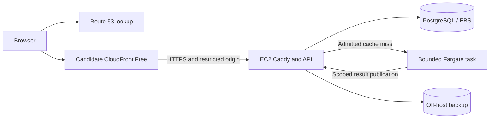

# R1 — AWS economics and topology

**9 September 2026. Evidence and decision forks; no infrastructure deployed.** The accepted EC2 budget survives arithmetic review, but its public-app capacity remains unproved. The strongest new lead is CloudFront's current Free plan. A serverless API with DynamoDB also deserves comparison: the earlier $85–$100 Fargate/ALB/RDS bundle is not the minimum cost of an AWS public application.

## Verification boundary

Root fetched origin before assigning this lane. Independently read HEAD and `origin/main`: both `e87e8a73b9857e022daefab150023a7a6a6be374`, committed `2026-09-07T17:45:56+02:00`. Root owns the remote-fetch and PR-sweep evidence; this lane did not change the checkout. Platform docs are **untracked working-tree material**, not content proved by that commit. Application changes were preserved. The requested Swiss-cheese skill supplied the R1 method.

✅ means freshly verified fact/arithmetic; ⚠️ means provisional choice/model; 🔍 requires implementation/account evidence. Sources were official web documentation, the selected-region EC2 pricing UI, and public AWS meter feeds discovered from the pricing pages' markup and published widget code. Initial DNS/feed-format failures were resolved: final feed retrieval succeeded. No AWS account, invoice or secrets were accessed.

[Saved price records](evidence/economics/aws-price-feed-records.json) include exact rate codes, retrieval times and AWS publication manifests. EBS was published `2026-09-09T00:46:05Z`; RDS `2026-09-04T17:27:16Z`. [Independent calculations](evidence/economics/recalculated-costs.json) are models, not measurements.

Input SHA-256 fingerprints:

| Input                            | SHA-256                                                            |
| -------------------------------- | ------------------------------------------------------------------ |
| `aws-baseline.md`                | `60fc6af9b26842b7d31c8dbb3716aa0be1fd47617eee34a0ccf39f0c7cfff0a2` |
| `ci-cd-and-costs.md`             | `04033c3a77b78417a0392410136e28f792faf7b2c14840432e595eac296cf72b` |
| `infrastructure-and-delivery.md` | `77e89cb18e438bb3bb07968a3c73aa99b682fc6da7d1da913a76cb6ad591ee3b` |
| `vps-first.md`                   | `6b9b151206ddaee0562a031409a06b01d6c772aa0a6ba4d63ecd5434a2767a63` |
| `docs/platform/README.md`        | `73b4cfb1034d7ccee6a9f2c8e3090914a3506cdcf85a92339825a80ade51401a` |
| Root `README.md`                 | `75d470a4f98f58d2d301666c7a293b01bd43407effbab1be2f435882d54d9262` |

## The accepted baseline

USD, N. Virginia, Linux on-demand, 730 hours/month; tax, currency conversion, promotional credits and operator time excluded. A 31-day month has 744 hours: 730 is an averaging convention.

| Item                                 | Independently checked calculation      |         USD/month |
| ------------------------------------ | -------------------------------------- | ----------------: |
| EC2 `t4g.small`                      | 730 × $0.0168                          |            12.264 |
| gp3 EBS, 30 GB total root + data     | 30 × $0.08                             |             2.400 |
| One public IPv4                      | 730 × $0.005                           |             3.650 |
| Route 53                             | One $0.50 zone + 100k standard queries |             0.540 |
| **Priced core**                      |                                        |        **18.854** |
| Backups/domain/logs/storage/headroom | Existing unmeasured allowances         |           **3–8** |
| **Modeled total**                    |                                        | **21.854–26.854** |

✅ Rates: [EC2](https://aws.amazon.com/ec2/pricing/on-demand/), [EBS](https://aws.amazon.com/ebs/pricing/), [IPv4](https://aws.amazon.com/vpc/pricing/), [Route 53](https://aws.amazon.com/route53/pricing/). The 30 GB is paid provisioned capacity, not a free allowance. It must include the root volume; adding 30 GB data plus root changes the bill. Image layers, retained releases, imports, indexes/WAL and recovery space need a disk test. gp3 includes 3,000 IOPS/125 MB/s, subject to instance limits; extra provisioning costs more.

✅ **The CPU trap:** small and medium both earn 24 credits/hour, with a 20% baseline per vCPU: about 0.4 aggregate sustained vCPU. Medium doubles RAM, not baseline CPU. Unlimited defaults apply unless changed. Sustaining both vCPUs at 100% adds approximately `(2 − 0.4) × 730 × $0.04 = $46.72/month` after credit accounting settles. Standard avoids this surplus meter by restricting sustained performance. [T4g specifications and modes](https://aws.amazon.com/ec2/instance-types/t4/)

⚠️ Two GiB for OS, Docker/SSM, Caddy, API/auth, importer and PostgreSQL is a candidate, not demonstrated capacity. [Package dependencies](../../../package.json) and [current CI](../../../.github/workflows/ci.yml) prove a browser application, not the proposed server. Test mixed sign-in/hash work, imports, library queries, backups and deployment overlap after credit exhaustion; inspect OOM/swap, available memory, p95 latency, credits, connections and WAL/disk peaks.

✅ Official EC2 UI rates were checked with Linux selected: N. Virginia small/medium $0.0168/$0.0336; Cape Town $0.0217/$0.0434. The EBS feed gives Cape Town gp3 $0.1047/GB-month. Thus N. Virginia medium core is **$31.118**; Cape Town small core is **$23.172**. Same allowances imply **$34.12–$39.12** and **$26.17–$31.17** respectively. These are price sensitivities, not latency results or full regional invoices.

## CloudFront Free is a material new option

✅ Free is $0/distribution/month, with 1 million requests, 100 GB transfer, five WAF rules and 5 GB S3 storage credit. It can cover attached Route 53 standard charges. The value is cached engine delivery and selected edge protection, not merely removing $0.54 DNS. [Pricing matrix](https://aws.amazon.com/cloudfront/pricing/)

Free permits five cache behaviors but lacks custom caching/origin/response policies, private VPC origins, advanced DDoS, SLA and paid-plan logging. Allowances are not hard stops: sustained excess can cause delivery-performance adjustments; historical usage affects eligibility. Uncovered services still cost money. [Plan contract](https://docs.aws.amazon.com/AmazonCloudFront/latest/DeveloperGuide/flat-rate-pricing-plan.html)



⚠️ Keep this candidate provisional until exact-plan managed `CachingDisabled`/origin forwarding, two-user isolation, revocation and Terraform subscription ownership work. CloudFront origin ranges alone admit other distributions: require distribution-specific origin authorization and test direct-IP/second-distribution bypass. Prove origin TLS renewal after locking ingress. The [security report](r1-platform-security.md) details these gates. [Custom-origin header mechanism](https://docs.aws.amazon.com/AmazonCloudFront/latest/DeveloperGuide/add-origin-custom-headers.html)

## Reproducing the expensive bundle

✅ This **selected topology** recalculates as follows; it is not an AWS/Fargate minimum:

| Item                             | Calculation                                 |             USD/month |
| -------------------------------- | ------------------------------------------- | --------------------: |
| Fargate x86 0.5 vCPU/1 GB        | 730 × (0.5 × $0.04048 + $0.004445)          |              18.02005 |
| Task IPv4                        | 730 × $0.005                                |                  3.65 |
| ALB + two modeled IPv4 addresses | 730 × ($0.0225 + 2 × $0.005)                |                23.725 |
| RDS PG small + 20 GB gp3         | 730 × $0.032 + 20 × $0.115                  |                 25.66 |
| DNS                              | Existing model                              |                  0.54 |
| **Core**                         |                                             |          **71.59505** |
| PAYG WAF                         | ACL $5 + two rules $2 + 100k requests $0.06 |                  7.06 |
| ALB usage                        | 0–1 average LCU × 730 × $0.008              |                0–5.84 |
| Ancillary allowance              | Unmeasured                                  |                  5–10 |
| **Modeled total**                |                                             | **83.65505–94.49505** |

[Fargate](https://aws.amazon.com/fargate/pricing/), [ALB](https://aws.amazon.com/elasticloadbalancing/pricing/), [RDS](https://aws.amazon.com/rds/postgresql/pricing/), [WAF](https://aws.amazon.com/waf/pricing/). Two ALB addresses are a modeled small deployment, not a scaling cap; LCU uses the largest relevant dimension. RDS is Single-AZ. CloudFront Free challenges a blanket “WAF adds $7” assumption.

Public-subnet Fargate IPv4 with outbound routing is documented; NAT is not inherent. One NAT gateway plus IPv4 is **$36.50/month** before processing, with the displaced task-IP cost considered separately. HTTP API lacks direct WAF association; REST supports it. Shield Standard is included; Shield Advanced's $3,000 monthly example is outside this budget. [Networking](https://docs.aws.amazon.com/AmazonECS/latest/developerguide/fargate-task-networking.html), [VPC pricing](https://aws.amazon.com/vpc/pricing/), [API differences](https://docs.aws.amazon.com/apigateway/latest/developerguide/http-api-vs-rest.html), [Shield](https://aws.amazon.com/shield/pricing/)

## Useful work per dollar

✅ Current exact Fargate meters yield **$1.0874** for 20 x86 task-hours at 1 vCPU/2 GB with IPv4; ARM gives **$0.89**. The existing $1.087408 uses rounded per-second examples; cents are unchanged. Neither is a depth/game-count promise. [Saved meters](evidence/economics/aws-price-feed-records.json)

Fargate bills image download through termination, per second with a one-minute Linux minimum; 20 GB temporary storage is included. IPv4 has its own per-second/60-second minimum; actual allocation timestamps need reconciliation. Every Linux task pulls images without cross-task layer caching. [Billing](https://aws.amazon.com/fargate/pricing/), [IPv4](https://aws.amazon.com/vpc/pricing/), [pull behavior](https://docs.aws.amazon.com/AmazonECS/latest/developerguide/fargate-pull-behavior.html)

```mermaid
sequenceDiagram
  participant API as Coordinator
  participant DB as Durable results/jobs
  participant ECS as Fargate
  API->>DB: Authorized compatible-result lookup
  alt Hit
    DB-->>API: Retained result
  else Miss
    API->>DB: Reserve cost and claim generation
    API->>ECS: Idempotent launch
    ECS->>ECS: Pull, start, bounded batch
    ECS->>API: Scoped publication and settlement
    ECS->>ECS: Exit; independent reaper handles overdue work
  end
```

⚠️ The [root calculator](../../../scripts/research-worker-economics.mjs) labels its startup assumption and batching/cache sensitivities. A 0.4-second one-root task can hit a 60-second billing floor: 150× productive time. It is a model, not an AWS benchmark.

GHCR storage/bandwidth is currently free. Same-region ECR pulls are free, with private storage $0.10/GB-month: a 2 GB retained image set costs $0.20/month. IAM/proximity may justify that cost; measure pulls and credential operations before selecting the registry. Fargate Spot can interrupt with two minutes' notice and does not automatically fall back to on-demand; at a $1.09 initial allowance, extra complexity can outweigh savings. [GHCR](https://docs.github.com/en/billing/concepts/product-billing/github-packages), [ECR](https://aws.amazon.com/ecr/pricing/), [Spot](https://docs.aws.amazon.com/AmazonECS/latest/developerguide/fargate-capacity-providers.html)

## The serverless fork deserves a fair trial

⚠️ Candidate: CloudFront/S3 browser app, Cognito, Lambda API/import coordination, DynamoDB owner/library/job manifests, S3 immutable payloads, optional Fargate. This could preserve public accounts/library and AWS learning while removing idle EC2. It requires an equally strong replacement for the planned SQL/RLS/queue contracts.

| Illustrative monthly meter                                                            |          USD |
| ------------------------------------------------------------------------------------- | -----------: |
| 100k Lambda requests, 512 MB, 200 ms average billed duration including initialization |     0.186667 |
| 100k HTTP API calls                                                                   |         0.10 |
| DynamoDB 200k read units + 50k write units                                            |      0.05625 |
| 5 GB DynamoDB at $0.25/GB before storage free allowance                               |         1.25 |
| 5 GB PITR at $0.20/GB                                                                 |         1.00 |
| **Priced scenario subtotal**                                                          | **2.592917** |

[Lambda](https://aws.amazon.com/lambda/pricing/), [HTTP API](https://aws.amazon.com/api-gateway/pricing/), [DynamoDB](https://aws.amazon.com/dynamodb/pricing/). **Not a complete app quote:** domain, artifacts/operations, logs, mail, independent backups and orchestration remain unpriced. Units already incorporate metering; transactions, item sizes, indexes and scans change them. Cognito direct/social Essentials has a 10k-MAU free allowance; federation/mail differ. SES starts $0.10/1,000 outbound messages before data/add-ons. [Cognito](https://aws.amazon.com/cognito/pricing/), [SES](https://aws.amazon.com/ses/pricing/)

Next experiment: one account, durable import, indexed library query, deletion/revocation and atomic analysis reservation, with a full billable trace. DynamoDB's 400 KB item limit means graph artifacts must be chunked/external. Lambda's 900-second ceiling and memory-proportional CPU constrain imports; attaching it to a DB VPC can reintroduce NAT. [DynamoDB limits](https://docs.aws.amazon.com/amazondynamodb/latest/developerguide/Constraints.html), [Lambda limits](https://docs.aws.amazon.com/lambda/latest/dg/gettingstarted-limits.html)

Aurora DSQL is another real scale-to-zero lead ($8/million DPU and $0.33/GB in published examples), but current docs explicitly lack RLS. SQL compatibility is not equivalent to satisfying our authorization/queue design; workload DPU consumption is unmeasured. [DSQL pricing](https://aws.amazon.com/rds/aurora/dsql/pricing/), [RLS limitation](https://docs.aws.amazon.com/aurora-dsql/latest/userguide/create-view.html)

## CI and lifecycle

✅ Only `ci.yml` currently exists under `.github/workflows`: read-only PR/main/manual checks, 15-minute timeout, seven-day failure artifacts. The historical live 129-second run was not independently refreshed in this lane. Root owns GitHub live verification.

Public standard hosted runners remain free; private owner-wide Free/Pro/Team allowances are 2k/3k/3k minutes. Linux x64/ARM64 overage is $0.006/$0.005 per minute. Existing scenarios correctly yield 1,720 minutes/no overage, or 5,320 minutes/$13.92 excess with 3k available, or $31.92 without allowance. Storage is separate. [Actions billing](https://docs.github.com/en/billing/concepts/product-billing/github-actions), [rates](https://docs.github.com/en/billing/reference/actions-runner-pricing)

✅ GitHub AWS OIDC requires exact audience/subject; repositories created after 15 July 2026 or opted in include immutable owner/repository IDs. The actual claim needs implementation verification. [OIDC](https://docs.github.com/en/actions/how-tos/secure-your-work/security-harden-deployments/oidc-in-aws)

⚠️ Staging shutdown is not total cleanup: retained disks/IPs/logs/backups persist. ALB partial hours round up; Route 53 zone fees are monthly, with a conditional under-12-hour test exception. Reaper, recovery testing, actual domain price and regional tax remain separate inputs. Budget alerts are not admission enforcement.

## Claims and next-round gates

Locations reference the fingerprinted inputs.

| ID  | Input location/claim                                 | Verdict and next evidence                                                                                                              |
| --- | ---------------------------------------------------- | -------------------------------------------------------------------------------------------------------------------------------------- |
| E01 | `aws-baseline.md:25–34`, $22–$27                     | ✅ Rates/math; ⚠️ allowances need retained-byte/traffic model                                                                          |
| E02 | `aws-baseline.md:13`, small capacity                 | 🔍 Sustained credit-exhausted memory/load/restore test                                                                                 |
| E03 | `aws-baseline.md:38`, medium upgrade                 | ✅ +$12.264; same baseline CPU, only RAM doubles                                                                                       |
| E04 | `aws-baseline.md:15`, 30 GB                          | ✅ Total includes root; 🔍 disk sufficiency unproved                                                                                   |
| E05 | `aws-baseline.md:40`, Standard                       | ✅ Mechanism; 🔍 actual credit setting                                                                                                 |
| E06 | `aws-baseline.md:49–58`, task price/envelope         | ✅ Cents; ⚠️ launch, retry, reaper and IP-timing implementation                                                                        |
| E07 | `aws-baseline.md:68`, no NAT                         | ✅ Supported mechanism; 🔍 final connectivity/permissions                                                                              |
| E08 | `aws-baseline.md:70`, paid edge later                | ⚠️ Revisit CloudFront Free; exact plan, origin/TLS/cache gates                                                                         |
| E09 | `aws-baseline.md:82`, Valkey ~$6                     | ✅ $0.084 × 0.1 GB × 730 = $6.132 before processing; correctly deferred. [Price](https://aws.amazon.com/elasticache/pricing/)          |
| E10 | `ci-cd-and-costs.md:64`, $85–$100                    | ✅ Selected model reproduced; not AWS minimum                                                                                          |
| E11 | `ci-cd-and-costs.md:129–149`, CI                     | ✅ Terms/math; 🔍 actual owner allowance/build times                                                                                   |
| E12 | `ci-cd-and-costs.md:13`, latest run                  | ⚠️ Root's live GitHub evidence needed                                                                                                  |
| E13 | `aws-baseline.md:86`, OIDC                           | ✅ Exact subject needed; 🔍 actual immutable-ID format                                                                                 |
| E14 | `infrastructure-and-delivery.md:115–120`, CPU sizing | ⚠️ Ceilings, not throughput; root sensitivity model                                                                                    |
| E15 | `vps-first.md:29–37`, Lightsail                      | ✅ $7/$12/$24 for 1/2/4 GB; 🔍 sizing. [Bundles](https://docs.aws.amazon.com/lightsail/latest/userguide/amazon-lightsail-bundles.html) |
| E16 | Root `README.md:87`, $25 target                      | ✅ Honest target, not cap or capacity guarantee                                                                                        |
| E17 | New serverless option                                | ⚠️ Promising unit economics; complete-cost and domain-contract experiment                                                              |
| E18 | Cape Town fits $25                                   | ⚠️ Core $23.172; same allowances imply $26.17–$31.17                                                                                   |

R1 ends here. R2 should attack host capacity, the exact free-edge security/configuration contract, and whether a serverless vertical slice preserves the full product requirements. No unrun experiment was used to declare a provider winner.
