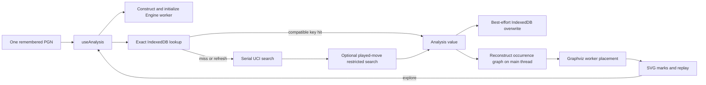
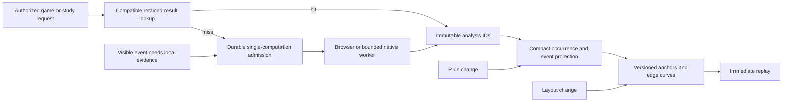

# R1 — Engine, retained work and diagram economics

**Finding:** persistent studies should retain analysis, compact semantic data and placed geometry separately. Redis is not required to avoid repeating Stockfish. The current browser cache already skips searches, but still initializes an engine and reconstructs a potentially multi-megabyte graph. More depth alone does not supply the local evidence needed to classify interior tactical events.

This is the bounded engine/cache lane of Swiss-cheese **R1**, not a completed platform design, a capacity certification or an implementation. It stops before R2. Source code was not edited. Proposals and unrun experiments below remain provisional.

## Verification boundary

Verified locally: `HEAD == origin/main == e87e8a73b9857e022daefab150023a7a6a6be374`, commit date `2026-09-07T17:45:56+02:00`. The parent performed the successful origin fetch, confirmed zero ahead/behind, and verified PR #5's merged SHA through the GitHub connector; this lane independently checked both refs and the commit date. No checkout/reset was performed over the user's dirty worktree. Research date: 9 September 2026.

All `src/lib` engine/graph files cited below match that commit. The four platform documents are **untracked current proposals**, so their claims are pinned by content hash, not attributed to the commit. Existing Tal work was preserved. The full [source manifest](evidence/engine/source-manifest.json) records 46 file hashes and the complete searches used for absence claims.

| Snapshot                                       | SHA-256                                                            |
| ---------------------------------------------- | ------------------------------------------------------------------ |
| `src/lib/engine.ts`                            | `94ea15e1a1547cb71a350e77ea221a4ec8a7bfc0d3cb0e5c9cdd6fce04ad53d8` |
| `src/lib/evolution.ts`                         | `bcbdfde4f8964762bd6234b5e4d5470d1f8e727c77fb8b136c4d3cb0503fe66f` |
| `src/lib/evolutionLayout.ts`                   | `5a09cecffaa5a55210e6f1c5b497d2639357964c1893e96cb8fbf1b5ab7705f6` |
| `docs/platform/README.md`                      | `73b4cfb1034d7ccee6a9f2c8e3090914a3506cdcf85a92339825a80ade51401a` |
| `docs/platform/data-and-analysis.md`           | `a3d60f2395865f06fa7847bf480854ae1f10cb6614b42b721859351f23aa5ab3` |
| `docs/platform/aws-baseline.md`                | `60fc6af9b26842b7d31c8dbb3716aa0be1fd47617eee34a0ccf39f0c7cfff0a2` |
| `docs/platform/infrastructure-and-delivery.md` | `77e89cb18e438bb3bb07968a3c73aa99b682fc6da7d1da913a76cb6ad591ee3b` |
| Modified `src/components/GameImporter.tsx`     | `3478e49b096efdbff119d950562ce3756442891c300f35c6c34e6e5d75da352c` |
| Untracked `src/lib/studyGames.ts`              | `01a8ddc2051081d81cd41a7f6b5e327e1b0c1cbd2dd5369ef840d31241725587` |

Evidence labels: **✅ verified** means direct current code, a completed probe or fresh primary source; **❌ false** means contradicted by that evidence; **△ conditional** means true only under stated conditions; **◇ proposed** means documented but not implemented; **🔍 experiment** means the decision needs measurement. These labels do not turn a mocked engine into an engine-quality benchmark.

## Ranked findings

1. **Cache the graph's construction, not only its layout.** Fresh reconstruction from frozen inputs produced 2.07–5.22 MB of graph JSON for the four Tal/control games, compared with 12.6–25.4 KB of saved compressed game/analysis. The retained root rerun spent 2.353–4.223 seconds constructing those graphs, then 95–372 ms laying them out. These are Mac SSR observations, not browser p95 or EC2 capacity; the first lane run and root rerun matched semantic counts, dimensions and serialized sizes exactly, with different timings. `EvolutionBuilder.append` replays full histories, creates positions and scans accumulated contributions; it runs from the React hook, before work is sent to the Graphviz worker. A layout-only cache would leave substantial work in place. Evidence: `evolution.ts:35–100`, `useAnalysis.ts:67–87`, [graph probe](evidence/engine/graph-probe.json).
2. **The cache is disposable acceleration, not saved research.** Browser reopening recovers exact root searches, reconstructs the graph and discards prior exploration state. Branch exploration explicitly refreshes the search; the same key is overwritten. Eviction uses ascending key order, so a newly computed entry can be immediately removed at the threshold. Retained studies need immutable result IDs, reference-aware garbage collection and a separate hot-cache policy. Evidence: `engine.ts:70–94,163–171,235–245`, `useAnalysis.ts:23–31,45–81`, `GameWorkbench.tsx:33–45`, [cache probe](evidence/engine/cache-probe.json).
3. **The main fidelity gap is often evidence placement, not root depth.** In the rebuilt Botvinnik–Tal map, 390 glyphs contain a check, 373 contain an unassessed check, and only 14 contain a locally supported one. In the retained Deep Blue depth-20 input, 119 of 124 check-containing glyphs still contain an unassessed check. These are predicates over merged glyph members, not a guaranteed disjoint partition. Interior PV nodes do not inherit a meaningful local score from the root. Selectively analysing the parents of visible checks is a more directly targeted experiment than raising every played root to a larger depth. Evidence: `semantics.ts:20–33`, `evolution.ts:93–100`, graph probe.
4. **Sharing sibling analysis separately from played-move coverage is a concrete reuse opportunity.** The current key includes `playedMove`, although that parameter does not change the first unrestricted MultiPV search. Two games that share a prefix and then diverge can rerun identical sibling work. A base sibling result plus separately keyed restricted fallback can preserve the retention rule while sharing more work. Four frozen games contain only 262 roots: current exact identities produce 261 keys; removing played-move annotation from the sibling identity produces 258. That is evidence of the mechanism, not a claim of a large lifetime hit rate. Evidence: `engine.ts:42,186–188,228–240`, both probes.
5. **Concurrency must be designed before a shared service exists.** Two separate Engine instances requesting the same missing key each searched. Direct concurrent calls on one Engine overwrote its single listener; one promise had not settled when observed after 50 ms. The current hook serializes engine calls, so this does not establish a present UI race. It does establish that the class is not a safe concurrent provider API. Hosted job joining belongs in durable admission/publication logic; a Redis lock alone does not supply it. Evidence: `engine.ts:98–101,134–154,197–227`, `useAnalysis.ts:46–88`, cache probe.
6. **A lifetime atlas is a separate projection, not a larger single-game SVG.** The current runtime has no atlas aggregation/query implementation. It loads one game, with only `/paper` separately routed. The proposed 24-ply index, 250 visible nodes, exact encounter counts and 100,000-game test corpus remain design hypotheses. None of the single-game measurements proves them. Evidence: `App.tsx:11–58`, `games.ts:73–82`, entire source searches in the manifest, `data-and-analysis.md:145–157`, `infrastructure-and-delivery.md:122`.

## What happens today



The startup and lookup branches overlap; a cache hit does not wait for engine readiness but the constructor has already started the worker. Replay changes visibility and selection rather than rerunning Stockfish or Graphviz on every move. When new analysis is published, placement uses an additional stability heuristic: keep existing anchors/edges and route new edges locally after a full DOT run. Therefore “Graphviz handles all incremental geometry” would be inaccurate. `evolutionLayout.ts:220–269` and `unfold.ts:6–42` establish the extra local layout stage.

### Cache/search load-bearing claims register

| ID  | Claim and verdict                                                                                                                                        | Exact evidence / implication                                                                                                                                                                                                                                                                                                                                                                   |
| --- | -------------------------------------------------------------------------------------------------------------------------------------------------------- | ---------------------------------------------------------------------------------------------------------------------------------------------------------------------------------------------------------------------------------------------------------------------------------------------------------------------------------------------------------------------------------------------- |
| C01 | ✅ The shipped browser engine is Stockfish 18.0.8 lite single-thread.                                                                                    | `engine.ts:4,103–123`; `scripts/prepare-engine.mjs:5–9`; `package.json:31–36`. The upstream wrapper describes lite as smaller and weaker than the full build; full/native equivalence is not established. [Wrapper primary source](https://github.com/nmrugg/stockfish.js/blob/master/README.md).                                                                                              |
| C02 | ✅ Stockfish search/evaluation uses CPU, not a GPU.                                                                                                      | [Official FAQ](https://official-stockfish.github.io/docs/stockfish-wiki/Stockfish-FAQ.html#can-stockfish-use-my-gpu). A GPU-oriented alternative is a separate engine/provider decision.                                                                                                                                                                                                       |
| C03 | ✅ Quick 400 ms; exploration 1,800 ms; study 60,000 ms; requested depth 20; MultiPV 8.                                                                   | `engine.ts:5–8`, `useAnalysis.ts:67–81`. These are ceilings/configuration, not guaranteed achieved depth.                                                                                                                                                                                                                                                                                      |
| C04 | ✅ A time-limited depth-20 request may return depth 12 and that partial result is reused.                                                                | `engine.ts:163–171,213–224`; cache probe `partialCacheHit`. UCI stops at the first applicable limit. [Official UCI documentation](https://official-stockfish.github.io/docs/stockfish-wiki/UCI-Protocol-and-Stockfish-Commands.html#go).                                                                                                                                                       |
| C05 | ❌ Reported depth is not a uniformly explored tree or a guarantee of 20 returned PV plies.                                                               | `evolution.ts:48,76–77`; [Stockfish depth explanation](https://official-stockfish.github.io/docs/stockfish-wiki/Stockfish-FAQ.html#what-is-depth). Pruning/extensions make the tree selective; display truncation is independent.                                                                                                                                                              |
| C06 | ✅ The current key contains initial FEN, full UCI history, time, requested depth, MultiPV mode, played move, restriction and manual engine/schema label. | `engine.ts:36–42`. Identical four-field boards with different histories do not share this key.                                                                                                                                                                                                                                                                                                 |
| C07 | ◇ The full binary/NNUE/architecture/rules manifest is proposed, not stored by the adapter.                                                               | Proposed `data-and-analysis.md:89–97`; actual `engine.ts:42`, `types/game.ts:34–42`. Nodes, selective depth, engine-reported time and hash occupancy are also not retained.                                                                                                                                                                                                                    |
| C08 | ✅ Same-depth MultiPV selection avoids mixing an incomplete higher iteration into sibling comparisons.                                                   | `engine.ts:192–225`; `scoreBands.ts:15–24`, `evolutionLayout.ts:167–170`. Existing unit test is a UCI double, not a Stockfish quality trial.                                                                                                                                                                                                                                                   |
| C09 | △ Played fallback targets the main search's achieved depth, but can itself stop early.                                                                   | `engine.ts:235–243`; mismatched cached fallback is rejected at `169`. Chart/width comparisons filter mismatched depth. The graph may still retain its legal path; that does not make its score comparable.                                                                                                                                                                                     |
| C10 | ✅ Missing played move uses a restricted search and rank 9 is a sentinel.                                                                                | `engine.ts:236–242`, `types/game.ts:36`; exact rank outside the eight candidates remains unknown.                                                                                                                                                                                                                                                                                              |
| C11 | ✅ History is replayed before terminal detection and sent to Stockfish.                                                                                  | `engine.ts:173–185,228–230`; `games.ts:19–25`. Terminal results are marked complete without search, but worker initialization still happens first.                                                                                                                                                                                                                                             |
| C12 | ❌ “Cached reopen needs no worker” is false today.                                                                                                       | `useAnalysis.ts:45`; `engine.ts:103–126`; cache probe observed initialization and zero `go` commands on a hit.                                                                                                                                                                                                                                                                                 |
| C13 | △ “3,000-entry cache” describes a successful-transaction count bound, not a byte budget, LRU or durable archive.                                         | `engine.ts:70–94`: after crossing 3,000, remove ascending keys down to 2,800. The real IndexedDB probe evicted the newly written key. [IndexedDB cursor ordering](https://w3c.github.io/IndexedDB/#cursor-direction).                                                                                                                                                                          |
| C14 | ✅ Refresh overwrites an exact key; old results are not versioned.                                                                                       | `engine.ts:76,168,245`; cache probe `refreshTwice` observed two searches and one entry.                                                                                                                                                                                                                                                                                                        |
| C15 | △ Writes are best effort and not acknowledged at transaction commit.                                                                                     | `writeAnalysis` has no `oncomplete`/`onabort` await; `engine.ts:70–94`. The returned result remains usable, but this code cannot back a “saved safely” indicator. Storage failure durability was not fault-injected.                                                                                                                                                                           |
| C16 | ❌ Simultaneous matching work is not coalesced.                                                                                                          | Two-instance real-IDB/mock-UCI probe searched twice; single-listener class has no queue. Entire relevant surface search found no shared worker, browser lock or in-flight map. Production hook serial execution remains intact.                                                                                                                                                                |
| C17 | ✅ Reopening and switching profiles rebuilds workbench state.                                                                                            | `App.tsx:23–29,58`; `GameWorkbench.tsx:17–24`; `useAnalysis.ts:8,23,45–81`. Branch paths/bookmarks are not a saved study.                                                                                                                                                                                                                                                                      |
| C18 | ✅ The source graph and engine histories remain separate from display merging.                                                                           | `evolution.ts:11–18,43–74`; `evolutionLayout.ts:27–69,130–156`; `semantics.ts:48–51`. Four-field aliases are display equivalence, not search identity.                                                                                                                                                                                                                                         |
| C19 | ◇ Durable engine/semantic/placed representations, job joining and Redis deferral are coherent proposals.                                                 | `data-and-analysis.md:99–119`, `aws-baseline.md:72–82`. No runtime backend/Redis implementation was found across the complete application surface. SQL, tenant isolation, crash recovery and reuse policy still need implementation evidence.                                                                                                                                                  |
| C20 | 🔍 Exact key does not prove bit-for-bit regeneration from a fresh search.                                                                                | No `ucinewgame`/`Clear Hash` is sent; an Engine retains search state across roots, and search uses time limits. [UCI state/reset documentation](https://official-stockfish.github.io/docs/stockfish-wiki/UCI-Protocol-and-Stockfish-Commands.html#ucinewgame). Record completed result IDs and warm/cold benchmark policy; do not label a recomputation identical solely because inputs match. |

## Diagram and lifetime claim register

The paper specifies retained candidate sequences, merging, shortening and visual marks, but does not publish a complete executable classifier or reproduction manifest. Its depth-20 recipe retains four through nine sequences based on the played move's rank; event handling and layout parameters contain ambiguities. Our code's 50 cp “supported check” proxy is explicitly an adaptation. The paper describes benefit through effective checks, not merely the presence of a `+` in a PV. Its Figure 2 caption preserves event neighbours, while finished figures motivate the repository's event-chain policy. Exact quantitative reproduction is therefore not established by matching a weight ratio. [Original author manuscript, §§3–3.2, Figures 2–3](https://people.cs.nycu.edu.tw/~yushuen/data/ChessVis14.pdf).

| ID  | Claim and verdict                                                                                     | Exact evidence / implication                                                                                                                                                                                                                                                                                      |
| --- | ----------------------------------------------------------------------------------------------------- | ----------------------------------------------------------------------------------------------------------------------------------------------------------------------------------------------------------------------------------------------------------------------------------------------------------------- |
| D01 | ✅ Candidate retention follows the four-to-nine pattern, with a separate fallback.                    | `semantics.ts:5–11`; `evolution.ts:39–48`. This is not all legal moves or the full engine search tree.                                                                                                                                                                                                            |
| D02 | ✅ Visual rules are explicit application code, not supplied by Graphviz.                              | `semantics.ts:20–60`, `EvolutionMarks.tsx:78–113,149–218`; quality width is locally normalized, compressed strokes fixed, shapes/turn borders distinct.                                                                                                                                                           |
| D03 | △ “Effective check” is not proven by the current classifier.                                          | `semantics.ts:17–33` only checks competitiveness within 50 cp when same-depth siblings exist. `GameWorkbench.tsx:42` defaults to retained-check mode; `EvolutionMarks.tsx:29–30` and `eventFill` can highlight unassessed checks. Legally checking, locally supported and forced concession are different claims. |
| D04 | ✅ Mate/draw evidence is occurrence based; merged display glyphs may be draw related.                 | `games.ts:22–25`, `evolution.ts:49,76`, `EvolutionMarks.tsx:50–52`; do not use grey fill to stop every history passing through the shared board.                                                                                                                                                                  |
| D05 | △ Existing DOT settings are measurable heuristics, not the paper's exact solver configuration.        | `evolutionDot.ts:18–32,54`: LR, `.04` nodesep, `.16` ranksep, 50/10 weights. [Graphviz weight](https://graphviz.org/docs/attrs/weight/) and [rank separation](https://graphviz.org/docs/attrs/ranksep/) document the actual controls.                                                                             |
| D06 | ✅ The default does not enforce ordered mirrored fans.                                                | `evolutionDot.ts:18,43–50` computes the alternate ordering but uses it only when `orderFans` is true. [Graphviz ordering](https://graphviz.org/docs/attrs/ordering/) makes this a constraint, not an aesthetic suggestion.                                                                                        |
| D07 | ✅ Repeated layout keeps published geometry through additional application logic.                     | `evolutionLayout.ts:125–127,220–269`; previous anchors and edges survive, new curves can be local cubic fallbacks. It is not guaranteed globally optimal after arbitrary expansion.                                                                                                                               |
| D08 | ✅ Whole-game graph construction, Graphviz placement and SVG painting are separate costs.             | `useAnalysis.ts:81–85`; `graphviz.ts:25–60`, worker `3–5`; graph probe. Off-main-thread Graphviz does not move `EvolutionBuilder.append` or React SVG traversal off the main thread.                                                                                                                              |
| D09 | △ The Graphviz wrapper has a 30-second failure bound, not a verified large-map service level.         | `graphviz.ts:45–53`; timeout terminates worker and rejects all pending layouts. Size/p95/memory limits for mobile or lifetime chunks remain unmeasured.                                                                                                                                                           |
| D10 | ✅ Layout changes can alter appearance substantially without new engine work.                         | Botvinnik frozen-input ablation below; no image-fidelity or user-comprehension judgement was measured. More glyphs did not imply monotonically larger height.                                                                                                                                                     |
| D11 | ◇ Played-prefix lifetime aggregation is a plausible separate model.                                   | `data-and-analysis.md:145–157`, `README.md:49–61`; current runtime is one-game only. Counts must attach to encounters, not distinct move blobs or board visits.                                                                                                                                                   |
| D12 | ◇ A bounded neighbourhood needs a navigation/aggregation contract, not just a 250-node cap.           | `data-and-analysis.md:155–157` proposes 24 plies and 250 nodes. No chunk joins, breadcrumb/minimap, cache invalidation or contribution update implementation is present. Test exact denominators under deletion/correction and transposition before promoting.                                                    |
| D13 | △ Graphviz/SVG suitability for 1,000 users or 100,000 games is unmeasured.                            | `infrastructure-and-delivery.md:84–94,122,138` states targets/design forks. Frozen single-game data does not establish these capacities.                                                                                                                                                                          |
| D14 | ✅ The local saved Tal numbers are payload evidence, not cloud compute evidence.                      | Four compressed files sum to 71,635 bytes; saved measurements report 262 roots and 128,184 ms historical application elapsed time. Fresh probe validates input sizes and rebuilds geometry, not historical CPU utilization.                                                                                       |
| D15 | 🔍 Browser-native adapter quality, native thread scaling and budget-to-depth curves are unknown here. | The adapter uses lite/single at fixed Hash 32; no fresh native/Fargate/ARM quality or load benchmark ran. `README.md:119–121`, `infrastructure-and-delivery.md:102–120` must remain conditional.                                                                                                                  |

### Frozen input reconstruction

Generated using the current production builder, Graphviz WASM through SSR, and the real SVG marks component. The JSON below excludes the redundant `byId` map but retains occurrence histories, paths and continuations. It is not an optimized interchange codec. Times are deliberately not projected onto AWS.

| Input                    | Roots | Actual depth min/median/max | At target 20 | Saved input gzip |     Graph JSON / gzip | Visible glyphs |
| ------------------------ | ----: | --------------------------- | -----------: | ---------------: | --------------------: | -------------: |
| Botvinnik–Tal            |    94 | 11 / 14 / 19                |            0 |         25,436 B | 5,218,002 / 407,659 B |          1,315 |
| Tal–Larsen               |    74 | 11 / 13 / 18                |            0 |         19,825 B | 3,483,902 / 293,132 B |            976 |
| Tal–Smyslov              |    52 | 10 / 14 / 20                |            1 |         13,766 B | 2,073,091 / 191,595 B |            684 |
| Indigojeans–GM Shadi     |    42 | 11 / 13 / 17                |            0 |         12,608 B | 2,373,639 / 223,571 B |            619 |
| Deep Blue retained study |    90 | 20 / 20 / 20                |           90 |         33,048 B | 6,971,631 / 519,140 B |          1,052 |

These are count/serialization measurements, not claims that a larger graph is better. The full [graph evidence](evidence/engine/graph-probe.json) includes SHA-256 for every frozen input, SVG sizes, local timings, fallback coverage and check predicates.

| Botvinnik–Tal policy; same saved candidates  | Visible glyphs | Diagram width × height | New engine searches |
| -------------------------------------------- | -------------: | ---------------------- | ------------------: |
| Current event compression + position merging |          1,315 | 2607.1 × 802.3         |                   0 |
| Event compression + ply-specific merging     |          1,327 | 2625.9 × 471.8         |                   0 |
| Preserve event neighbours + position merging |          1,872 | 2701.1 × 630.8         |                   0 |
| Display only first 12 PV plies               |          1,120 | 2569.5 × 381.8         |                   0 |
| Display up to 30 existing PV plies           |          1,352 | 2607.1 × 660.8         |                   0 |

The 30-ply projection only uses continuations already returned; it invents no search coverage. The ablation demonstrates that engine horizon, retained topology and final geometry are distinct. A human visual comparison and task-based reading test are still required to choose a policy.

## Constructive alternatives to take into R2



This is **proposed**, not implemented. Owner/public namespace and execution trust must apply before lookup. A device result is not upgraded to trusted server evidence by legal PV validation. Reuse of a deeper result is a declared compatibility choice; an immutable old study remains pinned to the old result.

| Experiment / decision                                                      | Concrete implementation hypothesis                                                                                                                           | Falsification and stop condition                                                                                                                                                                                                                                                              |
| -------------------------------------------------------------------------- | ------------------------------------------------------------------------------------------------------------------------------------------------------------ | --------------------------------------------------------------------------------------------------------------------------------------------------------------------------------------------------------------------------------------------------------------------------------------------- |
| E01 `[experiment]` Save compact placed studies before adding Redis         | Store candidate result IDs plus parent/move-coded occurrences, event metadata, display aliases, anchors and curves. Restore without Engine construction.     | Compare cold reopen on three browsers to current build, including storage failure; require zero `go`, identical legal replay, identical selected paths and substantially lower p95 main-thread time. Reject a codec that loses repetition/clock history or costs more to decode than rebuild. |
| E02 `[experiment]` Split sibling search from played-move annotation        | One root/MultiPV result; restricted fallback only if played move absent; compose candidate retention at the study layer.                                     | For a repeated-prefix corpus, count actual prevented `go` commands; compare same-depth widths/chart and missing-played coverage exactly. Stop if sharing leaks owner data or silently compares mismatched depths. Four-game saving is only 3 additional sibling requests.                     |
| E03 `[experiment]` Analyse visible event parents first                     | Score a bounded queue of unassessed visible checks/contested junctions before spending another full-game depth pass. Use an explicit annotation budget.      | Equal allocated CPU budget against uniform deepening on Tal/control fixtures; measure locally assessed event coverage, score stability and blinded comprehension. Do not equate more coloured squares with better fidelity. Preserve “unknown” when budget expires.                           |
| E04 `[experiment]` Spend computation where decisions change                | Reuse earlier results, then prioritise selected roots, unstable top-candidate gaps, missing played coverage and PV endpoints. Keep interior scores distinct. | Replay a frozen request workload at equal budget; measure resolved user questions, candidate/score disagreement against a held-out stronger run, and fairness. Kill the policy if it starves quiet but important positions or fabricates certainty.                                           |
| E05 `[experiment]` Make layout stability explicit                          | Offer pinned study geometry; only an explicit reorganize action requests a fresh global layout. Cache policy versions separately.                            | Expand the same roots in several orders; check legal reachability, collisions, edge crossings, bounds and focus membership. Compare final results with a fresh global layout. The current incremental heuristics alone do not prove this contract.                                            |
| E06 `[decision]` Choose a warm-search policy for workers                   | Batch related roots to amortize engine setup, while record order and hash-reset policy remain inspectable. Separate public/private execution scopes.         | Compare warm/cold and reversed root order with fixed node and time budgets. Quantify changes in returned candidates and effective cost; do not call warm and cold output bit-identical without evidence.                                                                                      |
| E07 `[experiment]` Make the lifetime atlas useful before engine enrichment | Aggregate exact played prefixes and encounter outcomes. Keep board transposition links separate; return bounded detail with exact collapsed totals.          | Synthetic duplicate uploads, distinct same-moves encounters, repeated positions, corrections and deletion must reconcile exactly with direct counting. Test deep navigation and restored chunk coordinates on a declared 100,000-game fixture; no unrun capacity claim.                       |
| E08 `[decision]` Persist public exemplars as ordinary product data         | Ship independently public Tal reference studies with pinned analysis and geometry; personal imports keep private namespaces.                                 | Prove engine-free demo/opening, source/provenance display, no private contribution leakage, and upgrade invalidation. This saves repeated demo work without depending on a global private-position cache.                                                                                     |

For E03, a tactical concession classifier remains a separate research problem. A lightweight intermediate product can honestly label a legal check, a competitive locally assessed check and an authored tactical explanation differently. It should not claim to have solved the paper's unpublished classifier.

## What R2 must not inherit as settled

- `[experiment]` No native, Fargate, EC2 memory, mobile p95, battery, large-cohort, internet-latency or multi-user throughput test ran in this lane.
- `[experiment]` No browser crash/quota eviction, suspended background-tab, corrupted-cache record or write-abort fault injection ran. The cache probe uses real IndexedDB but deterministic mocked UCI responses.
- `[experiment]` The reported session's actual browser cache hit rate and network loading were not captured. Code and probes explain mechanisms; they do not identify the exact cause of the user's observed wait.
- `[experiment]` No new Stockfish game analysis ran. Frozen depth labels and candidate arrays were inspected and projected; no claim of chess accuracy or changed playing strength follows.
- `[decision]` A full engine/NNUE provenance manifest, immutable result IDs, durable job joining and retained graph codec are proposed. They require a build/reconciliation round before being called guarantees.
- `[experiment]` All 11 original figures were not visually re-audited in this platform lane. The source manuscript was reopened for the load-bearing selection/event/layout statements; the earlier figure atlas remains reference material, not newly certified evidence.

Reproduction commands, run from the repository root with its Node runtime:

```sh
node docs/platform/research/evidence/engine/cache-probe.mjs
node docs/platform/research/evidence/engine/graph-probe.mjs
```

The cache probe intercepts every page request and uses a temporary browser profile. Its first sandboxed Chromium launch failed at macOS Mach-port permission setup; the explicitly reviewed isolated-browser retry succeeded. No cloud resource, user browser state or active app server was used. The graph probe creates Vite in middleware-only mode with WebSockets disabled, uses saved inputs and closes it after completion.
