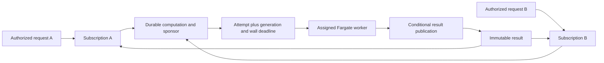
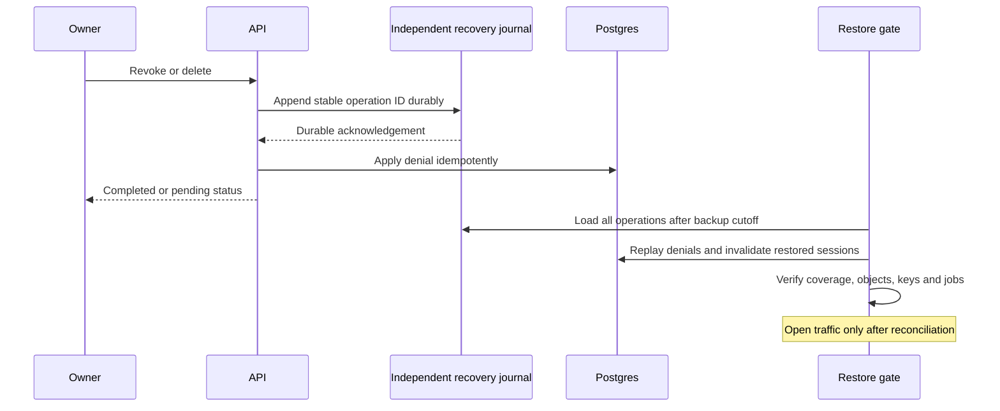

# R1: platform security, identity and data feasibility

**The small EC2 design remains credible as a proposal. The load-bearing gaps are contracts we still need to build and test: EC2 container credentials, privileged deployment, auth-library defaults, shared-computation ownership and recovery after deletion. None requires Redis, an ALB or a database migration to MySQL by default.** This is the bounded first research round, not a launch-security verdict or completed implementation.

## Evidence boundary

- Checked 9 September 2026. Root refreshed `origin`; this lane independently read `HEAD` and `origin/main`, both `e87e8a73b9857e022daefab150023a7a6a6be374`, commit date `2026-09-07T17:45:56+02:00`. Source citations below refer to this SHA unless marked draft.
- The platform documents are untracked drafts. Their SHA-256 values at the start of this lane are recorded below; citing `origin/main` alone would not pin them.
- Root's successful GitHub connector sweep and individual PR fetches are retained in [R1 PR evidence](evidence/r1-pr-sweep.json). PRs 1–5 were merged; PR 5's merge commit is the checked HEAD. This lane's separate `gh` attempt failed connecting to `api.github.com`; it did not establish absence of other work. Fresh repository-visibility metadata remains `[live-data]` for this lane.
- Personal-brain query coverage was complete: 57 clean primary documents and 26 clean sources; the targeted platform/auth/cache query returned zero results. No work-brain material was accessed.
- Entire application/configuration inventory and a repository search outside generated dependencies, public assets and docs returned no `better-auth`, `pg-boss`, Supabase integration, SQL schema/RLS policy, `RunTask`, `SendCommand`, IMDS or `iam:PassRole` implementation. [Package dependencies (line 29)](../../../package.json) contain only the frontend/engine stack. This is positive evidence that the named platform controls are not implemented here, not a defect in a deployed platform.
- No account mutations, paid resources, OAuth consent, external messages, application edits, database experiments or live security probes were performed. Library and AWS documentation establish capability, not our eventual configuration's correctness.

| Audited draft                    | SHA-256                                                            |
| -------------------------------- | ------------------------------------------------------------------ |
| `identity-and-access.md`         | `8ee55b12e098415c835ed9f01c163f14f1415b2f0ffe0d5065b9dab87caec62c` |
| `data-and-analysis.md`           | `a3d60f2395865f06fa7847bf480854ae1f10cb6614b42b721859351f23aa5ab3` |
| `infrastructure-and-delivery.md` | `77e89cb18e438bb3bb07968a3c73aa99b682fc6da7d1da913a76cb6ad591ee3b` |
| `repository-strategy.md`         | `b4a2775955f9c0552fcd57ab91fded3aff6383983ba85753359aaba043baff36` |
| `aws-baseline.md`                | `60fc6af9b26842b7d31c8dbb3716aa0be1fd47617eee34a0ccf39f0c7cfff0a2` |
| `validation-and-decisions.md`    | `35c895ee9e9234cdcfbef04df00fd79d86f3150acddcad63d478899fcc023684` |

Marks: ✅ current code, source or draft statement re-verified; ⚠️ proposal/inference still requiring a decision; 🔍 live or implementation evidence not obtained. A verified requirement is not a passed test.

## Ranked findings

### S1 — High: Compose placement does not establish the proposed IAM separation

The [AWS draft (line 66)](../aws-baseline.md) requires distinct host, deployment and worker identities. [Infrastructure (line 48)](../infrastructure-and-delivery.md) separately assigns ECS launch privileges to the coordinator. Those are good requirements, but there is no specified mechanism preventing an API/import container from accessing the EC2 instance profile. A full search of platform drafts for `IMDS`, `instance metadata`, the metadata endpoint addresses and metadata-option names returned zero matches at this audit's start.

✅ AWS distinguishes task roles from execution roles, warns that colocated EC2 containers can reach instance credentials, and provides a stronger task boundary on Fargate. The baseline uses Compose, so ECS-specific agent settings are not a solution for this host. IMDSv2 and response-hop limits are configurable; requiring v2 alone does not assert that a container cannot obtain a token. [ECS task roles](https://docs.aws.amazon.com/AmazonECS/latest/developerguide/task-iam-roles.html), [EC2 metadata options](https://docs.aws.amazon.com/AWSEC2/latest/UserGuide/configuring-instance-metadata-options.html).

⚠️ Constructive option: block application-container routes to both metadata address families, omit host networking/privileged mode/Docker socket, and keep AWS-capable host helpers behind narrowly defined operations. The existing [container restrictions (line 66)](../vps-first.md) already support most of this direction. A small trusted host dispatcher can accept only a database-issued attempt ID, load the approved launch manifest itself, and perform ECS calls. It must not accept arbitrary AWS requests, shell commands or role/image overrides. This is an implementation candidate, not demonstrated process isolation against host-root compromise.

`[experiment]` Prove separately: SSM agent works; API/import containers cannot obtain metadata credentials; the approved dispatcher launches only its fixed task definition; worker/ingress processes cannot invoke it as a general AWS proxy. Test actual container networking and IPv6 configuration, not just Terraform fields.

### S2 — High: the deployment entry point is part of the root trust boundary

[AWS (line 66)](../aws-baseline.md) and [delivery (line 46)](../infrastructure-and-delivery.md) say “constrained” Systems Manager command. No named document, parameter contract or negative authorization test exists yet. The current [CI workflow (line 7)](../../../.github/workflows/ci.yml) has read-only repository permissions and no AWS deployment, so it does not prove this future boundary.

✅ SSM Agent runs with root/SYSTEM privileges; AWS explicitly calls for tight `SendCommand` and `StartSession` control. Instance-tag scoping narrows the destination, not the power of an arbitrary shell command on it. `SendCommand` supports a selected document and version. [SSM root access](https://docs.aws.amazon.com/systems-manager/latest/userguide/ssm-agent-restrict-root-level-commands.html), [SendCommand contract](https://docs.aws.amazon.com/systems-manager/latest/APIReference/API_SendCommand.html).

⚠️ Specify a fixed document calling a root-owned release script. Accept an approved repository plus validated immutable digest/release identifier; resolve the verified release server-side. Separate permissions to edit the document/script, assume the deploy role, run interactive sessions and mutate infrastructure. An attacker allowed to replace the script defeats its input validation. Do not call this independent approval when one maintainer controls all steps.

✅ Exact GitHub OIDC subjects remain necessary. Current GitHub docs distinguish environment subjects from branch subjects and now describe immutable repository/owner IDs for some repositories. The draft correctly asks to inspect the actual format; a copied wildcard example would weaken it. [GitHub AWS OIDC](https://docs.github.com/en/actions/how-tos/secure-your-work/security-harden-deployments/oidc-in-aws).

`[experiment]` Reject a PR ref, wrong environment, arbitrary digest, alternate SSM document, command injection, rollback to an incompatible schema and document-version substitution. Keep break-glass administration distinct and audited.

### S3 — High: Better Auth is feasible, but its defaults are not our security policy

✅ The [candidate in the VPS draft (line 55)](../vps-first.md) has an official PostgreSQL adapter, schema generation/migration and a non-default auth-schema option. That makes a direct Postgres integration plausible. It does not prove compatibility with Enpassant's proposed owner-scoped domain transactions. [PostgreSQL adapter](https://better-auth.com/docs/adapters/postgresql).

Material documented defaults:

- Cookie-cached sessions can remain accepted on another device until cache expiry after revocation. Keep that feature disabled initially and perform a fresh database session/status check for private access. [Session management](https://better-auth.com/docs/concepts/session-management).
- Implicit same-email OAuth linking is enabled subject to verified/trusted-provider rules; forced trusted providers can bypass verification. OAuth tokens are not encrypted by default. Built-in deletion can hard-delete a user. Select explicit linking/encryption policies and prevent that deletion endpoint from bypassing Enpassant's durable deletion workflow. [Users and accounts](https://better-auth.com/docs/concepts/users-accounts).
- The email-OTP plugin exposes hashing/encryption storage options but documents plaintext as its default. Choose and test the required storage mode, attempt limits and delivery failure behavior. [Email OTP](https://better-auth.com/docs/plugins/email-otp).

⚠️ Keep auth tables and their runtime role separate from `app_api` domain tables. The auth library needs to look up sessions before a domain owner context exists. Adopt the selected library's session representation; do not silently promise the managed-alternative opaque-token-hash schema if the chosen adapter stores session tokens differently. Pin a version before generating/reviewing migrations. The pages inspected currently display version 1.7.3; no version is installed in this repository.

The [Supabase BFF alternative (line 21)](../identity-and-access.md) is correctly labelled custom and gated by a spike. Supabase's normal SSR guidance expects browser-readable refresh tokens, and its documented rotation/reuse exceptions do not validate a separate opaque-session bridge. Retain this as an alternative design requiring independent evidence, not a fallback already proven to work. [Supabase SSR](https://supabase.com/docs/guides/auth/server-side/advanced-guide), [session rotation](https://supabase.com/docs/guides/auth/sessions).

`[experiment]` Exercise the real library, roles and pool with two users/two browsers: linking, new recovery address, OTP replay, logout everywhere, suspension, cache bypass and staged account deletion. A mocked auth response cannot prove these behaviors.

### S4 — High before server studies: computation ownership has not caught up with request sharing

The [reuse contract (line 115)](../data-and-analysis.md) says matching requests share one execution/reservation and cancel by detaching. The [job protocol (line 129)](../data-and-analysis.md) fences publication against a request's state; [cancellation (line 133)](../data-and-analysis.md) kills the child for a cancelled request. The [logical table list (line 31)](../data-and-analysis.md) has requests, targets and results but no independently owned active computation/subscription or sponsor rule. Those statements are not yet a complete shared-execution contract.

Example: A launches public study X; B joins; A cancels or deletes their account. B still needs X, while A's request is forbidden to publish and the original reservation belongs to A. Neither “check request state” nor “settle once” decides which surviving object can publish or pay.

⚠️ Two defensible forks:

| Fork                    | Mechanism                                                                                                                          | Trade-off                                                                                                    |
| ----------------------- | ---------------------------------------------------------------------------------------------------------------------------------- | ------------------------------------------------------------------------------------------------------------ |
| Simpler initial sharing | Coalesce private misses within one owner; publish curated public results deliberately, from an operator-funded run                 | Most repeated-use savings without cross-owner sponsorship/cancellation complexity                            |
| General shared work     | A durable computation owns attempts, grants, budget sponsor and result publication; authorized request subscriptions attach/detach | Supports simultaneous public misses, but requires explicit sponsor deletion, last-subscriber and retry rules |

For general sharing, result publication checks computation generation/deadline/state. Attaching it to each private request separately checks that request's owner, revision and cancellation state. A joined request never inherits another user's input grant.

✅ pg-boss advertises transaction-integrated job creation and retry primitives. This creates another simplification to test: when every relevant write and enqueue is in the same Postgres transaction, a separate outbox relay may be unnecessary for that queue boundary. Keep an outbox only where a distinct transactional boundary needs it. Queue-delivery claims do not establish exactly-once external ECS execution. [pg-boss](https://github.com/timgit/pg-boss).

`[decision]` Choose sharing scope/sponsorship before implementing server studies. `[experiment]` Kill between reserve, enqueue, launch response, upload, commit and acknowledgement; join/cancel/delete both first and later subscribers; prove one published effect and accounted attempts. The release gate already calls for these failures, but no execution evidence exists.

This is the proposed general-sharing fork, not implemented topology. Cancelling one subscription need not cancel the computation; private attachment still requires independent authorization.

### S5 — Medium: RLS and the deletion journal are good foundations with precise limits

✅ [RLS requirements (line 83)](../identity-and-access.md) correctly require a non-owner role, `NOBYPASSRLS`, transaction-local context and owner-bound child constraints. PostgreSQL confirms that owners/bypass roles escape ordinary RLS, referential-integrity checks bypass it, and policies querying other tables can introduce races. `set_config(..., true)` lasts for the transaction. [RLS](https://www.postgresql.org/docs/current/ddl-rowsecurity.html), [configuration functions](https://www.postgresql.org/docs/current/functions-admin.html).

⚠️ This guards against missing tenant filters under a trusted API, not every compromised-API or arbitrary-SQL attack: the API is the authority that supplies owner context. Deny schema-changing privileges and role switching; normalize constraint errors to avoid existence disclosures; use a fail-closed transaction wrapper. Test commit, abort, pooled reuse, nested work and unauthenticated context. Do not run the auth adapter's pre-session lookups through an assumed owner context.

✅ [Deletion (line 93)](../identity-and-access.md) already orders domain cleanup before auth-identity removal and [recovery (line 95)](../identity-and-access.md) requires an independent journal. It also specifies append-before-acknowledgement, which closes a real backup-resurrection hole. This should survive into implementation.

⚠️ “Independent” needs a concrete IAM/retention contract: backup/host credentials must not silently erase the journal they rely on; retained manual snapshots and object versions extend the oldest recoverable cutoff. Keep restore closed if journal coverage cannot be proved. Versioned S3 `DELETE` normally adds a marker rather than removing previous payloads, so final deletion must enumerate permitted versions or use a demonstrated retention lifecycle. [S3 deletion markers](https://docs.aws.amazon.com/AmazonS3/latest/userguide/DeleteMarker.html).

`[experiment]` Crash after journal append but before DB denial, restore a pre-revocation DB, and prove suspension/unlink/share deletion replays before traffic or imports resume. Test journal loss, missing encryption keys, stale task grants and missing object versions as restore failures. These are unrun fault injections, not current security defects.

### S6 — Medium before Fargate: launch permission and worker grants need separate specifications

The [draft (line 60)](../aws-baseline.md) gives workers assigned input/output grants and denies DB/provider credentials. That boundary is useful. The worker's AWS execution role, task role and broker authorization are nevertheless different things. An execution role needed for image/log handling does not imply the engine needs broad S3 or ECS permissions.

✅ `RunTask` accepts command/environment/resource/role overrides and uses eventual consistency; its idempotency token must be retried with the original parameters. `iam:PassRole` should select approved roles and the intended service. [RunTask](https://docs.aws.amazon.com/AmazonECS/latest/APIReference/API_RunTask.html), [PassRole](https://docs.aws.amazon.com/IAM/latest/UserGuide/id_roles_use_passrole.html).

⚠️ Freeze allowed task-definition revision, image, cluster, subnet, security group, task count, allocation and execution/task roles in the dispatcher. Do not accept a client-supplied `RunTask` body. Decide how a new task proves identity to receive its first broker grant; a task ARN in a request is not proof by itself. Grants need audience, input/output scope, attempt/generation and expiry; publication still consults the database. Keep reusable credentials out of command overrides and logs.

The [independent reaper (line 58)](../aws-baseline.md) is correctly required. It needs a manifest/deadline visible without the failed EC2 coordinator, bounded stop permissions, retained evidence and a failure alarm. An in-container timer alone cannot cover a wedged process or launch uncertainty. No AWS policy or task experiment was run.

## Provider contracts that survived, and one useful alternative

✅ Lichess documents PKCE S256 for public clients, long-lived access tokens and no refresh-token flow. `/api/account` uses authenticated OAuth with no extra scope; token revocation is defined. User-game export supports bounded filters, date ordering and NDJSON. The [provider design (line 35)](../identity-and-access.md) is consistent with those sources. Actual OAuth consent/revocation remains `[experiment]`. [Authentication spec](https://github.com/lichess-org/api/blob/master/doc/specs/lichess-api.yaml), [account endpoint](https://github.com/lichess-org/api/blob/master/doc/specs/tags/account/api-account.yaml), [token endpoint](https://github.com/lichess-org/api/blob/master/doc/specs/tags/oauth/api-token.yaml), [export endpoint](https://github.com/lichess-org/api/blob/master/doc/specs/tags/games/api-games-user-username.yaml).

⚠️ Credential-minimizing fork: use OAuth only to establish a timestamped ownership proof, then revoke/discard the token and import public games anonymously. This avoids retaining a provider credential for public-only data, at the cost of different throughput and weaker ongoing control evidence. The UI must say when ownership was verified, and fresh sensitive linking still needs new proof. Compare this with retained consented tokens; do not silently change a user's unlink/sync choice.

✅ Chess.com's April 2026 help describes public read-only data and routes authenticated integrations to an application form. It does not authorize us to invent OAuth endpoints or treat a profile name as ownership. The older endpoint document contains both 12-hour and 24-hour freshness statements and documents stable player IDs/rename caveats. Current response metadata is therefore the correct operational input. [Current help](https://support.chess.com/en/articles/9650547-what-is-the-pubapi-and-how-do-i-use-it), [endpoint reference](https://www.chess.com/news/view/published-data-api).

The [serial per-provider lease (line 65)](../data-and-analysis.md), interruption-safe overlapping windows, completed-game restriction and arbitrary-URL rejection are reasonable conservative policies. “Serial unlimited” in provider prose is not a capacity guarantee or permission to ignore 429s. No live archive load or authenticated Chess.com access was tested. `[experiment]` Probe a bounded public fixture, cache headers, equal-timestamp pagination, 429/backoff and safe redirect behavior; `[live-data]` authenticated Chess.com access remains provider-dependent.

## Public edge, domain and repository implications

The economics lane found a potentially valuable CloudFront Free flat-rate option. ✅ Its official feature matrix includes managed origin-request rules, WAF/IP rate limiting and five cache behaviors, while custom policies, private VPC origins and advanced protection differ by tier. This changes the earlier assumption that adding an edge necessarily needs another paid WAF allocation. [Plan features](https://docs.aws.amazon.com/AmazonCloudFront/latest/DeveloperGuide/flat-rate-pricing-plan.html).

⚠️ Security conditions, handed to root for exact plan verification:

1. Use an explicit non-caching behavior for all auth/private API/download/share routes. `CachingDisabled` is a managed policy with zero TTLs; a positive minimum TTL can override origin `private`/`no-store`. `AllViewer` forwards cookies, headers and query parameters. Prove those policies are accepted on the selected Free distribution; ordinary CloudFront policy documentation alone does not establish plan eligibility. [Managed cache policies](https://docs.aws.amazon.com/AmazonCloudFront/latest/DeveloperGuide/using-managed-cache-policies.html), [managed origin policies](https://docs.aws.amazon.com/AmazonCloudFront/latest/DeveloperGuide/using-managed-origin-request-policies.html).
2. Restrict origin ingress and validate a distribution-specific secret origin header. A CloudFront origin-facing prefix list alone identifies CloudFront infrastructure, not our distribution. Test direct-IP access and a second distribution with a wrong/missing secret. [Custom origin headers](https://docs.aws.amazon.com/AmazonCloudFront/latest/DeveloperGuide/add-origin-custom-headers.html), [AWS restriction pattern](https://docs.aws.amazon.com/AmazonCloudFront/latest/DeveloperGuide/restrict-access-to-load-balancer.html). The latter uses ALB; adapting its network principle to Caddy/EC2 still needs proof.
3. Keep HTTPS on both hops. CloudFront requires a trusted origin certificate matching its origin name or forwarded Host. Locking the origin can break naive HTTP/TLS-ALPN certificate challenges. DNS-01 is a candidate that avoids inbound validation, with a supported DNS plugin and narrowly scoped credentials; prove renewal under the final rules. [Custom-origin TLS](https://docs.aws.amazon.com/AmazonCloudFront/latest/DeveloperGuide/using-https-cloudfront-to-custom-origin.html), [Caddy challenges](https://caddyserver.com/docs/automatic-https).

✅ Route 53 supports `.co.za`, with annual registration and a zone check; its page says privacy protection is unavailable. This is not an availability check for `enpassant.co.za`, and not a privacy-law conclusion. Registrar choice and DNS hosting can remain separate. [Route 53 .co.za](https://docs.aws.amazon.com/Route53/latest/DeveloperGuide/co.za.html).

✅ The repository declares GPL-3.0-or-later in [package metadata (line 5)](../../../package.json). The local [licence (line 164)](../../../LICENSE) permits non-conveyed modification/use; [section 6 (line 275)](../../../LICENSE) specifies corresponding-source access for the network distribution method described there. Repository privacy does not decide runtime user authorization. The [strategy draft (line 19)](../repository-strategy.md) correctly avoids treating a second repo/API boundary as automatic legal independence. No proprietary licensing conclusion or visibility change is supported by this round. The GNU FAQ's full page repeatedly timed out; its server/browser distinction was visible in indexed official text, but full-page re-verification is `🔍 PENDING-PRIMARY`. Local licence clauses above were read directly. [GNU FAQ](https://www.gnu.org/licenses/gpl-faq.en.html#UnreleasedMods).

## Uber article: preserve the operational lesson, do not cargo-cult the migration

✅ Uber's 2016 article primarily discusses PostgreSQL 9.2, frequent indexed updates, physical replication bandwidth, replica-query conflicts and upgrades; its particular corruption bug was already acknowledged as fixed. It describes why MySQL/InnoDB suited Uber's Schemaless work, not a benchmark of Enpassant. [Original article](https://www.uber.com/us/en/blog/postgres-to-mysql-migration/).

✅ Current PostgreSQL documents HOT's conditional avoidance of index churn and built-in logical replication across major versions. Neither means all update/replication costs vanished. [HOT](https://www.postgresql.org/docs/current/storage-hot.html), [logical replication](https://www.postgresql.org/docs/current/logical-replication.html).

⚠️ Our useful experiment is specific: measure queue heartbeats/status updates, retained-job cleanup, per-game contribution changes, WAL growth, dead tuples and autovacuum while library queries run. Keep progress checkpoints coarse enough to avoid rewriting large result JSON; keep immutable candidates separate from mutable lease counters. Avoid network/provider work inside DB transactions. The proposed [small pools (line 21)](../infrastructure-and-delivery.md) and [measure-before-indexing rule (line 49)](../data-and-analysis.md) are aligned. No result here establishes Postgres or MySQL throughput, RAM capacity or a cost advantage. `[experiment]` Run that workload on the selected version/host before choosing a different engine.

## Material-claim register and next-round targets

| ID  | Material claim                                                       | R1 verdict and evidence                                                                          | Remaining proof                                                             |
| --- | -------------------------------------------------------------------- | ------------------------------------------------------------------------------------------------ | --------------------------------------------------------------------------- |
| C01 | Existing code has a deployed account backend                         | ✅ Contradicted by full application inventory/search and package dependency list                 | Build/inspect future backend; do not label docs as deployed                 |
| C02 | Browser search reuse already exists                                  | ✅ [engine.ts:36](../../../src/lib/engine.ts), [entry cap (line 77)](../../../src/lib/engine.ts) | Runtime profiling for the user's reported reload                            |
| C03 | Public sources establish account control                             | ✅ Rejected by provider contracts and draft separation                                           | Authorized Lichess handshake; Chess.com approved capability                 |
| C04 | Better Auth can use local Postgres                                   | ✅ Official adapter capability                                                                   | Pin library; real auth/pool/migration test                                  |
| C05 | Auth defaults meet our chosen lifecycle                              | ⚠️ S3 identifies policy choices                                                                  | Two-browser revocation, recovery/linking/deletion tests                     |
| C06 | Supabase BFF bridge is a proven fallback                             | ⚠️ Explicit custom proposal                                                                      | Separate storage/refresh integration spike                                  |
| C07 | RLS policy presence proves isolation                                 | ✅ Rejected by documented bypass/context limits                                                  | Runtime-role adversarial transactions                                       |
| C08 | One cancelled request safely controls shared computation             | ⚠️ Contradiction in current domain sketch, S4                                                    | Sharing/sponsor decision; concurrency crash matrix                          |
| C09 | pg-boss removes external execution duplicates                        | ✅ Unsupported; domain effects still require fencing                                             | Same-transaction enqueue and failure injection                              |
| C10 | Independent revocation journal prevents restoration of denied access | ⚠️ Protocol is sound as specified, not executed                                                  | IAM/retention contract and isolated restore                                 |
| C11 | S3 object DELETE removes all retained data                           | ✅ False for normal versioned deletes                                                            | Version inventory and retention test                                        |
| C12 | Compose containers cannot inherit host cloud authority               | ⚠️ Mechanism absent in draft; AWS establishes exposure risk                                      | IMDS/network/helper negative tests                                          |
| C13 | SSM-only ingress is sufficient deployment least privilege            | ✅ False without command/document constraints                                                    | S2 release authorization tests                                              |
| C14 | ECS IAM limits prevent arbitrary worker launch overrides             | ⚠️ Not established                                                                               | Dispatcher schema and effective-policy tests                                |
| C15 | Worker grant is authenticated from task identity                     | 🔍 Bootstrap mechanism unchosen                                                                  | Signed proof/one-time enrollment design and replay test                     |
| C16 | Independent reaper bounds orphaned-task cost                         | ⚠️ Required, unimplemented                                                                       | Failure outside coordinator, bounded stop lag                               |
| C17 | CloudFront Free can securely carry our private API                   | ⚠️ Promising; root owns plan-policy verification                                                 | Exact plan config, two-user cache test, origin bypass and TLS renewal       |
| C18 | `.co.za` is supported by Route 53                                    | ✅ Official country-domain page                                                                  | Actual name availability, registrar choice and zone check                   |
| C19 | Repo must become private for a public app                            | ✅ No connection to runtime authorization; local GPL declaration verified                        | Fresh visibility/plan metadata; distribution inventory if changing strategy |
| C20 | Uber article proves Enpassant should use MySQL                       | ✅ It supplies a workload warning, no Enpassant comparison                                       | Measure queue/update/WAL workload first                                     |

R1 ends here. R2 should attack S1–S6 and the CloudFront candidate, resolve the sharing fork, and select a minimal auth/session contract. The unavailable GNU FAQ full page and fresh visibility metadata remain explicitly pending; no recommendation in this lane depends on proprietary licensing or a visibility change. Implementation remains a later reconciliation round under the Swiss-cheese method.
