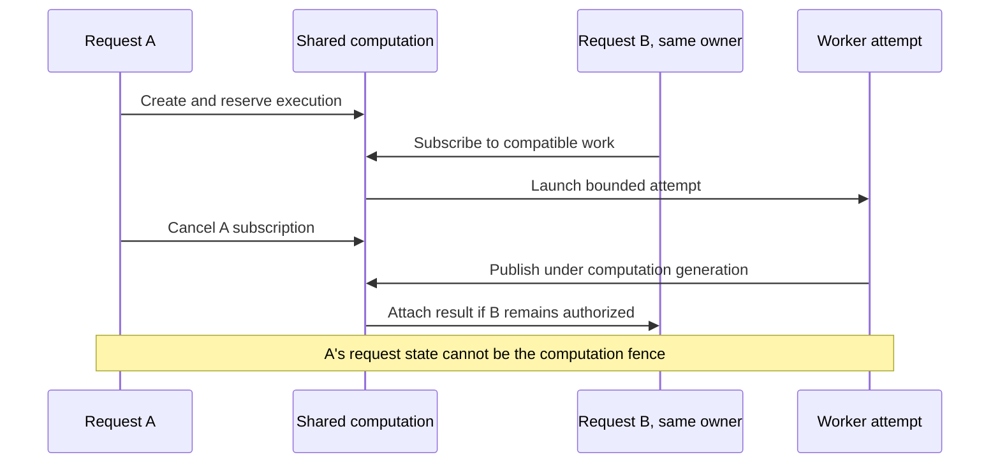
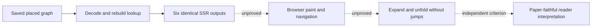

# R2: hostile review of the platform proposal

The modest EC2 host, durable reuse and optional deeper studies **SURVIVE-with-conditions**. The research has narrowed the choices without proving a public deployment. The strongest remaining contradiction is that even **same-owner** work sharing needs a computation lifecycle independent of the first request. Neither an accurate resource price nor byte-identical replay markup establishes launch capacity, reader fidelity or a complete spending limit.

This is the bounded second-round hostile lane, checked 9 September 2026 from cost-owner, operations, security and diagram-reader perspectives. It does not introduce another provider shortlist. No cloud resources, application code or other documents were changed. Deployment and user-workload experiments remain unrun.

## Evidence boundary

The R1 repository reference is `e87e8a73b9857e022daefab150023a7a6a6be374` for both local `HEAD` and `origin/main`; root performed the remote refresh. The drafts and experiments are uncommitted, so this review pins their actual bytes rather than attributing them to that commit. Locations below refer to this snapshot, before R2 reconciliation.

| Input                                                                 | SHA-256                                                            |
| --------------------------------------------------------------------- | ------------------------------------------------------------------ |
| [Central investigation](platform-investigation.md)                    | `cc38d56e67bf85f3937ed765a18cb3d6d745c98bb887c2c9a906beaaadf29326` |
| [R1 economics](r1-aws-economics.md)                                   | `3c2b59cdce141b7ee7d240098783e626dbda276d818bf80f40c438bbcccae139` |
| [R1 engine/cache](r1-engine-cache.md)                                 | `2c971ca891df34ee5b9d7e7177ce16d245003afa63db18c39342b96075d2f07f` |
| [R1 security](r1-platform-security.md)                                | `8452984f64cfff62f226eb68f5390e59f697b669ea1be79f48fa7c016b76d5b5` |
| [Data and analysis](../data-and-analysis.md)                          | `2404cedbe9d8342db6dfdd4ba7e393a246fe630c0496f619541b617eacc635e0` |
| [Snapshot experiment](../../../scripts/research-diagram-snapshot.mjs) | `3bd5fbd5f3451de71e8624549214d2b6f626a657cc941e87f91badd865ad4789` |
| [Worker cost model](../../../scripts/research-worker-economics.mjs)   | `79c04bf6a5dfc1cffa41fff670946ccb892bf115f60cd6d7e6bdfa1cc876d1fe` |

R2 spot checks reconfirmed the load-bearing AWS mechanisms: T4g small and medium each earn 24 credits/hour; Linux Fargate billing includes image download and has a one-minute minimum; CloudFront Free allows five cache behaviors; managed `CachingDisabled` has all three TTLs set to zero. These primary-source checks validate mechanisms, not our deployment. R1's recorded regional price-feed evidence remains the price basis; this round did not obtain an account invoice or entitlement decision.

## Ranked revisions

### H1 — P1: first-request ownership cannot govern shared execution

**DIES-because:** the suggestion that an independent computation object can wait until cross-owner sharing, at [central line 132](platform-investigation.md), does not reconcile [data lines 115, 129 and 133](../data-and-analysis.md). The same owner can open requests A and B for one search. B joins without a second execution reservation. A cancels. Publication fenced by A's request state either discards work B still needs or permits a cancelled request to publish. This requires no cross-owner race or attacker.

**Required revision:** define owner-scoped computation, attempt, subscriber and reservation identities now. Publication fences computation generation and current authorization; attachment to each request has its own cancellation/revision check. Account deletion revokes the owner computation. Cancelling the last subscriber changes execution demand, with a bounded stop/reconciliation policy. One settlement identity belongs to one attempt, including failed execution. The constructive lane's independent computation proposal addresses this counterexample; it still requires a transactional concurrency test. Curated public studies can remain operator-funded completed artifacts without active cross-owner sharing.

### H2 — P1: cheap batches can become unfair queues

**SURVIVES-with-conditions:** the [worker table (line 103)](platform-investigation.md) correctly exposes billing-minimum amplification. **DIES-because**, if read as a usable scheduler: it models neither arrivals nor interactive waiting, ownership, cancellation or allocation of task startup to subscribers.

A serial batch of 16 roots at the modeled 60 seconds/root occupies a slot for about 16 minutes plus startup; allowing the documented second 60-second fallback per root can double that. A one-slot system cannot promise responsive interactive service merely by prioritizing the next task. Waiting to fill 16 jobs also delays sparse traffic. The one-minute charge begins at image download, so startup is a real shared obligation, not free time. [AWS Fargate pricing](https://aws.amazon.com/fargate/pricing/).

**Required revision:** start with homogeneous-owner tasks, a wall deadline and root ceiling, no wait-to-fill requirement and no indefinite extension of a live batch. Specify whether an interactive arrival can preempt at a root boundary and what happens to the partial result. Allocate startup/retries to a named owner or operator sponsor before launch. Separate physical task, engine attempt and request budgets. Test a slow study followed by another owner's quick request, fallback at the task deadline, cancellation during startup, and a mixed batch where only one subscriber disappears. Report waiting-time distributions alongside dollars/root. A smaller batch may be the correct product choice even when its modeled cost/root is worse.

### H3 — P1: $25 buys a resource shape, not measured public capacity

**SURVIVES-with-conditions:** [central line 23](platform-investigation.md) correctly separates the North Virginia resource subtotal of $18.85 from $3–$8 allowances, tax and operator time. **DIES-because**, if promoted to a complete public-app price or an established 2 GiB capacity result.

Both `t4g.small` and `t4g.medium` sustain only 0.4 aggregate vCPU from earned credits. Medium doubles memory, not baseline CPU. Password hashing, import parsing, database work, compression, backups and release overlap compete even when Stockfish is elsewhere. [AWS credit table](https://docs.aws.amazon.com/AWSEC2/latest/UserGuide/burstable-credits-baseline-concepts.html).

**Required revision:** define the beta workload and acceptance thresholds before a paid sizing test: active sessions, signup burst, imported games, stored bytes, library query latency, memory headroom, backup duration and CPU-credit behavior after depletion. Measure a deployment/backup overlap as well as steady state. Preselect the response to failure: reduce admission, enlarge memory, select nonburstable capacity or revisit serverless. Include that next price bracket. A quiet idle host is not the required test; absence of this test is not evidence EC2 fails.

### H4 — P1: engine admission is not a total spending or resource limit

**SURVIVES-with-conditions:** reservations and a separate task-hour envelope are stronger than a UI budget counter. **DIES-because**, if described as bounding the whole public service. [Central line 112](platform-investigation.md) already excludes storage, transfer, logs and reaping, while [data line 139](../data-and-analysis.md) correctly retains unknown attempt obligations.

Accounts can accumulate libraries, artifacts, import requests and outbound emails without consuming engine time. A dead database host can prevent normal settlement while tasks continue. A cancelled task is not necessarily already terminated. Request counters alone do not bound compressed-input expansion, stored bytes or response generation.

**Required revision:** keep separate limits for owner/global retained bytes, object counts, input expansion, import concurrency, queue age, request rates and engine obligations. Reserve mandatory backup/recovery capacity separately from discretionary studies. Specify an independently triggered reaper with enough narrowly scoped access to stop tagged overdue tasks when the app host is down; do not release unknown reservations on a heartbeat timeout alone. Record its cost and failure behavior. Prove task-stop reconciliation, orphan upload collection and cap exhaustion with a failure matrix. Worker enrollment via a one-use bearer delivered by the trusted launcher is a candidate capability mechanism; an ECS task ARN supplied by a caller is not authentication. Lost enrollment responses must retain and reconcile the obligation before retry.

### H5 — P1: $0 CloudFront remains a configuration hypothesis

**SURVIVES-with-conditions:** [central lines 118–124](platform-investigation.md) avoid claiming enrollment and correctly distinguish distribution configuration from pricing-plan subscription. **DIES-because**, if the Free plan is treated as an already-secured edge or a guaranteed invoice item.

Free has five cache behaviors and excludes VPC origins and request logs; exact routing must fit that contract. Managed `CachingDisabled` sets minimum, maximum and default TTL to zero. This supports uncached authenticated responses, but says nothing about omitted paths, forwarded credentials, origin access or subscription attachment. [Plan contract](https://docs.aws.amazon.com/AmazonCloudFront/latest/DeveloperGuide/flat-rate-pricing-plan.html), [managed cache policy](https://docs.aws.amazon.com/AmazonCloudFront/latest/DeveloperGuide/using-managed-cache-policies.html).

**Required revision:** produce a complete behavior/path table with zero-TTL default, explicitly public immutable paths and matching credential forwarding. Prove two-user isolation, auth redirects/errors, query handling and unknown paths. Block direct origin traffic using source restriction plus the distribution's origin secret; the CloudFront prefix list alone admits other distributions. Prove trusted origin TLS renewal after ingress lockdown. Keep essential application audit events independent of unavailable edge request logs, with token/PGN redaction. Verify subscription, attached resources and infrastructure-as-code ownership before assigning bundled prices. An ineligible account is a decision fork, not permission to substitute a paid subscription or silently expose the origin.

### H6 — P2: the $2.59 serverless example is not a competing total

**SURVIVES-with-conditions:** [central line 27](platform-investigation.md) explicitly labels it a partial scenario. **DIES-because**, if compared directly with the fuller EC2 subtotal. It estimates selected API/Lambda/DynamoDB usage, not equivalent saved accounts, library behavior, operations and deep study delivery.

**Required revision:** preserve the same workload, recovery objective and cost categories in both alternatives. Include identity/transactional email, static/artifact storage, logs, secrets, import scheduling, backup independence and worker dispatch where required. Validate DynamoDB query and transaction charges against actual access patterns rather than counting a logical operation as one billable unit. Run the proposed ownership/reservation/deletion/library vertical slice before treating rewrite effort as negligible. Lambda's memory/CPU scaling and timeout are feasibility bounds, not evidence of equivalent native-engine cost or fidelity. This alternative deserves a measured fork; the partial arithmetic alone neither wins nor loses it.

### H7 — P2: identical SVG proves a serialization seam, not the reopen experience

**SURVIVES-with-conditions:** the [snapshot experiment (line 24)](../../../scripts/research-diagram-snapshot.mjs) proves that restoring the tested graph preserves six `EvolutionMarks` server-rendered outputs and focus sets. **DIES-because**, if “16 ms reopen” or complete paper fidelity is inferred.

The measured restore expands 407,659 gzip bytes into 5,218,002 JSON bytes and a 5,422-node object graph. Its timer excludes SVG generation, browser parsing/paint, interaction and peak memory; the overview markup alone is about 1.5 MB. The experiment supplies no unfolding handler and restores no mutable `EvolutionBuilder` state. Both sides use the same renderer, so they can preserve the same semantic defect. [Recorded experiment](evidence/diagram-snapshot.json).

**Required revision:** describe the result as local decode/restore time, not end-to-end opening. Test three browser engines, representative memory-constrained hardware, full replay, keyboard selection, camera state and unfolding/expansion after restore. Reject oversized/decompression-bomb snapshots, invalid references, duplicate IDs, nonfinite coordinates and incompatible schemas before rendering. Verify payload digest and authorization. Expansion must either reconstruct builder state while preserving a stated layout contract or disclose the fallback; a successful initial screenshot is insufficient.

### H8 — P2: more evaluated branches do not establish paper fidelity or a lifetime atlas

**SURVIVES-with-conditions:** [central lines 95–99](platform-investigation.md) distinguish sprawl, layout and evaluation coverage. **DIES-because**, if assessing more event parents is called a solved diagram grammar. A deeper root does not evaluate each interior PV position; preferentially evaluating checks can leave quiet but decisive ideas underexplained.

**Required revision:** use frozen equal-budget comparisons with preserved unknown states, a paper-figure cue checklist and reader tasks: identify a turning point, distinguish alternatives from transpositions, explain an assessed concession and recognize uncertainty. Measure comprehension and misleading cues alongside layout stability, coverage and time. The unpublished concession classifier remains an explicit fidelity limit. Snapshot equivalence and glyph counts cannot close it.

Likewise, the single-game experiment does not establish lifetime navigation. The proposed 24-ply/250-node projection and 100,000-game corpus remain hypotheses. Validate encounter denominators after deletion/correction, transposition accounting, bounded neighborhood transitions and stable selection before promising a sprawling archive. The product can preserve the visual grammar while rendering only the neighborhood the reader can currently inspect.

## Questions that must survive reconciliation

| Type           | Question and required evidence                                                                                                                                      |
| -------------- | ------------------------------------------------------------------------------------------------------------------------------------------------------------------- |
| `[decision]`   | What beta workload, queue wait and recovery objective does the roughly $25 target buy? Name limits and a failure response before sizing.                            |
| `[experiment]` | Can A cancel while same-owner B receives exactly one correctly fenced result and one settled execution charge? Include deletion and late completion.                |
| `[decision]`   | Who pays startup, cancellation lag and failed enrollment, and what bounds an interactive user's wait behind a slow batch?                                           |
| `[experiment]` | Does the exact CloudFront Free configuration isolate private responses and the origin through certificate rotation? Subscription eligibility remains `[live-data]`. |
| `[experiment]` | Can a restored snapshot expand, unfold and navigate with acceptable browser memory/latency while preserving the declared layout contract?                           |
| `[experiment]` | Does selective deeper analysis improve faithful interpretation under equal cost, including quiet positions and explicitly unknown evaluations?                      |

R2 should reconcile H1–H5 into one coherent design before implementation. H6–H8 remain bounded experiments and claim limits, not reasons to abandon durable reuse, the low-cost host or the user's paper-inspired diagrams.
