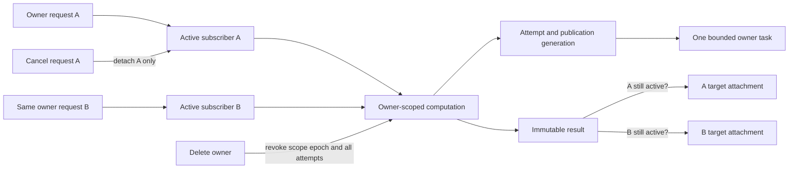

# R2 constructive proposal — retain the work, bound the computation

**Build the first useful slice locally: reopen a versioned placed study without starting Stockfish or Graphviz.** Keep the full legal occurrence paths and the analyses that produced it. Add mutable exploration recovery next. Hosted jobs and the lifetime atlas should consume the same result identities, but neither is a prerequisite for proving the saved-study experience.

This is a proposed contract, not applied migrations or implemented security. R1 completed before this lane began. The code baseline remains `e87e8a73b9857e022daefab150023a7a6a6be374` (`origin/main`, 7 September 2026); [R1's manifest](evidence/engine/source-manifest.json) distinguishes current uncommitted platform/Tal files. No source application files or cloud resources were changed by this lane.

The local [snapshot experiment (line 31)](../../../scripts/research-diagram-snapshot.mjs) serializes the placed graph without `byId`, restores that derived map and produces identical SVG for six component states. [Evidence](evidence/diagram-snapshot.json) covers replay, overview, isolated continuations and assessed-check detail. It does **not** prove browser interaction, untrusted payload validation, atomic saving or mutable `EvolutionBuilder` recovery. Those are acceptance gates below.

## Decisions and explicit forks

| Area                 | Proposed minimum                                                       | Alternative / trigger                                                                   |
| -------------------- | ---------------------------------------------------------------------- | --------------------------------------------------------------------------------------- |
| First deliverable    | Local versioned study bundle with lazy restored view                   | No cloud dependency; compact codecs only after the first safe format works              |
| Authoritative result | Immutable input/result manifest and result ID                          | Disposable IndexedDB search cache remains an accelerator                                |
| Active work sharing  | Same owner, exact computation identity, independent computation object | No cross-owner active joining; general sponsorship is deferred                          |
| Public exemplars     | Operator-funded curated computation and published completed revision   | Public browsing never silently spends a visitor's private budget                        |
| Worker enrollment    | One-use, short-lived bearer capability through trusted launch          | IAM-authenticated enrollment is a later separately priced/implemented fork              |
| Task batching        | One owner per task; bounded launch plan and wall quantum               | Multi-owner multiplexing requires a later isolation, allocation and fairness proof      |
| Lifetime graph       | Encounter-aware played prefixes with exact collapsed counts            | Engine enrichment is a separate overlay and budget                                      |
| Paper events         | Legal check / locally competitive proxy / unassessed remain distinct   | An effective-concession classifier requires evidence; no relabelling of the 50 cp proxy |

## Slice 1 — a saved view that opens immediately

Separate view restoration from live analysis scheduling. The current [hook (line 45)](../../../src/lib/useAnalysis.ts) eagerly constructs an engine; [builder append (line 35)](../../../src/lib/evolution.ts) reconstructs the occurrence graph; [layout (line 191)](../../../src/lib/evolutionLayout.ts) invokes Graphviz. A successful placed-study restore should call none of those paths.

```mermaid
flowchart LR
  Open[Open game or study revision] --> Read[Read versioned local bundle]
  Read --> Validate[Validate manifest and bounded payload]
  Validate -->|compatible placed snapshot| Restore[Parse and rebuild byId only]
  Restore --> View[Replay, board, focus and camera]
  Validate -->|missing or incompatible placement| Results[Load retained game and analyses]
  Results --> Build[Rebuild semantic graph and layout]
  Build --> Commit[Atomic study save]
  Commit --> View
  View -->|explicit deeper exploration| Resume[Hydrate mutable builder]
  Resume --> Lookup[Reuse compatible root result first]
  Lookup -->|miss| Lazy[Create Engine only now]
```



### Stored objects and identity

Create a separate `enpassant-studies` IndexedDB database. Do not use the existing 3,000-entry `positions` cache as the only source of referenced study data. Its [write path (line 70)](../../../src/lib/engine.ts) can evict entries and does not await a committed transaction.

| Store             | Key / contents                                                                                     | Required invariant                                                             |
| ----------------- | -------------------------------------------------------------------------------------------------- | ------------------------------------------------------------------------------ |
| `game_revision`   | Local revision ID; normalized game and metadata revision; canonical initial FEN + UCI moves digest | Different played encounters may reference identical move content               |
| `analysis_result` | Immutable result ID; input/search manifest, actual result, result digest and provenance            | Refresh produces a new ID; never overwrite a result referenced by a study      |
| `study_revision`  | Revision ID; game reference, ordered analysis bindings, graph policy, artifact references          | One revision describes one consistent generation of the graph                  |
| `placed_payload`  | Artifact ID; bounded JSON/binary body and digest                                                   | No functions, HTML, DOM handles or `Map` serialization assumptions             |
| `study_head`      | Study ID → latest acknowledged revision                                                            | Updated in the same transaction as the revision and its new local dependencies |
| `view_bookmark`   | Study revision, selected occurrence, cursor, camera and mode                                       | Debounced convenience state; failure must not invalidate the immutable study   |

The first format deliberately retains the existing occurrence arrays and curves instead of inventing a compact compression scheme. R1 shows the storage tradeoff is material, but the simplest correct round trip is already demonstrated. Compression is a transport/storage choice, not semantic identity. Retain both encoded byte count and decoded byte count/digest.

The following JSON is a contract example; human-readable IDs and digest placeholders are illustrative, not valid production identifiers:

```json
{
  "schema": "enpassant.placed-study.v1",
  "studyRevisionId": "revision-id",
  "scope": { "kind": "device-local", "namespaceId": "local-profile-id" },
  "gameRevisionId": "game-revision-id",
  "gameContentDigest": "sha256-of-canonical-initial-fen-and-uci-history",
  "analysisBindings": [
    {
      "sourceOccurrenceId": "p40",
      "sourcePathDigest": "sha256-of-full-source-history",
      "sourceMoves": ["d2d4", "g8f6"],
      "resultId": "immutable-result-id"
    }
  ],
  "policy": {
    "candidateRetention": "four-to-eight-plus-played.v1",
    "checkClassifier": "competitive-check-50cp.v1",
    "displayHorizonPlies": 20,
    "compression": "events.v1",
    "merging": "positions-with-occurrences.v1",
    "replayVisibility": "origin-ply.v1",
    "layoutPolicy": "weighted-dot-and-pinned-expansion.v1",
    "rendererSchema": "evolution-marks.v1",
    "graphvizPackage": "@viz-js/viz@3.30.0",
    "graphvizBuildDigest": "digest-recorded-by-build"
  },
  "placement": {
    "artifactId": "artifact-id",
    "encoding": "json+gzip",
    "encodedBytes": 407659,
    "decodedBytes": 5218002,
    "encodedDigest": "sha256-of-encoded-bytes",
    "decodedDigest": "sha256-of-json-bytes"
  },
  "builderCheckpointId": null
}
```

`sourceMoves` must contain the complete real path matching `sourceOccurrenceId`; the shortened example above illustrates shape only. Store engine version/build and NNUE identity on each result, along with requested versus achieved resources and execution trust. Older imported browser cache entries lacking the complete manifest may be retained as labelled legacy device results; do not manufacture missing binary hashes or upgrade their trust.

The placed payload contains `nodes`, `vertices`, `edges`, `continuations`, dimensions, placement readiness and statistics; the initial codec follows the fields used by the current component. Rebuild `byId` from unique node IDs. Keep aliases as membership lists, not merged engine histories. Store source game/analysis data because the chart and board need more than SVG geometry. Do not store executable SVG as the authority for a study.

### Read, save and invalidation rules

1. Read the bundle under the current local profile/account namespace. A later hosted adapter must authenticate and authorize the study before revealing existence or downloading its payload. A content hash never confers access.
2. Validate the format before constructing the graph: supported schema; unique IDs; all references resolve; finite bounded coordinates; bounded path strings; legal supported move format; digest/byte limits; expected game content; compatible policy. Keep imported text in React text/attribute bindings. Reject raw HTML, arbitrary URL fetches and executable content.
3. Proposed first limits are **4 MiB encoded, 32 MiB decoded, 20,000 occurrences, 10,000 displayed glyphs, 30,000 displayed edges and 1,200 plies per stored occurrence path**. These are conservative experiment settings above the measured fixtures, not established browser capacity. Enforce decompression limits while decoding, not after an unbounded allocation. Show a usable “study too large to save in this format” result; do not silently truncate it.
4. On compatible hit, restore and render; the status says “Loading saved diagram”, then ready. `new Engine()`, `builder.append` and Graphviz calls remain zero. A checksum failure is a failed snapshot read, not a reason to silently claim a cache hit.
5. A layout-only version change reuses retained analyses and builds new placement. A candidate/event/compression change regenerates the semantic projection. An engine upgrade offers a new study revision; old snapshots stay inspectable through a supported renderer or an explicit migration, not silently relabelled as current analysis.
6. Save all new local dependencies and `study_head` atomically and wait for the transaction's completion. “Saved” appears only after that acknowledgment. On quota/abort failure, keep the live diagram and old saved head; report that this revision was not saved. No old revision is removed to make a failed save appear successful.
7. Garbage collection may remove unreferenced study payloads under a stated retention policy. It must not apply the disposable search-cache eviction to results/placement still referenced by a saved study. Namespace deletion removes its saved heads and references; account switching cannot restore another account's private diagram.

Compatibility needs explicit schema support, not an equality check on every build string forever. A tested renderer migration may safely display an older payload; an unrecognized major schema is rejected. An invalid placed artifact does not invalidate independent legal game and analysis records. Rebuilding them is an explicit recoverable path with its own status.

## Slice 1b — restoring an editable exploration

JSON plus `byId` restores the **view**, not the private mutable state in `EvolutionBuilder`: `analysis`, `contributions`, `continuations`, `endings` and `placed` all affect later updates (`evolution.ts:14–19,80–100,125–133`). Replaying just the final result array is also not generally sufficient: a previously explored source can survive after a later parent search stops returning the path that originally created it.

Define a versioned builder checkpoint containing references to the same immutable node/result/placement generation:

```json
{
  "schema": "enpassant.builder-checkpoint.v1",
  "studyRevisionId": "revision-id",
  "placedPayloadDigest": "digest-of-the-paired-placed-payload",
  "gameRevisionId": "game-revision-id",
  "analysisBindings": "ordered-root-result-and-full-source-path-records",
  "contributions": "source-occurrence-id-to-contributed-node-ids",
  "continuations": "source-occurrence-id-to-exact-retained-occurrence-paths",
  "endings": "source-occurrence-id-to-leaf-and-pv-end-or-display-limit",
  "nodeTableReference": "same-versioned-node-table-as-placed-study"
}
```

The strings describe collection shapes, not a proposed serialization of literal prose. A production JSON Schema must encode the actual arrays/maps and limits. Export the checkpoint and placed snapshot from a frozen controller generation, then commit them together. A background result arriving during serialization creates the next generation; it cannot partially alter the saved one.

On exploration, hydrate and validate the checkpoint lazily, set its published placement to the restored revision, and then use the ordinary append/update logic. Existing coordinates and curves must survive until an explicit reorganize action or the documented expansion policy changes them. New search output creates a new result and study revision.

For legacy snapshots with no checkpoint, either reconstruct from complete source paths and retained results using a separately tested builder seeding operation, or require an explicit rebuild of editing state. Do not claim the old private fields were recovered by loading a view. If reconstruction cannot prove contribution provenance, keep legal replay available and refuse destructive replacement of saved branches.

## Slice 2 — durable computation belongs to the owner, not the first request

Same-owner coalescing still needs a computation object. A request is one user's UI intent; a computation is the reusable execution; an attempt is one real try; a task is the allocated process/container; a subscriber connects a request target to that computation. This resolves the contradiction between “join existing work” and “cancelled request may not publish”.



### Schema-level minimum

Every owner-derived table keeps `scope_id`; private parent references use composite scope/ID foreign keys. A curation scope is a distinct operator-controlled namespace with an operator budget. It is not an arbitrary user's public request. RLS and API ownership checks both use server-derived session scope.

| Entity                              | Essential fields and constraints                                                                                                                                                                                |
| ----------------------------------- | --------------------------------------------------------------------------------------------------------------------------------------------------------------------------------------------------------------- |
| `data_scope`                        | `id`, kind (owner or curation), optional owner FK with kind check, `lifecycle_epoch`, state (active, deleting or deleted); curation creation restricted to operator                                             |
| `analysis_request`                  | scope, idempotency key + body digest, requested preset/targets, request revision, status, cancelled time; owner never supplied by client                                                                        |
| `computation`                       | scope, canonical work-key digest + retained manifest, immutable input-content reference, trust tier, sponsor scope, generation, state, active-attempt ID, ready-result ID; sponsor equals scope in this minimum |
| `computation_subscriber`            | scope, request/target, computation, target revision, input authorization reference, active/detached state; unique `(scope, request, target)`                                                                    |
| `execution_attempt`                 | scope, computation, monotonic attempt number/generation, task ID, deadline, state, usage summary, staging-artifact ID; unique `(scope, computation, attempt_number)`                                            |
| `worker_task`                       | scope, immutable bounded launch plan, launch generation, allocated CPU/RAM, stop deadline, start/stop/usage state; one live task per owner at initial admission                                                 |
| `task_launch_attempt`               | task, unique client token, frozen request digest, encrypted launch payload/key version, returned ARN, reconciliation state; never regenerate a different payload under the same token                           |
| `budget_reservation`                | sponsor, unit/window, task or execution-attempt subject, reserved/settled values and state; unique reservation/settlement identity                                                                              |
| `worker_enrollment`                 | hashed one-use capability, task/launch generation, plan digest, scope epoch, expiry, used/revoked time                                                                                                          |
| `worker_grant`                      | hashed opaque credential, scope/task/attempt/generation, input/output scope, audience, expiry, revoked time; current state rechecked on use                                                                     |
| `analysis_result`                   | scope, immutable result ID, work/input/result digests, result/engine manifest, achieved resources, provenance, durable artifact reference                                                                       |
| `outbox` / `deletion_journal_state` | idempotent dispatch intent; independent journal acknowledgment/epoch needed before acknowledging irreversible deletion                                                                                          |

The database must enforce at most one nonterminal computation per `(scope_id, work_key_digest, execution_trust)` through a unique predicate/active-key mechanism. Include stopping work in that ownership until it has reconciled; a new request cannot revive an invalidated generation. PostgreSQL supports partial unique indexes, but the actual index predicate and transaction race tests belong to implementation. [PostgreSQL partial indexes](https://www.postgresql.org/docs/current/indexes-partial.html).

The work key includes the canonical initial FEN, complete legal UCI history, variant/rules/normalization versions, exact engine build/NNUE/configuration, thread/hash/MultiPV settings, search limits and root restrictions. For the first hosted implementation, exact compatibility is sufficient. Sharing a base sibling search independently of played-move fallback is a later optimization with its own same-depth composition tests. A deeper result must not be represented as the result of a shallower request.

### Admission and publication

```json
{
  "operation": "submit-analysis-request",
  "clientFields": {
    "gameRevisionId": "authorized-game-revision",
    "targets": ["authorized-occurrence-id"],
    "preset": "bounded-study-v1",
    "idempotencyKey": "client-operation-key"
  },
  "serverDerived": [
    "scope-and-current-lifecycle-epoch",
    "canonical-input-and-work-key",
    "entitlement-and-budget-window",
    "approved-engine-and-task-allocation"
  ],
  "transactionOutcomes": [
    "attach-authorized-ready-result-no-execution-reservation",
    "attach-subscriber-to-existing-owner-computation-no-second-execution-reservation",
    "create-computation-subscriber-reservation-and-outbox-atomically",
    "defer-or-reject-without-launch-when-budget-or-scope-disallows"
  ]
}
```

Transactions acquire scope/budget/active-key records in a stable order. Concurrent misses either create the one computation or join it after rechecking state; a failed unique insert is not an invitation to start another worker. Check retained results again before execution claim. Payload equality is checked for repeated idempotency keys.

Publication has two separate steps:

1. **Publish computation result:** validate bounded output and legal paths; confirm durable artifact bytes/digest; conditionally commit only if scope is active with the granted epoch, computation generation/state and active attempt match, deadline/publication lease is valid, and demand still exists. For private computations demand is at least one authorized active subscriber; for curation it is an active operator command. The fence does not inspect the first request as the computation's authority.
2. **Attach result to request targets:** for each subscriber, independently compare owner/scope, target revision, input authorization and cancellation state. Cancelled A receives no attachment; surviving B can receive it. Retry attachment idempotently from the already published result. An output committed just before A cancels need not be erased if B or another legitimate same-owner reference still retains it.

No worker directly writes the database. The broker owns both transactions. Result staging keys include task/attempt generation; an old worker cannot overwrite a ready artifact. A failed publish can leave a quarantined object for bounded cleanup, not a ready result. Exactly-once publication/settlement are desired effects enforced by these records, not an assumed queue delivery property.

### Cancellation, deletion and public curation

- Cancelling one request atomically detaches its subscribers and increments that request's revision. If a computation still has authorized subscribers, leave its generation/attempt/reservation alive. No sponsor transfer is needed because the owner scope—not request A—funds it.
- When the last subscriber detaches, atomically mark the computation stopping and invalidate its publication generation. Prevent further grants, request engine stop, and retain its financial obligation until execution/task state is reconciled. A same-key request arriving meanwhile waits for reconciliation or an existing authorized result; it does not undo the cancelled fence.
- Deleting an owner revokes the scope epoch, all subscribers/grants and admissions. Running worker output can no longer publish. Do not release outstanding reservations merely because the owner's UI record is gone; retain minimal accounting without private input under the disclosed deletion/retention policy.
- Deleting a game detaches requests/studies anchored to that encounter according to the product's explicit delete operation, invalidates atlas projections and removes its references. Another distinct retained encounter with identical moves is still a legitimate same-owner reference. Canonical move-blob deduplication must not decide encounter deletion semantics.
- A share revocation denies that share's future reads; it does not destroy the owner's private study. For immediate server revocation, serve private payloads through authorization-checked broker delivery with cache disabled. A direct previously issued storage URL has an expiry window; already downloaded bytes cannot be recalled. Do not claim otherwise.
- A deletion/revocation is acknowledged only after current access is denied and the independent journal is durable. Crash/restore tests must replay acknowledged epochs before serving traffic or dispatching jobs. Losing the journal/key path is a failed restore gate, not permission to resurrect access.
- Curated studies run under an operator scope and separate budget, with reviewed independently public input. They have no private user subscriber. Publish a finished public study revision deliberately. A public visitor's miss shows pending/unavailable or requests an independently admitted private study; it never opens cross-owner active sharing.

## Slice 3 — budgets, task fairness and enrollment

### Separate engine entitlement from allocated task cost

Reserve two different resources: bounded engine CPU allowance for the owner and billed allocation/wall-time allowance for the task/global budget. A cache hit reserves neither new execution. A join adds demand but not a second identical execution reservation. Failed attempts and genuinely new retries consume allowance; missing usage reports remain conservatively reserved until reconciled.

At computation admission, use a conservative per-root reservation including the standalone task/startup/fallback envelope so queued work has a real funded upper bound. When the scheduler forms a batch, transfer the selected root reservations into one exact task-allocation reservation in the same locked transaction; only then release duplicated startup headroom. There must be no gap in coverage and no double settlement. If measured task overhead requires more than the reserved sum, atomically obtain the difference or defer the batch. Unselected roots keep their original reservation. This initially over-reserves some work deliberately; a more permissive queued-admission policy would need an explicit “not yet funded” state and separate UI contract.

The sponsor is an accounting scope, not a claim that a private user is being financially billed. The operator pays the AWS invoice; owner quotas partition the available product allowance, while curated studies consume their own operator allocation.

Each task has one sponsor scope and a frozen plan of at most four already-admitted roots initially. Startup, minimum billing, fallback allowance, shutdown/reaper margin and retry obligations belong to that task's reservation. Do not allocate the startup cost only to whichever UI request happened to arrive first. A task ledger can distribute common overhead by a deterministic documented rule for reporting, but the invoice obligation is retained once at task level.

The initial fairness hypothesis is **one live task per owner, one global task slot, a configurable wall quantum such as 180 seconds, and no waiting to fill a batch**. These are experiments, not promised latency. A four-root plan does not mean four worst-case 120-second roots fit inside that quantum: the worker starts a root only if its complete allowed sibling/fallback execution plus stop margin fits. Otherwise return it to the queue. Test the actual startup distribution before choosing the quantum and preset combination.

Fair dispatch is round-robin across eligible owners within weighted priority classes; interactive work must not permanently starve background work. A task may not append an unlimited stream of new roots just because its engine is warm. End at the root/wall ceiling, then give other eligible owners a turn. Suspended/cancelled demand is removed before the next grant. The scope stays homogeneous even when several same-owner requests share the task.

This gives up some possible batch efficiency to obtain a tractable privacy and scheduling contract. Larger or multi-owner batches require equal-budget throughput and tail-wait tests before promotion. Report queue delay, startup time, useful engine time, cancellation waste and allocation cost separately. Stop/reservation controls bound admitted work; they are not a guarantee that a provider outage can never delay termination or billing.

### Minimal bootstrap is a bearer capability, not task attestation

For the first local worker, pass a freshly generated enrollment capability through the trusted launcher to the worker coordinator, preferably a pipe/file descriptor rather than application logs. The later Fargate adapter can deliver the equivalent one-use short-lived capability in a trusted container environment override. The **engine child receives a sanitized environment and only its input/search options**. It receives no enrollment token, broker grant, database credential, provider credential or ECS launch authority.

AWS exposes environment overrides through task description data, so ECS Read/Describe access is sensitive while a capability remains valid. Restrict those IAM rights; suppress launch bodies from application logs and review access/retention for control-plane logs. AWS documents the override mechanism and its appearance in `DescribeTasks`; this is a deliberate restricted-control-plane tradeoff, not secret attestation. [ContainerOverride](https://docs.aws.amazon.com/AmazonECS/latest/APIReference/API_ContainerOverride.html), [DescribeTasks](https://docs.aws.amazon.com/AmazonECS/latest/APIReference/API_DescribeTasks.html).

```json
{
  "enrollment": {
    "capability": "random-256-bit-one-use-bearer-secret",
    "serverStores": "sha256(capability)",
    "boundTo": [
      "worker-task-id",
      "launch-generation",
      "immutable-plan-digest",
      "sponsor-scope-and-lifecycle-epoch",
      "maximum-deadline",
      "broker-enrollment-audience"
    ],
    "expiresAt": "launch-admission-time-plus-short-startup-window"
  },
  "executionGrant": {
    "credential": "fresh-opaque-short-lived-bearer",
    "boundTo": [
      "task-and-execution-attempt",
      "computation-generation-and-owner-epoch",
      "one-assigned-input-id-and-digest",
      "one-attempt-specific-output-staging-prefix",
      "maximum-input-output-bytes",
      "allowed-operations-and-expiry"
    ]
  }
}
```

The server atomically consumes enrollment after checking its scope, epoch, launch generation, plan and expiry. It returns a bounded session/grants only for that plan. A claimed task ARN is metadata; possession of this capability authenticates enrollment. It does not cryptographically prove which physical task or honest binary is executing. A party able to read launch secrets belongs to the trusted control plane for this design. If that trust boundary is unacceptable, stop and choose the IAM-authenticated enrollment fork with its extra service/configuration/cost analysis.

Persist the **exact encrypted launch payload** and its digest alongside the ECS idempotency token so a crash does not lead to a different override body being retried with that token. Only the dispatcher can decrypt it; expire/purge the secret material after reconciliation, retaining nonsecret audit metadata. A retry after uncertain `RunTask` response first reconciles using the same token/frozen parameters and recorded state. It does not create a new token and launch another paid task speculatively. [RunTask API](https://docs.aws.amazon.com/AmazonECS/latest/APIReference/API_RunTask.html).

Provider deduplication has a finite window: AWS documents the lesser of 24 hours and task lifetime plus one hour, scoped to the cluster. Record first-dispatch time and the fixed cluster/region with the launch attempt. Retry only while the window is provably valid; if expiry is possible and the original launch remains unresolved, hold admission and reconcile rather than blindly replaying `RunTask`. A later replacement is a separately funded attempt after the old obligation is reconciled. Test recovery beyond that window as well as immediate response loss. [ECS idempotency contract](https://docs.aws.amazon.com/AmazonECS/latest/developerguide/ECS_Idempotency.html).

If enrollment succeeds but its response is lost, the one-use capability remains spent. Fail closed: the worker exits or reaches its deadline, the coordinator/reaper reconciles that reserved attempt, and a replacement is admitted only with new budget and a new attempt. This minimum sacrifices availability in that rare path to avoid quietly making the bootstrap replayable. A later retryable proof-of-possession enrollment protocol would be a separately reviewed enhancement.

Input reads, grant renewals and publication consult the current database epoch/generation even if the bearer has not expired. Renewal never extends the task's absolute maximum deadline. An independent reaper must stop overdue/orphaned tasks if the coordinator disappears; startup failure, blocked broker access and missing heartbeats do not release reservations until reconciled. The AWS reconciliation gate must prove the reaper's permissions, schedule and stop behavior; a local timer alone does not satisfy it.

## Slice 4 — the smallest honest lifetime projection

Build from played encounters before engine analysis. The minimum auth/library integration supplies a server-derived owner scope, immutable encounter revisions, canonical initial FEN/moves, selected player perspective, result and normalized cohort filters. It does not require completing every social/profile/provider feature first.

An encounter is a played event. A content digest identifies moves, not an encounter. Provider source IDs are owner-scoped encounter dedupe keys; unrelated PGN uploads without reliable encounter identity remain distinct or are presented for duplicate review. A player choosing White/Black perspective occurs before counting results. Self-play is excluded from “my outcome” by default; unknown result/metadata remains explicit.

| Object             | Contract                                                                                                                        |
| ------------------ | ------------------------------------------------------------------------------------------------------------------------------- |
| Corpus snapshot    | Owner + library epoch + fixed included encounter revisions + normalized filters + policy version; immutable after publication   |
| Contribution       | Unique `(snapshot, encounter_id)` with selected perspective, outcome and exact visited move prefixes                            |
| Prefix node        | Canonical initial position/variant + ordered UCI prefix; number of distinct included encounters through that prefix             |
| Next-move edge     | Distinct encounters choosing that next move from that exact prefix; one such edge at most per encounter per prefix              |
| Transposition link | Display-only relation between equivalent legal boards; it cannot merge encounter/prefix counters                                |
| Collapsed frontier | Exact distinct games through omitted immediate child branches, plus continuation metadata; never sum all descendant-node counts |
| Chunk              | Snapshot/policy/prefix cursor + bounded display data, collapsed counts and links to authorized encounter IDs                    |

An illustrative response:

```json
{
  "schema": "enpassant.atlas-chunk.v1",
  "snapshotId": "fixed-corpus-revision",
  "libraryEpoch": 12,
  "scope": "derived-by-server-not-client-selectable",
  "coverage": { "importState": "complete", "cohortEncounters": 100 },
  "prefix": ["d2d4", "d7d5"],
  "gamesThroughPrefix": 40,
  "outcomes": { "wins": 18, "draws": 4, "losses": 16, "unknown": 2 },
  "visibleChildren": [
    { "move": "c2c4", "games": 25, "childChunkCursor": "opaque-authorized-cursor" }
  ],
  "collapsedImmediateChildren": { "branchCount": 1, "games": 10 },
  "endedAtPrefix": 5,
  "displayBudget": { "maximumNodes": 250, "doesNotChangeDenominator": true }
}
```

Here `25 + 10 + 5 = 40`. The global cohort denominator is 100; the conditional outcome denominator at the selected prefix is 40; observed wins are 18/40 with two unknown outcomes shown. If a rate excludes unknown outcomes, its denominator must be named explicitly as 38 instead. Counting every occurrence of an equivalent board would answer a different question.

An atlas encoding policy names edge width as encounter frequency. A game-study overlay names edge width as comparable local candidate quality. They must have separate layers/legends; neither unexplained thickness nor the paper's check colours can imply engine assessment for an unanalysed archive branch.

Use the first 24 plies as a proposed precomputation boundary, not a product end-of-career limit. Deeper expansion reads stored moves and materializes another bounded prefix chunk. If imports are incomplete, publish explicit coverage and a fixed observed cohort count; do not imply unavailable games were included. Chunk visibility limits alter presentation, never counts.

A correction/deletion creates a new library epoch and invalidates any old owner atlas that would expose removed data. The minimum can return “rebuilding” until a consistent new snapshot is ready. Later incremental repair must subtract the exact prior contribution once and add the new one once, with a manifest that proves coverage before publication. Late engine results create a separate study overlay; they do not rewrite played-game outcomes.

## Bounded event enrichment

The proposed event-first queue is a study operation, not a self-expanding crawler. Freeze the candidate event frontier at the requested study revision, choose at most a preset number of source occurrences and reserve the complete budget before execution. For example, the initial experiment can nominate **up to four unassessed visible check parents** from that frozen graph, with the normal owner/global allowance. More branches/checks revealed by those searches do not join the same frontier automatically. A further round requires another explicit admitted action/revision.

Every result retains the distinction between a legal check, the existing within-50-centipawns competitiveness proxy, and unassessed evidence. [Current classifier (line 17)](../../../src/lib/semantics.ts) is not a proven implementation of the paper's effective-concession definition. Evaluation compares equal allocated budgets against uniform deepening and includes blinded reading tasks; more coloured glyphs is not a quality metric.

## Acceptance tests — proposed gates, not completed checks

| Gate                             | Required observation                                                                                                                                                                                                             |
| -------------------------------- | -------------------------------------------------------------------------------------------------------------------------------------------------------------------------------------------------------------------------------- |
| S01: cold restored view          | Across supported browsers, reopen a saved study with zero Engine constructions, zero `go` and zero Graphviz calls; measure parse/paint/main-thread time and memory separately                                                    |
| S02: view parity                 | Retain the six existing exact SVG states, then add board legality, route selection, quiet-path unfolding, mouse/keyboard navigation, zoom/camera, score chart and selected hidden occurrence parity                              |
| S03: bounded validation          | Reject invalid schema, digest, duplicate/missing IDs, nonfinite coordinates, illegal path, excessive decoded bytes/counts and decompression expansion before unsafe allocation or rendering                                      |
| S04: save failure                | Abort/deny/quota-fail the write; no new saved head, old revision remains usable, current view stays visible, UI does not say saved                                                                                               |
| S05: namespace and migration     | Switch accounts/profiles and prove no private restore; layout-only migration searches zero roots; engine upgrade preserves old provenance and creates new results                                                                |
| S06: mutable resume              | Save after exploring a branch, replace its parent's result so it no longer returns that branch, reopen and explore again; preserve contribution ownership, ancestors, endpoints and placed anchors without duplicate/stale paths |
| J01: matching misses             | Race at least two same-owner identical requests through database transactions; one computation/execution obligation, two subscribers; cross-owner requests remain separate                                                       |
| J02: first-request cancellation  | A launches, B joins, A cancels; B receives valid result, A does not; no invalidated computation fence or duplicate reservation                                                                                                   |
| J03: last-demand cancellation    | Cancel all subscribers before claim, during search and during publication; grants stop and late generations cannot publish; new same-key work waits for correct reconciliation                                                   |
| J04: deletion/revocation         | Delete first encounter versus entire owner; test independent same-content encounter retention; deny revoked share reads and replay acknowledged journal after restoring an older database                                        |
| J05: publish crash matrix        | Kill after staging upload, metadata insert, result commit and target attachment; reconcile exactly one result and valid active subscribers; orphan cleanup cannot remove a referenced artifact                                   |
| B01: reservation race            | Concurrent admission at budget boundary cannot exceed committed allowance; cache hits/joins create no new execution reservation; failed/new retries and missing usage retain their obligation                                    |
| B02: batch fairness              | Mix fast roots and 120-second fallback roots from multiple owners; one owner cannot append beyond the quantum, first/low-volume requests need not wait for batch fill, background class eventually progresses                    |
| W01: enrollment adversaries      | Wrong token, scope, epoch, plan, generation, audience, expiry and replay are denied; a claimed ARN without capability is denied; child engine/log output contains no capability                                                  |
| W02: uncertain launch/enrollment | Lose launch and enrollment responses independently; no speculative duplicate task, exact launch payload retry, conservative reservation and eventual stop/reconciliation                                                         |
| W03: coordinator loss            | Stop coordinator after launch; independent reaper stops task; no renewal after absolute deadline; measured termination lag feeds budget headroom                                                                                 |
| A01: encounter truth             | Same moves in two real encounters count twice; repeated import of same provider encounter counts once; repeated board positions never inflate wins                                                                               |
| A02: exact totals                | For every displayed prefix, outcomes sum to games-through-prefix; immediate child counts plus ended-at-prefix reconcile; collapse/expand leaves all counts invariant                                                             |
| A03: correction and depth        | Replace/delete contributions exactly once; partial import coverage is explicit; navigate past ply 24 without treating the remaining history as missing                                                                           |
| E01: finite enrichment           | A four-event frozen frontier can create new checks without enqueueing them; budget/execution count stays within that frontier until another admitted action                                                                      |

Use deterministic worker doubles for race/failure control and a small pinned real native-engine fixture for adapter integration. Neither replaces browser interaction, actual AWS launch/grant/reaper validation or a representative atlas load test. All test evidence must identify the layer it covers.

## Estimated sequence and the final build reconciliation

These are **rough engineer-day planning ranges**, assuming one engineer familiar with this repository, review feedback available and no unexpected provider restriction. They are not quotes, elapsed calendar promises or measured implementation effort. Existing prototypes reduce uncertainty but do not count as shipped features.

| Slice                                                               |                            Estimated effort | Exit / boundary                                                                                                  |
| ------------------------------------------------------------------- | ------------------------------------------: | ---------------------------------------------------------------------------------------------------------------- |
| Versioned local bundle, validation and lazy restore                 |                                    4–7 days | S01–S05; useful saved study before any cloud resource                                                            |
| Mutable builder checkpoint/resume                                   |                                    3–6 days | S06; explicit contribution semantics, no hidden reanalysis                                                       |
| Local scope/request/computation schema and fake-worker admission    |                                    5–9 days | J01–J04, B01 with real disposable Postgres; minimal auth/library integration contract only                       |
| Native worker, grants, task ledger and crash reconciliation locally |                                   6–12 days | J05, W01–W02 and local B02; no AWS capacity claim                                                                |
| Prefix/contribution/chunk reference implementation                  |                                   5–10 days | A01–A03 on synthetic fixtures; full polished atlas navigation is additional work                                 |
| AWS vertical-slice reconciliation                                   | 5–10 days after paid-resource authorization | Real ARM host, worker launch, enrollment, network, reaper, restore and billing evidence; W03 and resource sizing |

Do not batch all of this into the first deliverable. The 4–7-day saved-study slice should demonstrate the user-visible improvement and expose browser/storage costs before committing to backend machinery. Full public signup/recovery, provider OAuth/import coverage, operational hardening, documentation/tutorials and a polished lifetime UI are **not included** in these ranges; their contracts and effort must be added before a public-launch commitment.

The final reconciliation must compare the implemented slice against these contracts and the broader platform gates. On AWS it must record the chosen region, exact image/engine manifests, memory/CPU-credit behavior, TLS/private ingress, enrollment visibility, idempotency, task startup/shutdown, byte transfer, audit redaction, independent reaper, backup/journal restore, CI trust and observed service charges. Reprice any extra IAM endpoint, secrets service or revised compute allocation introduced during the build. A green local suite cannot close those cloud-specific requirements.
