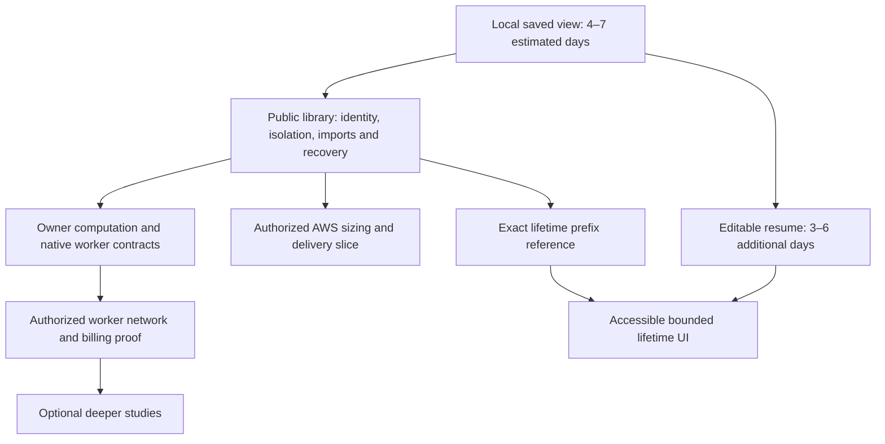

# R3: cross-examination and synthesis instructions

**The research is ready for a bounded final synthesis.** The three R2 lanes agree on the affordable AWS direction, separate durable analysis and placement, private owner scope, and finite optional computation. No unresolved question requires another provider catalogue. Some contracts now resolve earlier contradictions on paper; none should be presented as tested backend code. The next useful implementation is the local saved-study slice, while public hosting remains a separate release with its own identity, recovery and cost gates.

Checked 9 September 2026. This single cross-examiner read the central investigation, all three R2 reports and the relevant platform, delivery, identity, data and validation documents. Root is concurrently reconciling the parent data/job documents and diagrams; their stale statements below describe the inspected snapshot, not a demand to undo that work. No application, infrastructure, account or parent-document changes were made. R4 has not started in this lane.

## Evidence and coverage

The repository reference remains `e87e8a73b9857e022daefab150023a7a6a6be374`. R2 verified its successful main CI run, the 37-file application manifest and released AWS-provider capability. This round cross-examines those retained records; it does not claim another remote refresh, price observation, cloud benchmark or browser experiment.

| R3 input                                           | SHA-256 at inspection                                              |
| -------------------------------------------------- | ------------------------------------------------------------------ |
| [Central investigation](platform-investigation.md) | `dba9d7669733381de1075c6bf14bbe532dcba8aade2b247fb0cbf3ea5fdabbb1` |
| [R2 verification](r2-verification.md)              | `4ca36ec1ebab174d14cf072adda050731812f992bd8677665f46fdfb901f5165` |
| [R2 hostile review](r2-hostile-review.md)          | `5c6f78404165057d55e455a74e1c85680952096757ee7aa1d4c94cfe30725909` |
| [R2 minimal design](r2-minimal-design.md)          | `15de373787ef2344622575fac85d05e93f7a67bc260b2d32463adc07cd6fcb13` |

| User intent                        | Coverage and verdict                                                                                                                                                                                                                                                                 | Remaining proof or decision                                                                                                                                                   |
| ---------------------------------- | ------------------------------------------------------------------------------------------------------------------------------------------------------------------------------------------------------------------------------------------------------------------------------------ | ----------------------------------------------------------------------------------------------------------------------------------------------------------------------------- |
| Affordable AWS learning            | **Covered as a planning direction.** N. Virginia $18.85 priced core plus $3–$8 allowances; Cape Town $23.17 core; labs and engine separate. [Cost comparison](platform-investigation.md#hosting-cost-and-the-strongest-alternative), [learning steps (line 96)](../aws-baseline.md). | Region, measured size, tax/domain/mail/backup totals and paid experiment ceiling; learning roadmap is not completed tutorials.                                                |
| Public app anyone can join         | **Designed, not built.** Accounts, private library, recovery, completed-game imports and phased release are specified. [Release gates (line 109)](../validation-and-decisions.md).                                                                                                   | Public signup/abuse/recovery integration and its engineering effort are outside the local-save estimate.                                                                      |
| Security and privacy               | **Material boundaries covered conditionally.** Auth and domain roles, private delivery, journal-backed revocation, constrained host/worker identities and Free-edge candidate.                                                                                                       | Real two-account, restore, origin, grant and effective-IAM tests; one host remains one failure domain.                                                                        |
| CI/CD and repo cost                | **Current CI verified; deployment proposed.** Public repository and exact successful main run are evidenced; immutable builds, OIDC and promotion controls are specified.                                                                                                            | Actual deploy claims, registry credentials, private-plan implications and rollback drill. Privacy is not a substitute for runtime security.                                   |
| Avoid repeating Stockfish/layout   | **Strongest local evidence.** Cache defects isolated; six placed-graph SSR states match after restoration.                                                                                                                                                                           | Durable acknowledged save, browser interaction/memory, immutable provenance, lazy engine initialization and editable checkpoint recovery. Redis is not required.              |
| Paper fidelity and better diagrams | **Rules/evidence gaps explicitly retained.** Graphviz geometry, occurrence semantics and engine coverage are separated.                                                                                                                                                              | Effective-concession classification remains a proxy; equal-budget reader evaluation and all-figure cue regressions remain open. More depth/glyphs is not the success measure. |
| Lifetime games and patterns        | **Coherent proposed model.** Encounter-aware prefixes, exact collapse totals, selected perspective and separate engine overlays.                                                                                                                                                     | Reference aggregation, correction/deletion, bounded navigation and archive-scale measurements; correlation does not establish why a player won.                               |

No row is closed by a pricing calculation or by the existing frontend CI alone.

## Contradictions and consistency table

| ID  | Conflict or apparent conflict                                                                                                                                                                                                               | Cross-examiner resolution and concrete edit                                                                                                                                                                                                                                                                                                                                                                |
| --- | ------------------------------------------------------------------------------------------------------------------------------------------------------------------------------------------------------------------------------------------- | ---------------------------------------------------------------------------------------------------------------------------------------------------------------------------------------------------------------------------------------------------------------------------------------------------------------------------------------------------------------------------------------------------------- |
| X1  | R2 hostile H1 rejects first-request fencing; central now recommends independent owner computation; inspected [jobs DOT line 10](../diagrams/jobs.dot) still asks whether the owner/request is live.                                         | **Resolved design, stale parent artifact.** Promote computation/attempt generation plus owner epoch, then independent subscriber attachment. Cancelling A leaves B's demand alive. Keep a distinct last-subscriber stop path and owner-deletion path; regenerate/inspect the SVG after root's update.                                                                                                      |
| X2  | The sensitivity table features 16-root batches; [minimal design line 236](r2-minimal-design.md) starts with at most four roots, one owner, one slot and a proposed 180-second quantum.                                                      | **No mathematical contradiction; incompatible meanings if unlabeled.** The table explores economics, not the initial scheduler. A four-root plan is a ceiling, not a promise all four fit; fallback/startup/stop margin can permit only one. Label those quantities wherever the table is summarized.                                                                                                      |
| X3  | Reservations appear at request admission and again at task launch.                                                                                                                                                                          | **Resolved by a proposed transfer contract**, [minimal design line 232](r2-minimal-design.md): conservatively funded root obligations transfer atomically into a task reservation; release duplicated overhead only after coverage exists. Keep engine entitlement and billed allocation as distinct units; do not sum both as two AWS charges. Race/settlement tests remain open.                         |
| X4  | [Central data flow](platform-investigation.md#proposed-data-flow) draws S3/OAC as a solid path, while its prose calls static S3 optional; [deployment table (line 9)](../infrastructure-and-delivery.md) and AWS runtime show direct Caddy. | **Unsettled presentation, not a forced service choice.** Name the accepted direct-host cost reference and the conditional CloudFront candidate explicitly. Draw optional static S3 as optional. Label the central picture logical data flow; an HTTP packet-path picture must route origin responses through the selected edge. Never combine unrestricted direct ingress with an asserted protected edge. |
| X5  | “Terraform owns resources” can imply the Free subscription is managed by its distribution.                                                                                                                                                  | **Code question closed, implementation fork open.** R2 pinned AWS provider v6.63.0 lacks this resource; pending upstream PRs are not released capability. State separately owned subscription bootstrap/read-only association checks, or select a tested supporting release later. Do not repurpose `price_class` or monitoring subscription.                                                              |
| X6  | Local reopening is the first constructive slice; the parent “Phase 0” lists identity/data/import/infrastructure first.                                                                                                                      | **Different tracks need one explicit sequence.** Local durable-save work precedes cloud cost and can ship independently. Public-library Phase 1 needs its own four feasibility slices; neither lifetime aggregation nor server studies is a prerequisite. The local slice must not displace the user's public AWS objective indefinitely.                                                                  |
| X7  | Snapshot restoration matches SVG and takes about 16 ms; editable resume needs builder state and browser work.                                                                                                                               | **Evidence boundary resolved.** Preserve “gunzip/parse/reindex in one Mac run,” six static component comparisons, and uninstrumented zero-engine/layout declarations. Keep view restore and mutable checkpoint as separate deliverables. Do not headline “16 ms app reopen” or “paper fidelity proved.”                                                                                                    |
| X8  | Generic auth/session prose may borrow the Supabase BFF contract for Better Auth.                                                                                                                                                            | **Parent identity document now separates alternatives.** Adopt the chosen library's real schema/session controls; keep custom Supabase BFF and Cognito/serverless as distinct forks with integration costs. No mix-and-match session architecture is established.                                                                                                                                          |
| X9  | The [minimal entity table (line 164)](r2-minimal-design.md) embeds unescaped pipe characters in `data_scope` enum examples.                                                                                                                 | **Concrete document defect.** Escape the pipes or write comma-separated alternatives; otherwise Markdown splits the two-column row into extra cells. Recheck table column counts, not formatting alone.                                                                                                                                                                                                    |
| X10 | Paper-study edge width and atlas edge width represent different quantities.                                                                                                                                                                 | **Resolved in constructive prose**, [line 326](r2-minimal-design.md). Promote separate layers/legends: comparable candidate quality versus encounter frequency. The atlas sample is consistent: `25 + 10 + 5 = 40`, outcomes sum to 40, cohort is 100, known-outcome denominator is 38. Display collapse must not change any of those totals.                                                              |

The inspected [delivery diagram](../diagrams/delivery.dot) agrees with its stage table: trusted build, isolated staging, explicit same-digest promotion and separate infrastructure apply. It does not falsely show independent reviewers. The current direct-host AWS drawing correctly separates DNS from HTTPS; its title should retain “modeled, before tax, pending size/region” rather than letting “about $25” stand alone.

**Closing reconciliation:** root applied corrections during this review, and a targeted reread confirms X1–X3 and X9 are now reconciled in the parent prose/source. The job DOT separates computation publication, subscriber attachment, cancelling A and losing all demand; data prose includes the funded reservation transfer. The malformed enum row is fixed. Central now explicitly lists the region/serverless/auth/enrollment/subscription forks, labels 16-root batching as sensitivity, and draws optional S3 with a dashed arrow. These are closed document issues, not open implementation defects. The remaining X4 action is consistent captioning/packet-path explanation; the baseline already labels its direct-host reference separately from the candidate edge. Final rendered-SVG validation remains root's document check.

The closing inspected hashes are central `01036ed3806350463b40bc0161952986af9118f4a616a7844970c92022769ebe`, minimal design `144a4e94999fe2a934a27c92a7198ab09b0beedd779b80f22432599c1e7fe11c`, data design `286c877306cbd6d2e6f29466e91e7ddd9188a142c0c2621eab1991efd28bfe45`, and jobs DOT `1b1b6f74ac2dc214f9eebe7c72d764b97a784fcde51289df441d98d482b23e19`. Later edits require their own check; these fingerprints preserve which version closed each issue.

## Consolidated material open-question ledger

Each item has a specific closure, default and boundary. “Open” does not mean research must wait for a deployment. R4 should close document/code questions and preserve implementation gates honestly.

| ID / type                             | Question, working default and closure evidence                                                                                                                                                                                                                                                                                                                            | Blocks                                                                    |
| ------------------------------------- | ------------------------------------------------------------------------------------------------------------------------------------------------------------------------------------------------------------------------------------------------------------------------------------------------------------------------------------------------------------------------- | ------------------------------------------------------------------------- |
| Q1 `[decision]` + `[experiment]`      | **Region/size:** N. Virginia is a price reference; compare Cape Town latency/cost and jurisdiction, then run the credit-depleted 2 GiB mixed fixture in [central line 144](platform-investigation.md#experiments-that-decide-launch-readiness). If it fails, lower admission or reprice medium/nonburstable capacity; medium adds RAM, not baseline CPU.                  | Provisioning and capacity promises; not local save.                       |
| Q2 `[decision]` + `[live-data]`       | **Complete budget:** choose domain/registrar, SMTP, logging, backup/journal/key store and operator recovery targets. Add taxes, retained bytes, email and actual registry/network charges; keep baseline, engine and labs separate. Proposed RPO 24h/RTO 8h needs acceptance and a timed drill.                                                                           | Public operating/recovery commitments.                                    |
| Q3 `[experiment]`                     | **API serverless alternative:** retain the $2.59 example only as selected usage arithmetic. Run equivalent ownership, transaction/reservation, deletion, filtered library and recovery access patterns; include every matching cost category and migration effort. Trigger replacement only if total value improves.                                                      | Replacing EC2/Postgres; not continuing accepted direction.                |
| Q4 `[live-data]` + `[experiment]`     | **Free edge:** confirm account eligibility, exact five-behavior limit/routing, zero-TTL default/private paths, necessary credential forwarding, subscription state/attachments, second-distribution/direct-origin denial and locked-origin TLS renewal. Origin secret plus source restriction, not prefix list alone.                                                     | Calling the candidate secure/free for this deployment.                    |
| Q5 `[decision]`                       | **Subscription ownership:** separately controlled bootstrap plus read-only active-plan checks under the pinned provider, or a later tested supporting release. AWSCC/third-party coverage was not audited; it is not assumed. Record drift/renewal/removal owner without paid approval in routine deploy.                                                                 | Exact infrastructure implementation.                                      |
| Q6 `[decision]` + `[experiment]`      | **Auth:** pin Better Auth and prove sessions, OTP/linking, fresh suspension checks, CSRF, auth/domain roles and journal-aware deletion. Supabase BFF remains an unproven managed alternative; Cognito belongs to the serverless comparison. Choose a fork if the actual integration fails.                                                                                | Public signup/private delivery.                                           |
| Q7 `[decision]` + `[live-data]`       | **Provider connection:** choose verify-and-discard versus retained Lichess credential/sync behavior; test authorized consent and revocation. Chess.com public import is useful without ownership proof; authenticated linking requires its separate approved contract.                                                                                                    | Those connection capabilities, not PGN/public-source use.                 |
| Q8 `[experiment]`                     | **Computation lifecycle:** run real-Postgres admission races, A/B cancellation, last-demand stop, deletion, staged publication/attachment crashes and accounting transfer. Pin exact input/build/trust manifests; warm/cold engine state remains a reproducibility experiment.                                                                                            | Hosted study correctness and reuse claims.                                |
| Q9 `[decision]` + `[experiment]`      | **Worker bootstrap:** one-use launch bearer is the proposed minimum, not task attestation. Prove restricted Describe/log access, sanitized child environment, exact encrypted launch retry, expired/replayed grants and lost-response reconciliation. IAM-authenticated enrollment is a separately priced alternative if this control-plane trust is unacceptable.        | Server-study launch.                                                      |
| Q10 `[experiment]`                    | **Worker cost/fairness:** measure equivalent pinned native work on Fargate and Lambda, including image/startup, fallback, upload, termination, minimum/rounding and registry traffic. Lambda's 900-second limit permits bounded partitioning in principle. Test owner quantum, queue wait and independent reaper during host failure; reserve unknown obligations.        | Presets, task envelope and worker-platform decision.                      |
| Q11 `[decision]` + `[experiment]`     | **Whole-service bounds:** choose per-owner/global input expansion, retained-byte/object, import, email, export and queue limits, separately from engine caps. Prove exhaustion preserves necessary reads/recovery and does not silently discard saved data.                                                                                                               | Public abuse/cost control; no universal invoice-cap claim.                |
| Q12 `[experiment]`                    | **Saved study:** S01–S06 cover atomic acknowledged save, bounded decode, three browsers, namespace switching, legacy migration and mutable contribution recovery. Decide supported device/browser targets and retention/export behavior. Device-local profile separation is not protection against a compromised same-origin app or access to the device.                 | Reliable local save; later hosted durability adds its own acknowledgment. |
| Q13 `[experiment]`                    | **Paper quality:** frozen finite event frontier, equal allocated budget, quiet and tactical samples, all-figure cue checks and blinded reader tasks. Keep legal check, 50 cp local proxy and unknown separate. Unpublished effective-concession logic is an explicit limit, not inferred completeness.                                                                    | Claims of improved fidelity or coaching quality.                          |
| Q14 `[experiment]`                    | **Lifetime:** independent prefix/count model, perspective, duplicates, exact correction/deletion and immutable library epoch; expand past ply 24 in bounded chunks. Measure 1k/10k/100k encounters with a 10k-game owner; 250 visible nodes is a candidate, not validated responsiveness.                                                                                 | Lifetime release and scale claims.                                        |
| Q15 `[live-data]` + `[experiment]`    | **CI/registry:** retain public visibility for now; inspect actual deploy OIDC claims, effective IAM, SSM fixed-document controls, ARM/x86 artifact manifests, GHCR/private pull or ECR requirements, and failed rollout/restore. Owner-wide private Actions usage is unknown.                                                                                             | Production deployment and private-repo cost forecasts.                    |
| Q16 `[decision]` + `[primary-source]` | **Visibility/licensing:** privacy is optional, not mandatory for public hosting. Keep source/license provenance with distributed components. The GNU FAQ full-page read remained unavailable in R2; local GPL text does not settle every proprietary-derivative proposal. Obtain focused primary/legal review only if a proposed visibility/distribution change needs it. | That change, not current research or baseline hosting.                    |

## Minimal slice sizing and promotion order

The constructive ranges are **engineering estimates, not measured throughput or a public-launch quote**. The first local saved-view slice is 4–7 engineer-days; editable checkpoint recovery adds 3–6. The remaining proposed ranges are 5–9 for local computation/admission, 6–12 for worker/grant/recovery integration, 5–10 for a prefix reference model, and 5–10 for authorized AWS reconciliation. Their arithmetic sum is **28–54 engineer-days**, but it excludes full public auth/recovery, provider integration, operations/tutorials and polished lifetime UI. Do not convert that sum into a launch date.

This is dependency guidance, not a staffing/calendar plan. Public-library validation must include the existing snapshot payload sizes and browser engine transfer; worker studies can stay disabled. Require demonstrable saved replay before inventing a compact codec, and a small deterministic prefix model before a polished sprawling atlas. The public-library integration needs its own estimate once auth/provider scope and edge/region choices are fixed.

## Cut, promote and final synthesis edits

**Cut from the recommendation:** any claim that all gaps are closed, the app opens in 16 ms, $25 is a cap, $2.59 is a full alternative, depth 20 assesses every continuation, a bigger T4g gives more baseline CPU, a private repo provides runtime security, or a task ARN proves worker identity. Keep historical managed/VPS budgets in clearly secondary comparisons; they should not compete with the chosen baseline on the opening page.

**Promote into the authoritative plan:** independent owner computation and two-stage publication; immutable view versus editable checkpoint; no engine/layout on a compatible restored view; exact retention/provenance; finite event frontiers; one-owner bounded tasks with funded overhead; partial-result honesty; encounter rather than move-content counting; default uncached private delivery; and recovery that replays revocation before traffic. All remain proposed unless linked to layer-specific test evidence.

Concrete final edits for root:

1. Replace “R1 complete” as a claim-status shorthand in the central question table with **verified local fact**, **reconciled proposed contract**, or **unrun deployment/product gate**. Mark R3 complete only after reading this report; leave later rounds pending.
2. Preserve the reconciled X1–X3 and X9 changes through final formatting/rendering. Give each table/diagram a clear topology/scope; label optional CloudFront/S3 resources and reference region. Validate source DOT, generated SVG and accompanying prose together.
3. Add Q1–Q16 as the consolidated ledger or link this table; remove duplicate vague “more research” items. Provider subscription coverage is a resolved pinned-code fact, not an outstanding search task. Keep account eligibility and configuration as separate unknowns.
4. Present a single next implementation slice, its 4–7-day estimate and explicit limits, followed by the public-library track. Keep all full-launch effort exclusions visible. Show separately the direct-host recurring model and an optional-study sensitivity example.
5. Add a final proof map: local serializer/IndexedDB/SSR experiments, committed-main CI, proposed database/browser controls, and unrun AWS/live-provider tests. The final narrative may recommend action while retaining those open gates.

## Pasteable bounded handoffs

**Local save implementation:** “Implement only Slice 1 from `docs/platform/research/r2-minimal-design.md`: versioned bounded local study storage, immutable result references, atomic acknowledged head update and lazy restore. Preserve paper occurrence semantics and existing edits. Exercise S01–S05 with actual IndexedDB/browser behavior; instrument Engine and Graphviz calls. Report decode, paint and memory separately. Do not add hosting or claim editable checkpoint recovery.”

**Public-library feasibility:** “Estimate and build the smallest chosen-auth/Postgres vertical slice for two owners, one completed-game import and one saved private study. Prove actual pool/RLS/session/revocation and restore boundaries from the platform gates. Keep paid server analysis disabled. Return a measured resource fixture and missing public-launch scope; do not provision paid infrastructure without the separate account/region/spend instruction.”

**AWS comparison experiment:** “Using the selected account, region and explicit spending ceiling, test the stated small-host workload and exact edge configuration. Compare the complete matching serverless slice only if its required domain contracts are implemented. Capture resource configuration, active pricing-plan associations, credit state, memory, retained bytes, invoice dimensions and cleanup. Do not treat list prices or idle-host success as capacity.”

**Worker correctness experiment:** “Implement owner computation/attempt/subscriber and reservation transfer with disposable real Postgres and deterministic worker doubles first. Exercise J01–J05/B01–B02/W01–W02, including uncertain launch and consumed enrollment response loss. Then use one pinned real native engine for adapter proof; AWS reaper and billing remain a separately authorized W03 experiment.”

**Diagram/lifetime experiment:** “Use frozen Tal/Deep Blue inputs and a synthetic encounter corpus to compare finite event enrichment at equal allocated cost, explicit unknown cues and bounded prefix navigation. Check every relevant paper cue, exact encounter denominators, correction/deletion, expansion stability and reader tasks. Do not maximize node count or recolour a proxy as an effective-concession proof.”

R3 closes cross-report reconciliation as a research step. R4 should resolve the concrete document/code findings and bound the ledger; it need not wait for future AWS construction to finish the dossier honestly.
