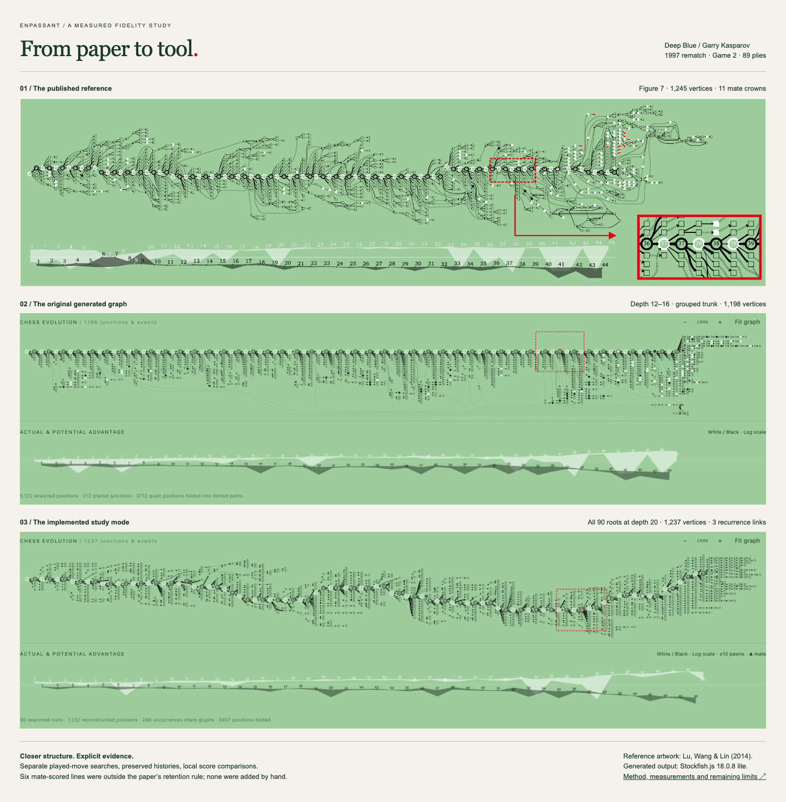

# From the paper to a working visualizer

7 September 2026 · Implementation and measured comparison

**The visualizer now implements a substantially more faithful structural model, but it is not an exact reproduction of Figure 7.** The full Deep Blue–Kasparov game reached depth 20 at all 90 roots. Its retained graph contains 1,237 vertices, compared with 1,245 in the paper. Those similar counts do not establish tactical or geometric equivalence.

To try it: **Import game → Try the paper’s game → Depth 20 study**. A fresh run took 12 minutes 11 seconds on this machine; cached reopening took about six seconds. Timing is an observation, not a performance guarantee. The study can be paused and resumed; every individual search has a 60-second ceiling, and missed depth targets are reported with an explicit retry action.



## What the controlled comparison established

The [baseline report](paper-fidelity-study-2026-09-07.md) recorded an attempted browser interception of `group=played` with unchanged coordinates. That interception did not assert it had run, and its exact URL matcher could miss a versioned module request. Its conclusion was not reliable.

We subsequently fed the **identical frozen baseline graph** directly to Graphviz. The original grouping and weights reproduce the original raw bounds exactly, `2588.9 × 279.52` (the application adds 36 units of padding). Changing only the grouping gives:

| Same graph, same scores | Branches above played source | Branches below played source | Played vertical spread |
| ----------------------- | ---------------------------: | ---------------------------: | ---------------------: |
| Original `group=played` |                            7 |                          312 |                      0 |
| Group removed           |                          165 |                          144 |                    154 |

This is evidence that the group was the principal cause of the flat, one-sided comb. The earlier negative result is corrected, not used as support. [Frozen baseline measurements](layout-baseline-ablation.json).

The final layout lets Graphviz choose branch order naturally and uses the paper’s **5:1 played-to-alternative placement preference**. We also tested forced fan ordering and equal placement weights on the depth-20 graph. Forced ordering increased raw height from 278.04 to 413.04; equal weights with that ordering increased it to 1,001. The selected policy produces 158 branches above their played source and 150 below. No mirrored fan template or hand-authored game coordinates are used. These are local branch-direction measures, not an edge-crossing score or a usability study. [Depth-20 measurements](layout-depth20-ablation.json).

## Analysis and graphical meaning

- **Coverage is explicit.** Quick preview requests 400 ms per root; Study targets depth 20 with a 60-second ceiling. Both retain one completed MultiPV iteration. The achieved depth is recorded. Terminal positions are identified separately from searched roots, and retained PV endpoints identify a display limit or the end of the returned line. The default horizon is 20 plies; search depth, PV length and display horizon are separate quantities.
- **The played continuation is genuinely searched.** Candidate retention is four if the played rank is 1–4, through its rank for 5–8, or eight plus a separate `searchmoves` result otherwise. The fallback targets the completed sibling depth. An exact rank outside eight is unknown. Mismatched-depth values are excluded from quantitative comparisons.
- **Events have evidence and precedence.** Checkmate is verified by legal replay; draw takes precedence over an ordinary check fill. The paper omits its operational effective-check classifier. Our explicitly documented proxy highlights a checking move only when its same-depth local evaluation is within 50 cp of the best sibling. Inferior checks can be shortened; unassessed checks remain visible and hollow. Root PV scores are never transferred to downstream checks. This proxy measures search support, not the authors’ full tactical concept.
- **Convergence keeps its histories.** Display sharing requires the same ply, placement, turn, castling and en-passant rights, and compatible event state. Clocks may differ because the occurrence histories remain separate. A route selector exposes each visible history in chess notation. Search cache keys include the full initial FEN and move path.
- **Recurrence is a relationship.** A dashed back link identifies the nearest matching ancestor. Played instants stay separate and chronological, retaining their own clocks and repetition state. The link is not an additional chess move or a merged engine history. Claimable threefold/fifty-move draws follow chess.js’s draw policy; a back link alone does not declare a draw.
- **Widths and bands agree.** Both use the retained candidates at one root and one completed depth. Widths use a monotone `log1p` adaptation of Eq. 2, normalized to 1–30, displayed at one tenth that scale. The worst played move receives no artificial thickness floor. Unmeasured or ambiguous merged-route edges remain neutral. Scores are not win probabilities; bands are not confidence intervals. Chart titles expose score/depth provenance; the ±10-pawn clipping and distinct mate markers are labeled.
- **Unfolding reveals actual nodes.** Clicking a dotted path opens its hidden moves inside the graph with single-ply connections, plus move buttons beside the board. Existing junction coordinates stay fixed; closing restores the original graph. Only the selected occurrence path unfolds when several histories share an edge.
- **A refreshed search replaces its paths.** Superseded continuations are removed. Independently explored roots retain their own contributions and required ancestors. Replay freezes published geometry and defers new layout publication until playback stops.

## What the famous game now shows

| Measurement                                    | Original quick baseline | New depth-20 study |
| ---------------------------------------------- | ----------------------: | -----------------: |
| Roots reaching depth 20                        |                  0 / 90 |            90 / 90 |
| Separately searched played moves outside eight |                       0 |                  5 |
| Reconstructed occurrences                      |                   5,122 |              7,132 |
| Visible vertices                               |                   1,198 |              1,237 |
| Displayed shared junctions                     |                      99 |                106 |
| Recurrence links                               |                       0 |                  3 |
| Retained mate endpoints                        |                       0 |                  0 |

The missing mate crowns are now better understood. Stockfish returned **six mate-scored PVs** at roots `p81`, `p85` and `p87`. They occupy ranks 6–8, outside the four retained candidates at those decisions. Applying the paper’s own retention rule removes them. The reference has eleven crown markers, so matching its depth and pruning rule with this modern engine still produces different tactical content. Adding those crowns by hand would falsify the result. The recorded mate lines and retention decisions are in the [measurement file](deepblue-depth20-measurements.json).

After the recorded resignation at `45. Ra6`, the best retained response is `...Qe3`, evaluated at **+0.54 for White** in this run. That is an engine estimate, not proof of a draw. The game’s recorded `1–0` result remains distinct from analysis of the final position.

The late cluster still differs from the reference. Most downstream checks remain unassessed (122 displayed glyphs in this run), because reconstructed PV positions are not separately searched roots. A chess-reviewed effective-check classifier with additional defensive searches, broader exploration controls, and access to the authors’ original engine data would be further work. The full published optimization objective and its virtual-node factors are not independently reimplemented; the application uses Graphviz’s layered algorithm. These limitations are visible rather than disguised as exact fidelity.

## Evidence and reproduction

The [verified PGN](deep-blue-kasparov-1997-game-2.pgn) comes from [US Chess’s contemporary record](https://www.uschess.org/archive/results/tnmt/97kdb/game2/game2.html). The reference is Lu, Wang & Lin, [_Chess Evolution Visualization_](https://people.cs.nycu.edu.tw/~yushuen/data/ChessVis14.pdf), §§3.1–3.3 and Figure 7. Original artwork remains attributed to its authors and rights holders.

With the repository’s supported Node/pnpm and installed Playwright Chromium:

```sh
pnpm dev
# Fresh isolated engine run, then optional cached rerender after a layout edit:
node scripts/research-paper-game.mjs --study
node scripts/research-paper-game.mjs --study --cached

# No Stockfish search needed for these controlled layout comparisons:
node scripts/research-layout.mjs docs/research/deepblue-depth20-analysis.json.gz
node scripts/research-layout.mjs docs/research/deepblue-baseline-graph.json.gz --frozen-graph
```

The benchmark disables development hot reload and leaves the user’s browser untouched. Compressed fixtures contain complete engine lines and legal histories, not just screenshots. Output hashes are recorded in the measurement files. Fresh searches can differ through engine state, time limits and hardware; frozen-graph tests isolate those effects.

Validation includes 34 unit tests and nine deterministic browser tests: actual Stockfish, profile/cache isolation, legal transpositions, recurrence and draw-in-check, same-root comparisons, stale-search replacement, forced legal reply versus sparse PV, horizon versus mate, route selection, in-graph unfolding, stable replay, imports, mobile layout, and the original Figure 5 fidelity gate. The two live-service import checks remain opt-in. The paper-image metrics are unchanged: ink precision 0.9697, recall 0.9233, color difference 0.08995.
