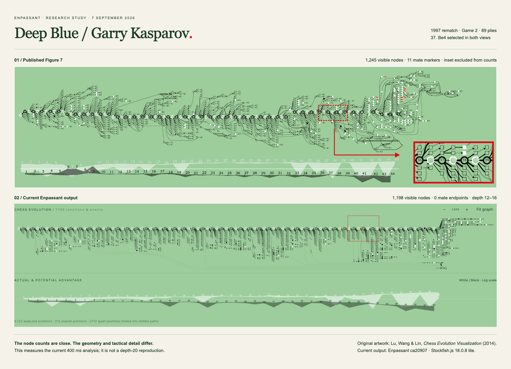

# Understanding the paper’s diagrams

7 September 2026 · Baseline research against application commit `ca20907`.

**Later source review:** the [complete visual rulebook and figure atlas](paper-visual-rulebook.md) qualifies this study's interpretation of neighbour preservation, draw loops and focus scope. Use its figure-by-figure evidence for the next renderer pass; retain this document as the baseline experiment record.

The [implemented fidelity pass](paper-fidelity-implementation.md) follows this baseline study. The later controlled experiment corrects the initial, inconclusive browser test of `group=played` below.

**Running the same game through Enpassant does not yet produce a close reproduction of Figure 7.** It produces a real, legally replayable analysis with related visual marks, but materially different geometry and tactical detail. Improving fidelity is achievable; identical output would additionally require the authors’ original analysis data and rendering configuration.

The example is **Deep Blue–Garry Kasparov, game 2 of the 1997 rematch**, played on 4 May. The [US Chess contemporary game record](https://www.uschess.org/archive/results/tnmt/97kdb/game2/game2.html) supplies the 89 plies through `45. Ra6`; its [match schedule](https://www.uschess.org/archive/results/tnmt/97kdb/index.html) supplies the date. [Importable PGN](deep-blue-kasparov-1997-game-2.pgn).

## What was actually checked

I reread the complete 14-page author manuscript, inspected its figures and equations, traced the current engine, graph, layout and rendering code, and ran the game in a fresh Chromium context. The default analysis completed in **42.9 seconds**, with no browser errors. The screenshot is the actual application, using its current 400 ms search budget and eight principal variations.

| Measurement                                       | Result                                                               |
| ------------------------------------------------- | -------------------------------------------------------------------- |
| Analyzed roots                                    | 90: initial position plus 89 played plies                            |
| Completed search depth                            | Minimum 12, median 13, maximum 16; none reached 20                   |
| Occurrences assembled from retained continuations | 5,122                                                                |
| Occurrences removed by display sharing            | 212; 99 displayed glyphs have multiple member histories              |
| Quiet positions hidden by shortening              | 3,712                                                                |
| Displayed graph                                   | 1,198 vertices, 1,250 edges, 538 compressed edges                    |
| Displayed event glyphs                            | 115 checks, zero mates, zero draws                                   |
| Checks rooted at ply 74 or later                  | 65 of the 115; these are all checks, not classified effective checks |
| Played moves absent from the root’s top eight     | Six, including `37...Rxa2`                                           |

Independent vector inspection of Figure 7 gives **1,245 visible nodes: 90 circles and 1,155 squares**, plus **11 mate image markers**. Counts exclude the score chart and enlarged inset. These are geometric observations, not recovered chess positions. The node totals differ by less than 4%, yet the shapes look substantially different. Node count alone would be a misleading acceptance test.

The baseline graph has a long, almost flat trunk with most alternatives beneath it. The source artwork distributes branches above and below a gently bending trunk, with distinct local clusters and late event-bearing continuations. The initial browser attempt to remove `group=played` produced unchanged coordinates, but did not assert that its interception ran; versioned module URLs could bypass its exact matcher. **That experiment was inconclusive.** A subsequent direct DOT experiment reproduces the original bounds and shows that removing only the group changes the outgoing branch split from 7 above / 312 below to 165 above / 144 below. See the [controlled measurements](layout-baseline-ablation.json) and [implementation report](paper-fidelity-implementation.md).

## Compact reference contract

These requirements come from [Lu, Wang & Lin, _Chess Evolution Visualization_](https://people.cs.nycu.edu.tw/~yushuen/data/ChessVis14.pdf). Page numbers below refer to the author manuscript.

| Reference           | Requirement                                                                                                                                    |
| ------------------- | ---------------------------------------------------------------------------------------------------------------------------------------------- |
| §3, p.3             | Depth 20. Retain four lines when played rank ≤4; through rank n for 5–8; eight plus played otherwise.                                          |
| §3.1, Fig.2, pp.3–4 | Merge equivalent positions before shortening event-free, single-parent/single-child chains. Preserve played nodes, events and their neighbors. |
| Eq.1, pp.4–5        | Weighted layered Graphviz layout; virtual-node factors 1/2/8, played-edge preference 5:1, spacing parameter 0.5.                               |
| §3.2, Fig.3, pp.5–6 | Circles: played; squares: predicted. Circle border: turn. Fill: event beneficiary; gray: draw; crown: mate. Quiet squares remain hollow.       |
| §3.2, Eq.2, p.6     | Highlight effective checks. Solid/dotted edges encode one/several plies. Log-squared thickness compares siblings only.                         |
| §3.3, p.6           | Aligned logarithmic chart: actual scores plus translucent potential-score ranges, separately by side.                                          |
| §§4–4.2, pp.6–9     | Linked board, descendant isolation, in-graph unfolding. Dynamic query-driven layout is future work.                                            |
| §5.1, pp.9–10       | Simplified, explicit, axis-parallel, 2D graph; repetition can create backward edges.                                                           |

## The structures we need to recognize

The following names are our working vocabulary for implementation and validation, not a formal taxonomy claimed by the authors. They describe relations and evidence; they should not become decorative shapes selected by a game’s name.

| Structure                                                 | Interpretation and implementation consequence                                                                                                                                                                                                         |
| --------------------------------------------------------- | ----------------------------------------------------------------------------------------------------------------------------------------------------------------------------------------------------------------------------------------------------- |
| **Fork**: one position, several continuations             | A decision in the retained analysis. Show the alternatives actually searched and distinguish them from the played continuation. A broad fork does not measure the number of all legal moves.                                                          |
| **Convergence**: several routes, one position             | Routes can reconnect after different move orders. A shared glyph needs accessible member histories; entering through one route must not silently switch the board or engine to another history.                                                       |
| **Corridor**: a long sequence without a junction          | Eligible sequences can become dotted links with recoverable internal moves. One displayed continuation does not prove a forced move: the engine may simply have returned one principal variation.                                                     |
| **Cycle**: a position is revisited                        | Model recurrence and the associated history. Preserve its meaning even when chronological replay remains linear. A back-link is an informative relation, not a layout error to be flattened away.                                                     |
| **Tactical cluster**: several event-bearing continuations | Interpret the specific checks, responses and endpoints. A large cluster may reflect search coverage, repeated routes or compression policy. It is not a probability of winning, and multiple mate leaves do not establish mate against every defense. |
| **Narrowing alternatives**                                | Determine whether options disappeared because of legality, pruning, search depth or convergence. Only the first is direct evidence that a player has fewer legal choices.                                                                             |
| **Thin played edge beside thicker alternatives**          | Can explain a missed opportunity only if the played move and alternatives have comparable scores. Visual emphasis used for navigation must not override that quantitative meaning.                                                                    |
| **Changing score envelope**                               | Shows the range of the sampled choices under a declared search policy. It is neither a statistical confidence interval nor a calibrated chance of recovery.                                                                                           |

We already have legal histories, visual junctions and recoverable hidden paths. The missing work is to make each of those structures carry a reliable, inspectable meaning across different games.

## Where the current implementation diverges

### 1. Search coverage and graph construction are different quantities

[`engine.ts`](../../src/lib/engine.ts) sends `go movetime 400 depth 20`. Twenty is a stopping ceiling, not a completed-depth guarantee. [`EvolutionBuilder.append`](../../src/lib/evolution.ts) separately truncates each returned continuation to twenty plies. In this run the returned lines had a median length of thirteen, with lengths ranging from one to thirty-four. Search depth, returned principal-variation length and retained display horizon must be recorded separately. The [official UCI documentation](https://official-stockfish.github.io/docs/stockfish-wiki/UCI-Protocol-and-Stockfish-Commands.html#go) defines the depth, time and restricted-move controls.

The app evaluates roots along the played game. Its thousands of downstream occurrences are reconstructed from those roots’ PVs; they do not each have an independent evaluation. This prevents us from honestly assigning a tactical-gain classification or a locally measured thickness to every downstream edge today. The UI phrase “5,122 analyzed positions” should eventually distinguish reconstructed occurrences from separately searched roots.

The candidate retention code is close to the reference policy for ranks within eight. Outside eight, it preserves the actual game trunk but does not request a comparable forced-root search for that move. The next played position is searched separately, which is useful but is not the same root comparison. Proposed remedy: a `searchmoves` fallback with stored budget/depth and explicit provenance; never infer an exact rank of nine from “not in the top eight.”

### 2. Our display graph cannot express recurrence

[`evolutionLayout.ts`](../../src/lib/evolutionLayout.ts) groups by `ply + full FEN + draw`. Every underlying edge increases ply. Consequently the resulting display graph is acyclic, even when a board position recurs later.

A diagnostic grouping of the same 5,122 occurrences found 4,910 current keys, 4,862 keys when retaining ply but excluding FEN clocks, and 4,830 when also excluding ply. Thirty-one groups then contained occurrences from different plies. These are sensitivity measurements, **not an approved replacement identity scheme**.

We should retain the occurrence tree as the authority for legal history, and define a separate relation for display equivalence. Piece placement alone is insufficient: turn, castling and en-passant rights affect available moves, while repetition and move counters affect outcomes. Recurrence links can expose the relationship without merging the histories used by the engine. A route picker, cycle-aware traversal and explicit terminal-state handling belong in that design.

### 3. Events determine compression, not just node color

[`games.ts`](../../src/lib/games.ts) records `check`, `mate` and `draw`; it has no “effective check” classification. [`EvolutionMarks.tsx`](../../src/components/EvolutionMarks.tsx) highlights every check, and the layout protects those checks and their neighbors from compression. Therefore introducing a sound event classifier will change the topology and density of the simplified graph as well as its color.

We must first define and validate the evidence needed for an effective check. “Contains `+` in SAN” is insufficient. Nor should we manufacture a centipawn threshold and describe it as the authors’ algorithm. Keep the legal check flag separate from a tactical classification with an unknown state; inspect the best defensive response and the resulting gain or preserved advantage. Use chess-reviewed examples of useful checks and tempting checks that fail.

There is also an event-precedence problem: the fill code checks `check` before `draw`. A legal repetition sequence can produce both flags. I verified this with initial FEN `4r2k/8/8/8/8/8/8/4K3 w - - 0 1` and `1. Kf1 Rf8+ 2. Ke1 Re8+ 3. Kf1 Rf8+ 4. Ke1 Re8+`: chess.js reports both check and threefold draw. Our current fill chooses check. This is a concrete future regression case, not a change made during this study.

### 4. Readability weights and chess-quality weights must stay separate

Current Graphviz layout weights are 40 for played edges, 8 for ordinary alternatives, and 2 for compressed edges. These affect placement. Stroke widths are calculated separately from local root scores, using a modified `log1p` mapping. The two concepts serve different purposes.

The rendered played stroke has a minimum width of **1.3**, even for a weak move or an unscored played move. This can conceal exactly the missed opportunity the diagram should explain. `37...Rxa2` is a concrete comparison case because it was outside the root’s top eight in this run. Proposed remedy: keep the path easy to follow through its numbered circles, selection treatment and placement; let quantitative edge width remain faithful to the local comparison. Unmeasured edges should remain explicitly neutral.

Calling `dot` does not establish equivalence to every published layout parameter. We need a controlled comparison of rank assignment, ordering, virtual-node treatment, edge routing and spacing with the same input graph. [Gansner et al.’s directed-graph algorithm](https://graphviz.org/documentation/TSE93.pdf) separates those stages; [Graphviz’s weight documentation](https://graphviz.org/docs/attrs/weight/) explains its placement preference. The direct frozen-graph ablation now establishes that `group=played` is a major cause of the one-sided comb. This corrects the earlier, unverified browser-interception result; engine coverage and event semantics remain separate fidelity gaps.

### 5. Chart consistency needs its own contract

[`scoreBands.ts`](../../src/lib/scoreBands.ts) uses all returned root candidates for its range, plus an independently searched score for the played destination. The diagram may retain only four of those eight candidates. We should either align those candidate sets or explain their difference. The actual point and potential bounds also need budget/depth provenance so fluctuations between searches are not presented as a player’s mistake.

`scoreValue` clamps centipawn scores at ±10 pawns and maps every mate score to that same bound before logarithmic scaling. This avoids runaway chart heights, but collapses very different states. We need a distinct, labeled mate treatment and a documented clipping policy. Node fill should continue to describe events, not be repurposed to show evaluation magnitude as some older roadmap passages suggest.

### 6. Unfolding and live exploration are separate design problems

Today, clicking a compressed edge opens move buttons beside the board while the map remains fixed. That preserves continuity, but is not an expansion of nodes inside the diagram. We can prototype local unfolding with surrounding anchors held steady, including collapse back to the exact previous map.

Initial replay reveals a completed layout. Later exploration adds nodes while preserving existing coordinates. However, `EvolutionBuilder.append` accumulates branches; it does not retract an earlier PV that a deeper search supersedes. A durable design needs versioned search results and a distinction between current candidates, historical candidates and user-pinned lines. Stable coordinates must not imply that old analysis remains current.

## What the famous game taught us

Three selected positions were searched again using the same engine and eight PVs, allowing up to 15 seconds with a depth-20 ceiling. All three completed depth 20. These searches reused one engine in the order shown; their timings are observations, not performance guarantees.

| Position to analyze      | Default run: best move / score | Depth-20 check: best move / score | Additional search time |
| ------------------------ | ------------------------------ | --------------------------------- | ---------------------- |
| Before White’s 37th move | `Be4`, +1.08                   | `Be4`, +1.29                      | 2.52 s                 |
| After `44. Kf1`          | `...Rb8`, +3.02                | `...Rb8`, +2.87                   | 6.84 s                 |
| After `45. Ra6`          | `...Qe3`, +1.05                | `...Qe3`, +0.40                   | 7.63 s                 |

Scores are from White’s perspective. A +0.40 search evaluation is not proof of a draw, and this experiment does not settle the historical game. It does show why a visualizer must support a defensive continuation after a recorded resignation and preserve the distinction between the recorded result and engine analysis. We should not add crowns merely to make a screenshot match.

This was not a full-game depth-20 run. We have not yet measured how much of the late structure a fully analyzed, carefully simplified graph would recover. The present evidence supports “not close yet,” while leaving the achievable fidelity of a research mode open.

## Implementation order after research

1. **Freeze a reproducible comparison corpus.** Keep Figure 7 and this PGN; add small legal fixtures for a transposition, repetition, misleading check, forced reply, quiet chain and mate beyond the display horizon. Add further historical examples only with verified PGNs/FENs.
2. **Specify analysis and event semantics.** Completed-depth mode, played-move fallback, coverage metadata, event classification, terminal precedence and candidate-set consistency. Publish uncertainty rather than silently approximating these fields.
3. **Build the graph of relations.** Safe display equivalence, recurrence links, member-history selection and compression that protects validated events and all recoverable paths.
4. **Calibrate layout on frozen graphs.** Compare the original, an uncompacted version, and each simplification stage. Vary one stage at a time. A graph should retain its real asymmetry without degenerating into a comb or a preset mirrored fan.
5. **Add unfolding and live updates.** Preserve the reader’s place while keeping analysis versions and route provenance correct.

Acceptance needs three independent layers: legal/history correctness; structural and tactical meaning; and rendered readability. Existing `/paper` screenshot tests protect the reconstructed Figure 5 artwork. They do not validate the generated Figure 7 topology. We should also test whether readers can identify a better move, trace a converging route and explain a repeated position; pixel similarity alone cannot answer those questions.

## Remaining source uncertainty

The author manuscript does not provide an operational effective-check classifier or sufficient engine build/options and graph data to reproduce the experiment exactly. Its wording about shortening is inconsistent in one sentence; Figure 2 and the explicit parent/child rule are the safer basis for a formal contract. Its score-band sampling needs a precise implementation definition. The cited supplementary graph files and executable were not recovered in this study, and the accompanying video was located but not successfully inspected. Those gaps are recorded rather than filled with invented rules.

Older `SPEC.md` and `docs/SPEC-v0-research.md` contain approximations and planned features. They are useful project history, but are not independent evidence for the research method or current implementation.

## Evidence and reproduction

- [Default-run measurements](deepblue-current-measurements.json), [depth-20 checkpoint lines](deepblue-deeper-checkpoints.json), and [original-figure measurements](figure7-measurements.json).
- [Original Figure 7 crop](images/figure7-source.png), [current diagram](images/deepblue-current.png), [comparison](images/deepblue-comparison.png).
- Start `pnpm dev`, then run `node scripts/research-paper-game.mjs` with the supported Node version and installed Playwright Chromium. It uses a fresh browser, writes evidence under ignored `artifacts/paper-research/`, and leaves the user’s browser session untouched. Time-limited runs can produce different PVs on another machine.
- `scripts/measure-figure7.py /path/to/ChessVis14.pdf` checks the known PDF hash and reports the source geometry. It requires `pypdf` and `pdfplumber`.
- Full baseline occurrence data and the two temporary experiment scripts remain locally under `artifacts/paper-research/`. Compact measurements are retained here; they are observations, not asserted cross-machine snapshots.

The reference crop is reproduced for this research comparison. Original artwork remains attributed to Lu, Wang & Lin and its rights holders; it is not relicensed as application code. Application screenshots and research notes belong to this repository.
