# Reading the chess evolution diagram

**Figure-by-figure rulebook · 7 September 2026 · research, before further renderer changes**

The paper's appearance comes from a connected system: selected continuations become a graph of positions; graph simplification determines which tactical events remain visible; marks distinguish those events from quiet moves; local edge widths explain decisions; and the aligned score chart tells the longer story. Matching the palette and calling Graphviz reproduces only part of that system.

This review covers **all 11 figures, every subpanel and inset, both equations, the methods, case studies, limitations and evaluation** in the 14-page author manuscript. It also samples the authors' demonstration video at the interaction and chart views. It does not claim to recover the unpublished engine data or every implementation detail. Several written statements conflict with the artwork, so a fully specified reproduction algorithm cannot honestly be extracted from prose alone.

Open the [visual figure atlas](paper-figure-atlas.html) to inspect the original artwork beside its interpretation. Every image there is a **published reference excerpt**, not a screenshot generated by Enpassant.

**Implementation update:** The subsequent [visual-rules implementation](visual-rules-implementation.md) records which gaps are now addressed, the explicit adaptations, frozen comparisons and validation. Code comparisons below remain the pre-implementation research baseline.

## Evidence and reading convention

Primary source: Lu, Wang and Lin, [_Chess Evolution Visualization_](https://people.cs.nycu.edu.tw/~yushuen/data/ChessVis14.pdf), IEEE TVCG 20(5), 2014. All page numbers below are **physical pages of the author PDF**, whose printed manuscript numbering also runs 1–14. The typeset IEEE version has different pagination; do not substitute its page numbers.

Source SHA-256: `584bd5e16cfed095866c4b20651a737282a22ec69b28bce97611fe26abc61e7e`.

Four evidence labels keep the contract honest:

| Label         | Meaning                                                                                                                   |
| ------------- | ------------------------------------------------------------------------------------------------------------------------- |
| **Specified** | Explicit in the paper's text, equation or legend. It may still conflict with another passage.                             |
| **Observed**  | Visible in a figure, source vector geometry or sampled video frame. It does not establish the algorithm that produced it. |
| **Inferred**  | A reasoned explanation connecting observations. It needs verification before becoming a product claim.                    |
| **Open**      | Missing detail or a conflict that the available source does not settle.                                                   |

Current-code comparisons refer to commit `249f7159c6cdd11ced49b980d37d9fb19cb049f9`. Earlier [baseline research](paper-fidelity-study-2026-09-07.md) and the [implementation report](paper-fidelity-implementation.md) describe earlier understanding and measured runs. **The qualifications below supersede their blanket claims about event-neighbour preservation, repetition, and Figure 4 isolation.**

## What changed in our understanding

1. **Preserving every event's neighbours does not match the finished figures.** Figure 2's caption says to retain highlighted nodes and their neighbours, but Figures 2c, 3, 5 and 8 contain white check events connected directly by compressed edges. The intervening Black reply is hidden. The source-derived Figure 5 fixture contains 207 such white-check-to-white-check compressed links. The caption and rendered results need an explicit reconciliation; our earlier rule treated the caption as settled.
2. **Compressed arrows have their own visual treatment.** Section 3.2 gives relative-quality thickness to solid arrows. Figure 5's 561 compressed edges all have one width and one dense tick pattern. Applying the same variable-width treatment to solid and compressed edges, as we currently do, is not supported by that example.
3. **The paper's graph really contains return paths.** Figure 6 makes this obvious, but Figure 9 contains five backward edges too, each returning to a grey glyph. One returns to the grey circle labelled 04 on the puzzle solution trunk. A merged position can therefore remain connected to both a draw cycle and a forward solution. Its colour cannot safely be translated into an occurrence-independent command to end replay.
4. **Focus has a limited provenance.** Figure 4 and the video at about 2:50 illuminate the selected source's computed continuations while later parts of the actual trunk remain faded. Unlimited descendant traversal of the complete played game is a different operation. The precise membership rule is not published.
5. **Mark proportions contribute materially to the difference.** The measured Figure 5 circle diameter is twice the square side. Ours is about 2.62 times. Source event squares take their event colour at the boundary as well as the fill; we outline every predicted square in dark ink. Source compressed strokes are about 4.7 times heavier relative to square size than our neutral compressed strokes.
6. **The cited layout method is not an unambiguous recipe.** The chess paper assigns the 1/2/8 factors in the opposite real/virtual-node order from its cited Gansner paper. Its spacing units are also unclear. This needs a controlled layout experiment, not another claim that a 5:1 edge-weight ratio establishes reproduction.

These are distinct from differences between a 2014 search and today's Stockfish. Changing the engine cannot fix a mistaken mark, focus scope or compression rule.

## 1. The marks form a compositional language

The diagram node is a **position**. The arrow is a move between positions. The colour of a circle's boundary describes the player whose turn comes **at that position**, not the player who just moved. This distinction is essential when reading labels and choosing the corresponding board.

### Nodes and their layers

| ID  | Cue                                                | Meaning and evidence                                                                                                             | Boundary of the claim                                                                                                                                       |
| --- | -------------------------------------------------- | -------------------------------------------------------------------------------------------------------------------------------- | ----------------------------------------------------------------------------------------------------------------------------------------------------------- |
| N1  | Circle                                             | Position on the actual/reference sequence. Specified, §3.2 and Fig.3, p.5.                                                       | In Fig.9 the circles present the puzzle's chosen solution; the shape need not imply a historically played tournament move.                                  |
| N2  | Square                                             | A predicted position outside that sequence. Specified, Fig.3.                                                                    | It is not a chessboard square, a piece or a probability sample.                                                                                             |
| N3  | White circle boundary                              | White to move. Specified, legend and composition example.                                                                        | A White checking move usually arrives at a **black-bordered** circle, because Black must respond.                                                           |
| N4  | Black circle boundary                              | Black to move. Specified, Fig.3.                                                                                                 | Do not alternate fills merely to alternate players.                                                                                                         |
| N5  | Hollow/green interior                              | No highlighted event. Quiet predicted nodes are black hollow squares. Specified, §3.2.                                           | It does not mean an equal evaluation, an unimportant move, or a safe king.                                                                                  |
| N6  | White fill                                         | White benefits from the highlighted check; with a crown, White mates Black. Specified, Fig.3.                                    | It is not a general positive-evaluation fill. Effective-check evidence is required.                                                                         |
| N7  | Black fill                                         | Black benefits from the highlighted check; with a crown, Black mates White. Specified, Fig.3.                                    | The colour identifies the beneficiary, not the checked king.                                                                                                |
| N8  | Grey fill                                          | Draw-related position. Specified in the legend; cycles visible in Figs.6 and 9.                                                  | The paper leaves draw detection and aggregation across merged histories open. A grey glyph is not enough to decide a particular replay history is terminal. |
| N9  | Red crown over side-coloured fill                  | Checkmate for the benefiting side. Specified, Fig.3.                                                                             | A favourable evaluation, resignation or truncated PV is insufficient.                                                                                       |
| N10 | Number inside a circle                             | Progress along the reference line. Observed sequence is white-border 01, black-border 01, white-border 02, black-border 02, etc. | Interpret alongside the turn border. These are not independent ply labels 1, 2, 3, 4.                                                                       |
| N11 | Smaller predicted squares                          | Actual/reference positions stay visually prominent. Observed throughout; Fig.5 diameter-to-side ratio ≈2:1.                      | The ratio is a measured rendering target, not a numerical requirement stated by the authors.                                                                |
| N12 | White/black/grey square boundary on a filled event | Event squares form a clean patch of that colour. Observed in Fig.3 and vector source for Figs.2, 5, 6 and 9.                     | Prediction boundaries do not gain the circle's side-to-move meaning.                                                                                        |

For example, **a white-filled, black-bordered circle with a red crown** means: this is a reference-line position, White has delivered mate, and the turn belongs to Black. A black square with a red crown means a predicted mate delivered by Black; its square outline does not independently encode a turn.

The paper says to omit checks that worsen the position and describes an effective check as forcing a concession involving material or king position (§3, p.3; §3.2, p.5). It supplies no operational test. Our current “within 50 centipawns of the best searched sibling” proxy measures competitiveness of a checking move; it does **not** establish the described forced concession. Nor does it classify the many interior PV positions for which we have no local search. That distinction must remain visible in the data model.

### Edges, geometry and colour

| ID  | Cue                            | Meaning and evidence                                                                                        | What must not be inferred                                                                                                             |
| --- | ------------------------------ | ----------------------------------------------------------------------------------------------------------- | ------------------------------------------------------------------------------------------------------------------------------------- |
| E1  | Arrowhead                      | Direction of a legal transition or a retained sequence. Specified, §3.1–3.2.                                | Merely crossing another edge does not form a junction. Shared glyphs do.                                                              |
| E2  | Solid edge                     | One ply/one player's move. Specified by the decision-tree definition; the legend loosely calls it one move. | Horizontal distance is not its duration.                                                                                              |
| E3  | Dotted/ticked edge             | Several plies with internal positions suppressed. Specified, Fig.3.                                         | It does not encode uncertainty, low confidence, future time, or weak play.                                                            |
| E4  | Solid-arrow thickness          | Relative gain among choices **leaving the same position**. Specified, Eq.2, p.6.                            | Widths from different parents are not comparable. A thick edge is not a win probability.                                              |
| E5  | Dense transverse ticks         | The source's implementation of a compressed edge; constant weight observed in Fig.5.                        | The visible number of ticks does not count hidden plies.                                                                              |
| E6  | Curved edge                    | Routing makes a relationship readable and avoids conflicts. Specified, §3.1.                                | Curvature itself is not tactical difficulty or move quality.                                                                          |
| E7  | Generally left-to-right layout | Game progression; alternative positions spread vertically. Specified, §3.1–3.2.                             | Above/below the trunk has no White/Black, good/bad, opening/endgame or score meaning.                                                 |
| E8  | Backward edge/loop             | Return to a represented position. Observed, Figs.6 and 9.                                                   | A separate decorative relationship arrow is not the same graph representation as redirecting the actual move path into a shared node. |
| E9  | Black ordinary graph ink       | Relationships are neutral in colour; local strength uses width. Observed.                                   | Red callout arrows in Figs.5–8 are figure annotations, not move-quality arrows.                                                       |
| E10 | Faded context                  | Interaction emphasis; non-focused content remains visible. Specified, §4, Fig.4.                            | Faded positions are not thereby pruned, illegal or evaluated as worse.                                                                |

The logical path length and display rank are different quantities. Simplifying a chain brings its endpoints closer on the drawing. The shared move numbering keeps the chart and reference trunk aligned; it does not turn every predicted square into a precisely calibrated time-axis tick. The paper does not specify a fixed “pixels per hidden ply” rule.

### Two different weights

**Layout weight** keeps a path shorter and easier to follow. Equation 1 uses `ω = 50000` when both endpoints are player positions and `10000` otherwise. It combines this with `k = 1` for two virtual nodes, `2` for one virtual node, and `8` for two real nodes, minimizing weighted edge lengths subject to neighbour spacing. It sets `d = 0.5`. The coordinate units, size convention and full software configuration are not supplied.

**Rendered width** tells the reader about the local decision. Equation 2 uses the minimum sibling gain `min_i`; its raw width is `log(δ_ij - min_i)²` above that minimum and `α = 1` at the minimum, then normalizes into `[1, 30]` within that parent's outgoing set. The source does not settle the log base, score units, tied candidates, mate handling or the width of a merged edge with differently scored histories. For small positive score gaps, a literal log-squared formula also needs care; our monotone `log1p` adaptation must stay labelled as an adaptation.

A mistake on the actual path should therefore remain thin relative to better alternatives at that fork, even though the path's **placement** is favoured. These roles must never be conflated.

The [cited Gansner layout paper](https://graphviz.org/documentation/TSE93.pdf), §4, physical pp.17–18, describes factors 1, 2 and 8 for **real/real, mixed, virtual/virtual**, respectively—the reverse endpoint ordering of the chess paper's Equation 1. It favours straightening chains of virtual nodes. We have not established whether the chess implementation intentionally changed this or the manuscript reverses the description. Our existing Graphviz call already supplies layered placement and spline routing; the unresolved issue is the exact objective/configuration, not the complete absence of those stages.

## 2. Construction rules determine the visible structures

The specified order is important:

1. Retain the complete played/reference sequence, including mistakes.
2. Analyze the reference positions with Stockfish, at the stated search depth of 20 plies.
3. Select promising move sequences. If the played choice is ranked 1–4, keep the best four. If it is ranked 5–8, keep through its rank. If it is ranked 9 or worse, keep the best eight and its continuation. Four to nine is a **root retention policy**, not a command to draw four children on every downstream square.
4. Merge positions reached by different routes; redirect their edges. Figure 2a→b demonstrates that this is a change in graph structure, not just overlapping two glyphs.
5. Shorten quiet chains, retaining significant positions and relationships. Figure 2b→c demonstrates the large visual change.
6. Lay out the simplified directed graph and render its semantic marks, then align the score chart.

The paper supplies neither the complete search tree nor the precise internal engine access used to obtain it. Modern UCI MultiPV root lines are our chosen input representation, not recovered proof of the original data pipeline. A depth-20 search also does not guarantee each returned PV has exactly 20 moves or independently scores every intermediate position.

### The compression conflict

The prose on pp.3–4 describes shortening nodes that have one parent, one child and no event. One later sentence instead refers to retaining nodes with more than two children; it omits two-child forks and multi-parent junctions. Figure 2's caption adds protection for the neighbours of highlighted nodes.

Taken literally, blanket event-neighbour protection cannot produce the consecutive white-event dotted chains visible in Figure 2c and enlarged in Figure 5. Two White-delivered checks require an intervening Black turn. If their glyphs are connected by a compressed edge, at least one adjacent reply was hidden. **207** links in the source-derived Figure 5 geometry connect two white-filled alternative nodes this way.

What is established: the rendered figures keep the meaningful event glyphs, branch/merge relationships and reference line while allowing intervening moves to disappear. What remains open: the exact extra protection around reference nodes and events. The likely implementation is more selective than our current blanket neighbour retention, but that is an inference.

Before changing production, compare at least two explicit policies on frozen legal fixtures: the literal caption policy and a figure-consistent quiet-chain policy that permits a forced quiet response between retained checks to be hidden. Keep path expansion lossless in both. Do not declare either to be the recovered authors' algorithm without stronger evidence.

### A vocabulary for reading topology

These names are our explanatory vocabulary, not additional glyphs or a taxonomy claimed by the paper.

| Structure           | What the reader can learn                                                                 | What establishes it                                                                                 |
| ------------------- | ----------------------------------------------------------------------------------------- | --------------------------------------------------------------------------------------------------- |
| Fork                | Which retained continuations leave this position, and which was locally preferable.       | Multiple outgoing paths; comparable evaluations for width.                                          |
| Convergence         | Different move orders lead to a shared position.                                          | Directed paths meet at one actual glyph; legality and state identity verified separately.           |
| Rejoining the trunk | A predicted route reaches a position also on the reference sequence.                      | Shared node, promoted visually to the reference circle; no silent history switch in replay.         |
| Quiet corridor      | Intermediate positions have been suppressed to keep the argument readable.                | Dotted edge with a recoverable ordered sequence.                                                    |
| Event chain         | Several highlighted checks form a tactical continuation.                                  | Event classification at each marked position; hidden replies recoverable between them.              |
| Draw loop           | A route returns to an already represented position and is associated with draw behaviour. | Directed cycle and the relevant history; geometry alone cannot prove a draw rule has fired.         |
| Mate fan            | Several sampled routes end in mate.                                                       | Verified mate endpoints. Coverage of every best defensive reply requires separate evidence.         |
| Thin played edge    | The chosen continuation loses relative value compared with retained siblings.             | Scores from a comparable local search. Trunk prominence must not overwrite the width.               |
| Sparse/empty region | Few retained visible structures survive there.                                            | Could arise from pruning, merging, compression or quiet play; it is not proof of a forced sequence. |

Do not select a preset “attack fan,” “draw loop” or symmetric tree based on a game name or score. The relationships should produce the shape. Conversely, do not dismiss every geometric difference as a changed engine evaluation: the source's mark hierarchy and simplification are independently testable.

### Position identity and draw state

The paper describes merging equivalent piece arrangements via hashing, but does not publish the full equivalence key or how event status is aggregated. For a legal interactive product, board state must include relevant turn and move rights, while draw/repetition history must remain available on each occurrence.

Figure 9 is especially instructive. Vector and arrowhead inspection finds **five backward edges, all returning to grey glyphs**, including the circle 04. That circle also has the forward solution continuation leading toward mate. This makes sense as a graph of shared positions with a draw-related route. It does not make sense as a single immutable terminal occurrence that must end every history that visits it.

**Inference:** a repetition encountered through one route may mark the shared glyph grey without removing forward choices available in another history. **Open:** the source does not confirm that aggregation algorithm, whether draws are claimable or automatic, or how it distinguishes them. Our app must not copy a possible ambiguity into its legal replay. A relational view and a chronological occurrence view can share data while preserving that distinction.

## 3. The score chart tells a different part of the story

| Cue                           | Reading rule                                                                | Evidence / uncertainty                                                                                    |
| ----------------------------- | --------------------------------------------------------------------------- | --------------------------------------------------------------------------------------------------------- |
| White and black primitives    | One series for each player, evaluated after that player's respective moves. | §3.3; Figs.5–8. The two sets are temporally staggered, not necessarily simultaneous mirror images.        |
| Circle marker                 | Actual advantage at that played move.                                       | Specified. Source close-ups and the video show small outlined circles; our current marks are filled dots. |
| Translucent band              | Potential advantages from computed alternative sequences.                   | Specified. Exact sampling of the preceding-to-current move interval is not fully described.               |
| Shared horizontal alignment   | Corresponding stage/move on the graph and chart.                            | Specified; visible move labels make the association readable.                                             |
| Vertical displacement         | Log-scaled engine score, from each side's perspective.                      | Specified; base, handling of zero/negative values, clipping and mate values are not fully specified.      |
| Band extent and actual point  | Opportunity offered by the considered choices versus what was achieved.     | Compare the same side and decision context.                                                               |
| Overlapping translucent areas | Both series remain visible.                                                 | Opacity ≈0.498 for both source-derived Fig.5 bands.                                                       |
| Labels by points              | Move numbers for that side.                                                 | Observed. They are not engine score labels.                                                               |

This is not a confidence interval, a win-probability ribbon or proof that recovery is possible against perfect defence. Figure 5 demonstrates a reversal near moves 9–10; Figure 6 illustrates a late change despite earlier advantage; Figures 7–8 combine score trends with different tactical structures.

Our current chart uses the retained root candidates and the played candidate from the preceding search, with signed `log1p`, a ±10-pawn clamp and a separate mate triangle. Those are explicit product choices. The paper does not specify that exact calculation or the triangle. We should preserve depth/score provenance rather than imply exact quantitative reconstruction from its picture.

## 4. Every figure, including its subpanels

### Figure 1 · Why a board alone is insufficient · p.1

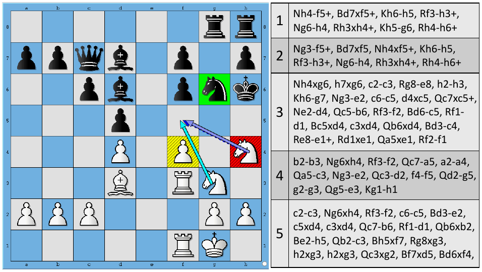

**Left:** Arena uses green, yellow and red square backgrounds for capture/attack situations and purple/light-blue arrows for candidate moves. **Right:** the future lines are long algebraic strings. These colours belong to the comparison chess GUI, not the new evolution graph's event vocabulary.

**Lesson:** the evolution graph must expose sequential relationships while a linked board explains the piece mechanism. Figure 9 returns to this same puzzle. We should test whether a user can move from a diagram event to the corresponding board and understand why it occurs.

### Figure 2 · Tree → merged graph → shortened graph · p.4

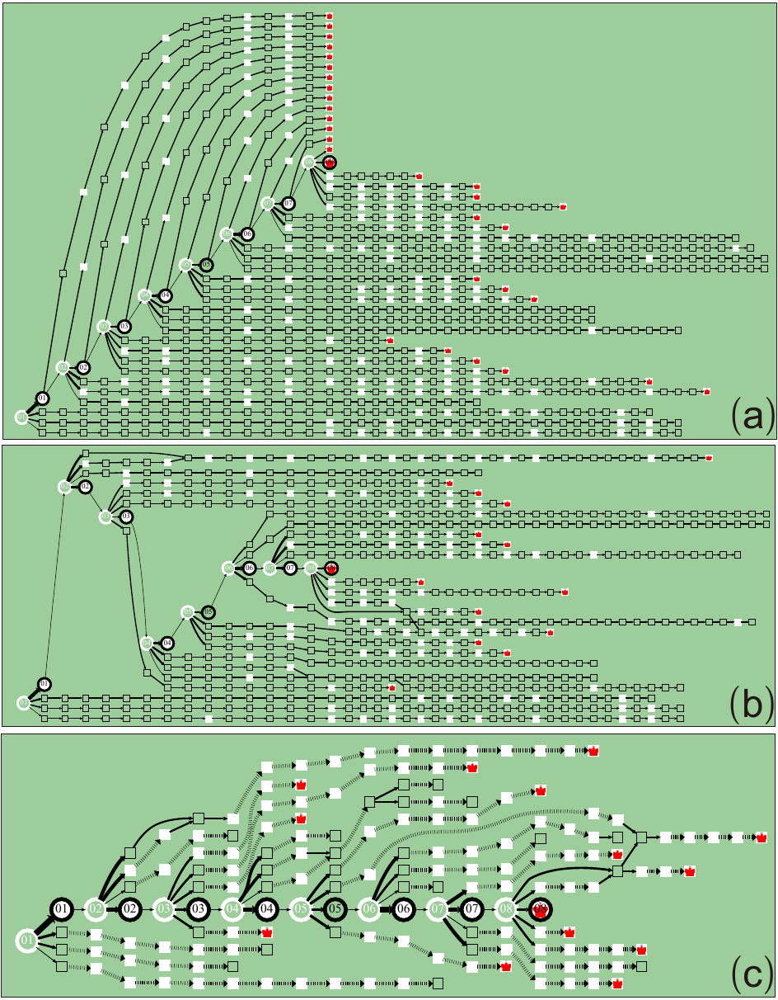

**(a)** Expanded retained sequences contain much duplication and long regular lanes. **(b)** Merging reveals connections and dramatically reorganizes the picture even before shortening. **(c)** Shortening emphasizes the reference trunk, junctions and events; dotted chains retain access to hidden positions.

**Lesson:** comparing only the final screenshot hides which pipeline stage is failing. Capture these three stages from the same frozen input. The figure also prevents a blanket “all quiet neighbours persist” rule; see the explicit conflict above. The circles are much easier to trace in (c), but some played arrows remain thin.

### Figure 3 · The compositional legend · p.5

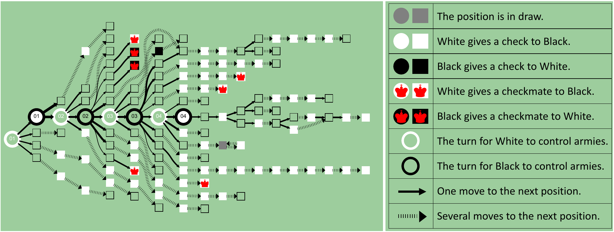

**Left:** a worked graph includes both White and Black mate possibilities, forks, dotted event chains, quiet endpoints and locally different solid widths. **Right:** nine legend rows cover draw, checks, mates, turns and edge multiplicity. The two inline examples below the figure explain combinations of shape, boundary, fill and crown.

**Lesson:** implement a composition table rather than several unrelated colour conditions. Quiet predicted squares are black hollow; white event squares are clean white patches. A black-bordered white circle is entirely meaningful, and circles do not simply alternate black/white interiors. Dotted arrow texture remains strong even where solid arrows are thin.

### Figure 4 · Focus with context · p.6

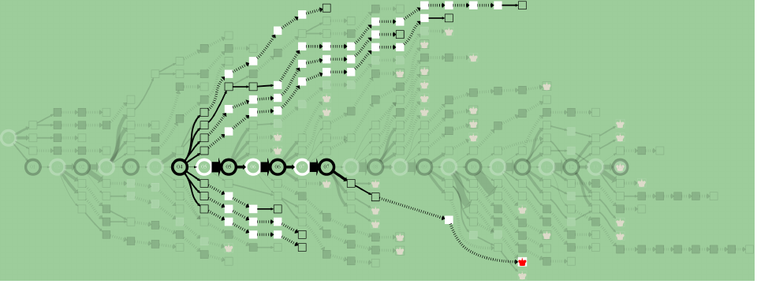

The source at Black's 04 is emphasized with its computed branches. A finite stretch of the played trunk remains bright; later played circles are faded even though the full game continues to them. The geometry remains recognizable in the background.

**Lesson:** source-contribution membership and unrestricted reachability are different. Our `descendants()` currently follows occurrence parents through the entire future played line. Figure 4 demands a more precise focus contract. The video at approximately 2:50 confirms the visible scope, but does not expose the underlying membership algorithm.

### Figure 5 · A game read at three scales · p.7

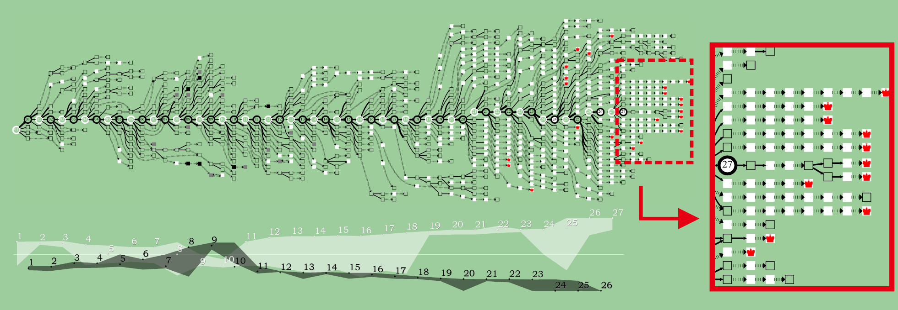

**Overview:** irregular local structures surround a gently bending trunk. **Chart:** White loses its initial advantage around moves 9–10, then recovers as the sampled Black decisions worsen. **Right inset:** the same terminal region is enlarged; repeated white event glyphs and crowns become legible, with quiet escapes/endpoints still present.

**Lesson:** the overview communicates changing density and the chart locates decisions; the close-up explains actual paths. The red dashed rectangle, red leader arrow and framed inset are annotations linking scales. They are not graph moves, mate counts or extra nodes. This is the strongest rendering calibration example because we already have its recovered vector geometry. Its game metadata, as stated in the manuscript, should not substitute for a verified PGN.

### Figure 6 · Advantage can end in a draw loop · p.7

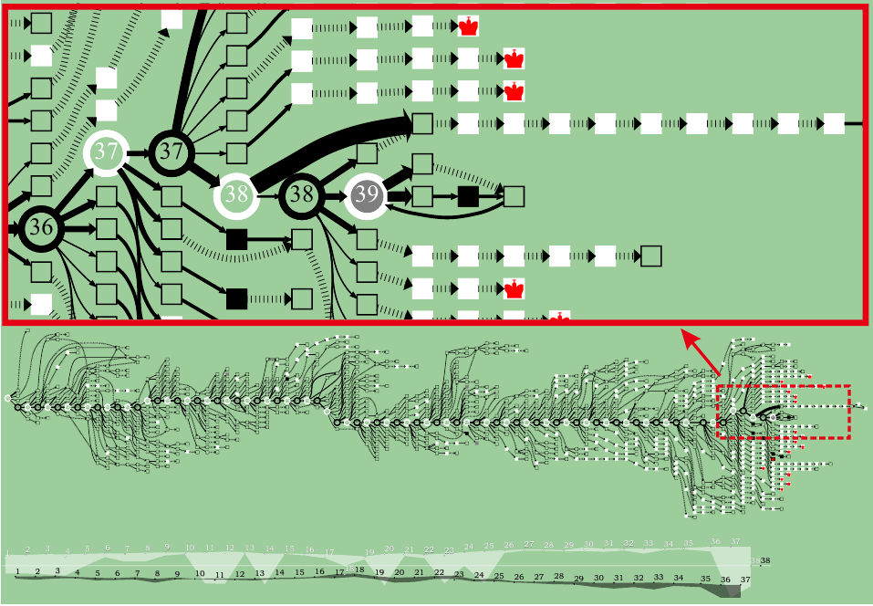

**Top detail:** near move 38, a thin played choice can be compared with a much thicker alternative. A black checking square participates in the short loop returning into the grey circle 39. **Bottom overview and chart:** earlier advantage supplies context; a large late tactical region contains several possibilities, not a uniform winning outcome.

**Lesson:** draw is part of topology and history, not just a final grey dot. The paper discusses Capablanca's missed `38.Ke2` alternative to `38.Kf2`; the underlying game fixture still needs an independently verified record before becoming a legal regression test. A backward arrow belongs to the actual represented continuation.

### Figure 7 · Deep Blue–Kasparov, 1997 game 2 · p.8

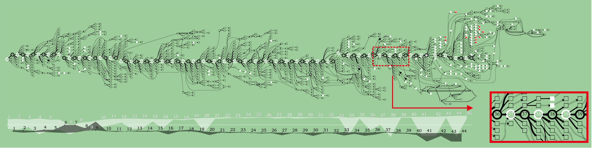

**Overview:** early quiet structures, convergences and variable local density lead to much more visible White-event activity late in the game. **Inset:** move 37 and the following local decisions are enlarged; thickness must be read between siblings. **Chart:** White and Black actual/potential series continue to separate at their respective move samples.

**Lesson:** match the structural language and the ability to explain the critical decisions, not only total node count or where the trunk sits. The paper itself says Kasparov resigned a position that could have led to a draw (Case 3, p.9). Its mate-bearing alternatives do not prove that every defence loses. Our verified 89-ply PGN ends in recorded resignation after `45.Ra6`; that final played position must not acquire a crown just because the result is 1–0.

The earlier depth-20 study found six mate-scored returned PVs, all outside its retained candidate sets. This explains one specific difference in displayed events; it does not explain the whole visual gap. See [the measured comparison](paper-fidelity-implementation.md).

### Figure 8 · Defence errors within an attack · p.8

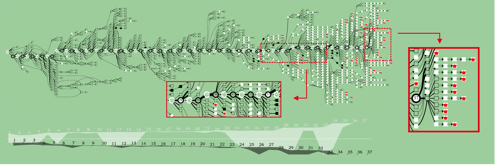

**Overview:** Stockfish–AnMon's structure differs from Figure 7, including a strong early lower excursion and a much denser late event region. **Lower middle inset:** the response choices around moves 28–33 show local-width differences. **Right inset:** multiple checking sequences end in mate beyond the final reference move 37. **Chart:** the trend is visible without making every predicted node carry a score colour.

**Lesson:** the decision that accelerates defeat and the eventual tactical mechanism deserve different close-ups. The engines' five-second playing budget is not the paper's post-analysis depth-20 budget. Do not configure the analysis to five seconds merely because this was a blitz example.

### Figure 9 · A solution path, alternative failures and cycles · p.9

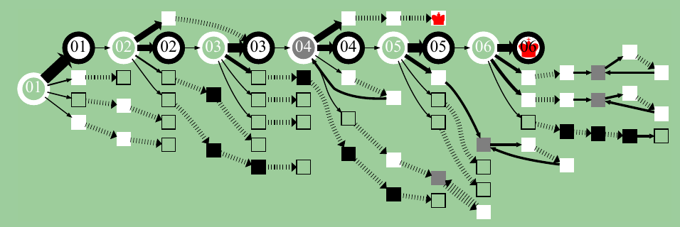

The circle path presents a six-move mating solution for White. Black's intervening replies are described in Case 5 as the only legal replies along the correct solution. Alternatives include Black-check sequences, White mates, quiet endpoints and grey return structures.

**Lesson:** a displayed single edge proves only one retained continuation, unless legal-move enumeration independently establishes a forced reply. This figure supplies the paper's explicit legal claim, not a universal meaning for narrow branches.

The grey circle 04 also has a backward return and a forward solution continuation. Four grey squares elsewhere receive backward paths. This contradicts the broad claim in §5.1 that Figure 6's move 39 is the only backward-edge example in the results, and it qualifies a terminal-only interpretation of grey. The [extracted topology](images/atlas/figure9-topology.json) records geometry with arrow-tip matching; it does not invent FENs.

### Figure 10 · Does the interface help people answer? · p.11

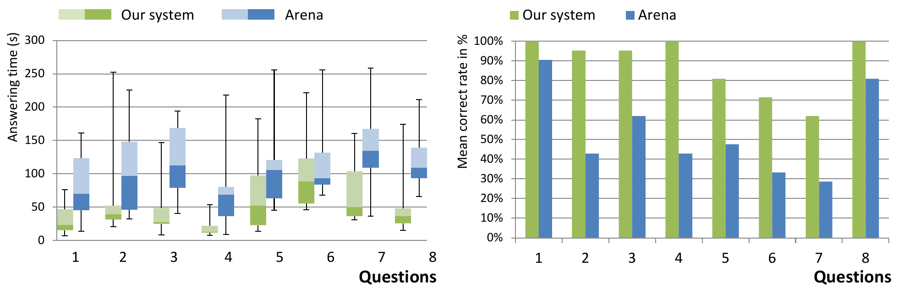

**Left:** per-question answer-time distributions for the authors' interface (green) and Arena (blue). **Right:** mean correctness rates. The caption's listed percentile order is reversed relative to an upward numerical y-axis: lower values sit lower, so the 5th percentile is at the bottom and 95th at the top. This is evaluation artwork, not a new chess encoding.

**Lesson:** evaluate whether users find a critical move, compare alternatives and trace an outcome accurately and efficiently. A prettier screenshot or passing source-pixel test does not establish that. The study involved 21 participants and training; it is not evidence that every new user instantly understands the diagram. Table 1 uses a `p < 0.08` criterion; do not silently describe every comparison as significant at 0.05.

### Figure 11 · Preference after learning the interface · p.12

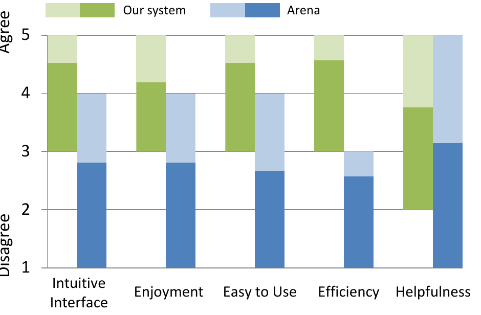

Five categories rate intuitiveness, enjoyment, ease, efficiency and teaching helpfulness. The displayed spans indicate minimum to maximum, with the colour split marking the mean; the scale is 1–5. Green and blue distinguish the two interfaces, not chess sides.

**Lesson:** clarity depends on learning the language and moving between global and local views. The text still calls the graph abstract for younger children and says users need the board to understand piece mechanisms. Our product needs a readable legend and worked examples, not just the completed graph.

## 5. What the video adds

The [author publication page](https://people.cs.nycu.edu.tw/~yushuen/publications.html) links the [4:12 demonstration](https://people.cs.nycu.edu.tw/~yushuen/data/ChessVis14.mp4?feature=player_embedded&v=UvAZaehDBB4). It loaded in Chrome after the text-fetch tool failed. These are sampled visible frames, not a complete narration transcript or a claim to have watched every transition:

| Approximate time | Observed content                                                                                                                                       | Consequence                                                                                                                                          |
| ---------------- | ------------------------------------------------------------------------------------------------------------------------------------------------------ | ---------------------------------------------------------------------------------------------------------------------------------------------------- |
| 0:00             | Puzzle graph beside the board, including the grey 04 node.                                                                                             | The grey mark is also in the demo, not merely a PDF rasterization artifact.                                                                          |
| 2:20             | Magnified chart with outlined actual-score circles, labels and translucent bands.                                                                      | Calibrate chart marks separately from graph nodes.                                                                                                   |
| 2:40             | Another endgame graph, linked board and score chart.                                                                                                   | The visual language applies beyond the five printed cases.                                                                                           |
| 2:50             | Focus on Black's 04; only its displayed computed continuations stay bright, including a finite trunk segment.                                          | Keep analysis provenance when defining focus.                                                                                                        |
| 2:57             | Hidden quiet squares expanded in a local row within the magnified branch; one square is yellow and the board shows its position with a red move arrow. | Yellow is an interaction highlight in this view, not a permanent tactical event. Expansion is local, rather than a strip beneath the complete map.   |
| 3:06             | Focused continuation and board, fading into the results section.                                                                                       | Board linkage remains central during detailed tracing.                                                                                               |
| 3:11             | Early part of a game revealed alongside board replay.                                                                                                  | Revealing precomputed content during replay is compatible with the demonstration. Dynamic _query-driven recomputation_ is still future work in §4.2. |

The text explicitly describes a smooth transition when unfolding a dotted edge (§4). The sampled frames confirm the resulting local view, but do not recover timing, interpolation, collapse rules or the handling of overlapping expanded paths.

## 6. Measured appearance, separate from chess analysis

These measurements use our existing source-derived Figure 5 fixture, whose coordinate and line-width transforms were checked in the [reconstruction study](../figure5-reconstruction.md). Compare dimensionless ratios rather than copying PDF points into CSS pixels.

| Measurement                     | Published Figure 5 geometry                              | Current generated marks                | Implication                                                                                    |
| ------------------------------- | -------------------------------------------------------- | -------------------------------------- | ---------------------------------------------------------------------------------------------- |
| Circle diameter / square side   | `3.8574 / 1.9288 ≈ 2.00`                                 | `13.6 / 5.2 ≈ 2.62`                    | Our alternatives have less presence relative to the trunk.                                     |
| Compressed stroke / square side | `0.6651 / 1.9288 ≈ 0.345`                                | neutral `0.38 / 5.2 ≈ 0.073`           | Source compressed ink is about 4.7× heavier relative to glyph size.                            |
| Compressed dash-to-gap          | `0.0665 : 0.3325 = 1 : 5`                                | `1.1 : 1.65 = 2 : 3`                   | Source creates fine transverse ticks across a broad stroke, not little longitudinal dashes.    |
| Compressed weights              | All 561 compressed edges use width `0.6651`              | Neutral or local-score-dependent width | Keep compression texture distinct from solid-arrow quality.                                    |
| White event square              | White boundary, white fill                               | Dark boundary, white fill              | The border changes the luminous event-chain contrast.                                          |
| Dark ink / draw                 | Black / approximately `#7f7f7f`                          | Green-tinted dark ink / `#7c847e`      | Small colour shifts matter less than topology and texture, but are measurable.                 |
| Background                      | Outer `#9dcd9d`, graph interior `#9dcd9b` in this source | Predominantly `#9dcd9d`                | The paper names darkseagreen, but literal CSS `darkseagreen` is not the sampled source colour. |
| Score-band opacity              | Both ≈0.498                                              | White 0.52, Black 0.43                 | This is a separate calibration surface.                                                        |

The exact sizes are observations from this fixture, not proof of a universal author setting. Other figures are placed at different scales. Arrowhead proportions and the red king-like mate symbol also require close-up calibration; our fixed SVG arrow marker and simplified crown are approximations.

## 7. Mapping the rules to our current renderer

| Area             | Current behaviour                                                                                                           | Assessment and next evidence needed                                                                                                             |
| ---------------- | --------------------------------------------------------------------------------------------------------------------------- | ----------------------------------------------------------------------------------------------------------------------------------------------- |
| Search/retention | `engine.ts` supports completed-depth studies; `semantics.ts` applies 4/n/8+played retention.                                | Substantially aligned at roots. The data pipeline and evaluations of interior positions are not recovered from the paper.                       |
| Position merging | `evolutionLayout.ts` groups by ply, position and event classification; histories remain separate.                           | Partial. Cross-ply identities and draw-related merged nodes visible in Figs.6/9 are not represented the same way.                               |
| Recurrence       | Adds a separately styled return relationship after chronological layout.                                                    | Useful product extension; different from the paper's redirected continuation edge into a shared position.                                       |
| Effective checks | `checkQuality()` accepts searched checks within 50 cp of the best sibling; most PV interiors are unassessed.                | A proxy, not the paper's stated tactical criterion. Avoid claims of full event fidelity.                                                        |
| Compression      | Keeps all played/events, their immediate neighbours, junctions and occurrence leaves; unassessed checks also protect nodes. | Implements one literal reading of the caption, but conflicts with event chains in the finished figures. Requires an explicit policy comparison. |
| Glyphs           | Circles/squares, turn borders, beneficiary fill, grey and crown.                                                            | Core vocabulary present. Event outlines, proportions and icon silhouette still diverge.                                                         |
| Edge marks       | Variable quality/neutral width used for both solid and compressed paths; sparse dashes.                                     | Direct, measurable divergence from Fig.5 and §3.2's solid-width scope.                                                                          |
| Layout           | Graphviz, LR, 5:1 path preference, no played-group constraint; compact ranks.                                               | Good basis, unproven exact equivalence. Resolve the k-factor/spacing questions and measure fixed input.                                         |
| Focus            | `descendants()` follows occurrence ancestry, including later played roots.                                                  | Does not match Fig.4's observed bounded scope. Need source-contribution membership and a defined policy through shared nodes.                   |
| Unfolding        | `unfold.ts` puts recovered moves into a strip below the whole graph.                                                        | Lossless access exists. Local placement and transition differ from the video.                                                                   |
| Score chart      | Same retained root set, local actual score, two log-scaled bands.                                                           | Conceptually aligned; sampling, point styling, clipping and mate treatment are explicit adaptations.                                            |
| Replay/growth    | Reveals positions from a stable computed map; later analyses can add content while preserving anchors.                      | A valid product direction. Do not use live-update constraints as proof of paper layout fidelity.                                                |
| Static `/paper`  | Recovered Figure 5 geometry.                                                                                                | A mark/layout reference. Its passing screenshot test does not validate generated topology or legal chess semantics.                             |

Relevant files: [semantics](../../src/lib/semantics.ts), [construction](../../src/lib/evolution.ts), [simplification/layout](../../src/lib/evolutionLayout.ts), [DOT configuration](../../src/lib/evolutionDot.ts), [marks](../../src/components/EvolutionMarks.tsx), [chart](../../src/lib/scoreBands.ts), [unfolding](../../src/lib/unfold.ts).

## 8. Questions the available source still cannot settle

| Open point                                     | Evidence required to settle it                                                     | Safe research position                                                                                                 |
| ---------------------------------------------- | ---------------------------------------------------------------------------------- | ---------------------------------------------------------------------------------------------------------------------- |
| Exact effective-check classifier               | Author code, labelled examples, or a defensible independently validated definition | Keep legal check, assessed effect and unknown status separate.                                                         |
| Which neighbours survive shortening?           | Original graph stages/data or a precise author clarification                       | Compare the literal caption and observed event-chain policies explicitly.                                              |
| Draw status on a shared node                   | Original position histories and draw aggregation code                              | Preserve legal occurrence history; interpret Fig.9 as a relational ambiguity, not permission to terminate every route. |
| Full position-equivalence key                  | Source code or original hashed records                                             | Include move rights; do not infer identity from board pixels alone.                                                    |
| Which branches belong to a focus?              | Source-contribution data or demonstrated selection across a merge                  | Finite computed-line scope is observed; unlimited full-game reachability is not the same operation.                    |
| Edge score units and merged-edge widths        | Raw local evaluations and rendering code                                           | Label `log1p` and neutral widths as our choices.                                                                       |
| Exact score-band samples                       | Original score records and mapping                                                 | State a reproducible app contract rather than claim the picture establishes it.                                        |
| Layout k factors, spacing and rank constraints | Original Graphviz version/options or controlled reproductions                      | The cited methods conflict in factor ordering; do not blindly apply the numbers twice.                                 |
| Historical examples beyond Figure 7            | Independently verified PGNs/FENs                                                   | Use them as visual exemplars until game records are verified.                                                          |

The author page provides the paper and video. The named supplementary `ModerateRadial.pdf`, `DeepBlueFull.pdf`, questionnaire, graph data and executable were not recovered here. The radial/full/implicit/3D comparisons discussed in §5.1 are design arguments, not additional figures or alternate production modes that must be built.

## 9. Acceptance examples before the next implementation pass

The next change should be reviewable against a small corpus with **frozen analysis**, so engine variation cannot hide mistakes in visual rules.

| Example                                       | It should demonstrate                                                               | Failure that it catches                                                                                           |
| --------------------------------------------- | ----------------------------------------------------------------------------------- | ----------------------------------------------------------------------------------------------------------------- |
| Composition sheet from Fig.3                  | Quiet, check, mate and draw marks for both sides; reference and predicted positions | Alternating fills, reversed beneficiary, dark outline on white event squares, selection overwriting event meaning |
| Same input shown as Fig.2a/b/c                | Retention, merging and shortening as separate stages                                | “Looks close” while relations disappear or quiet duplication dominates                                            |
| White check → quiet Black reply → White check | Both competing neighbour policies, plus lossless expansion                          | Treating the caption/figure conflict as already resolved                                                          |
| Two legal routes to one position              | One visible convergence, both correct histories inspectable                         | Confusing crossings with joins; silently switching the engine's history                                           |
| Repetition with a forward alternative         | A real return path, correct draw history, forward option preserved where legal      | A decorative extra loop or premature termination of every route                                                   |
| Same-parent strong/weak/equal moves           | Comparable solid widths and a still-traceable thin played path                      | Global width normalization or forced minimum played width hiding a mistake                                        |
| Beneficial versus refuted checking move       | A supported event classification and explicit unknowns                              | Filling every SAN `+` or calling a 50-cp rule the paper's algorithm                                               |
| Legal forced reply versus one returned PV     | Distinguishable proof of legality and sparse analysis                               | Claiming forced mate from a single visible line                                                                   |
| Fig.4-style source focus                      | Correct selected contribution through shared nodes with context faded               | Lighting the entire remaining game by accident                                                                    |
| Local compressed-path expansion               | Recover exact hidden order near its branch, then restore context                    | Moving the explanation to an unrelated area or losing anchors                                                     |
| Verified Figure 7 full game                   | Readable changing structure, chart alignment, critical decision detail              | Passing only a node-count test or adding crowns to match a historical picture                                     |

Evaluate at overview and magnified scales. Keep legal/history correctness, semantic correctness, and appearance as separate gates. Then ask a reader to identify the critical decision, compare siblings, trace a convergence and explain a return loop. That is closer to the purpose of Figures 10–11 than accepting a screenshot alone.

## Reproduction and rights

Run `python scripts/extract-paper-atlas.py /path/to/ChessVis14.pdf` with Poppler, pypdf and pdfplumber. The script checks the source hash, renders the eleven excerpts, records crop coordinates/rotation, measures source-derived Figure 5 marks and extracts Figure 9's visible return topology using arrow tips. It does not infer chess positions from graphics or modify the app.

Evidence files: [crop manifest](images/atlas/manifest.json), [visual measurements](images/atlas/visual-measurements.json), [Figure 9 topology](images/atlas/figure9-topology.json). Page images and text were inspected together; only the selected attributed excerpts are retained here.

Original figure artwork belongs to Lu, Wang and Lin and the relevant rights holders. It is reproduced here as research evidence for comparison and is not relicensed as application code. The notes and atlas distinguish source observations from Enpassant's implementation and proposed adaptations.
