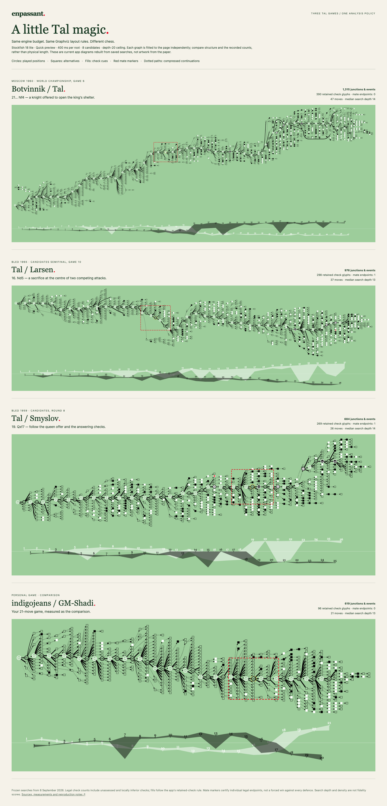

# A first Tal collection

8 September 2026. Open **Import game → Explore Mikhail Tal** in the app. These are bundled historical move scores, analyzed locally through the same production pipeline as an imported personal game. They do not contain precomposed diagram geometry or copied annotations.

## Scores and checkpoints

| Game                                                                    | Score                                                    | Moment to explore    | What makes it useful here                                                                                                           |
| ----------------------------------------------------------------------- | -------------------------------------------------------- | -------------------- | ----------------------------------------------------------------------------------------------------------------------------------- |
| [Botvinnik–Tal, Moscow 1960](../../public/games/botvinnik-tal-1960.pgn) | World Championship game 6 · 26 March · 0–1 · 93 plies    | 21… Nf4              | A speculative knight offer, a forcing middle phase, and a longer ending.                                                            |
| [Tal–Larsen, Bled 1965](../../public/games/tal-larsen-1965.pgn)         | Candidates semifinal game 10 · 8 August · 1–0 · 73 plies | 16. Nd5, then 17… f5 | Opposite-side castling, an attack, and defensive alternatives whose assessment deserves closer inspection.                          |
| [Tal–Smyslov, Bled 1959](../../public/games/tal-smyslov-1959.pgn)       | Candidates round 8 · 18 September · 1–0 · 51 plies       | 19. Qxf7             | A shorter game with a queen offer and checks by both sides; a useful counterexample to equating game length with tactical activity. |

Botvinnik–Tal’s full score was checked against the [Lichess match study](https://lichess.org/study/gIQYxy2h/yTm6ibUU) and the independently reproduced PGN in [Uppsala’s thesis appendix, listing 7.1](https://uu.diva-portal.org/smash/get/diva2%3A1966853/FULLTEXT01.pdf). [US Chess’s review of _Tal: Move by Move_](https://new.uschess.org/news/review-tal-move-by-move) provides an independent board before 21… Nf4. Its illustrative FEN resets the halfmove clock; the fixture test compares the board, turn and legal rights while preserving the clock from actual replay.

Tal–Larsen’s score and date were checked against [Tal’s contemporary annotations, translated by Douglas Griffin](https://dgriffinchess.wordpress.com/wp-content/uploads/2019/12/tal-larsen-10th-match-game-candidates-semi-final-bled-1965.pdf), originally in _Shakhmaty (Riga)_ №21, 1965. [Mark Weeks’s annotated walkthrough](https://www.mark-weeks.com/aboutcom/aa05e21.htm) independently confirms the moves and documents disagreements between Tal’s and Kasparov’s analyses. In particular, the score is **18. Rde1**, not Rhe1. Both rook moves are legal, so legality alone would not catch that transcription error.

Tal–Smyslov’s score was checked against [Forever Chess Games](https://www.foreverchessgames.com/games/tal-mihail-vs-smyslov-vassily-candidats-tournament-1959-70679e76) and the [1995 public PGN transcription](https://groups.google.com/g/rec.games.chess/c/ESD1QobURYg). [OlimpBase’s Candidates record](https://www.olimpbase.org/ind-wcc/wc1960-cand.html) supplies round 8 and the precise date. Player names and event labels are normalized for the app; no ratings are invented.

All three scores are legally replayed by chess.js. All finish with resignation rather than a played checkmate. A result of 1–0 or 0–1 must not manufacture a mate crown; a crown elsewhere in the diagram must come from a legally replayed engine continuation.

## Comparison protocol

Run the app, then:

```sh
node scripts/research-tal-games.mjs
```

The script visits the three Tal games and `indigojeans–GM-Shadi` serially in fresh Chromium contexts. Each uses the production **Quick preview** profile: Stockfish 18.0.8 lite single-thread, MultiPV 8, 400 ms per root with a depth-20 ceiling. Played moves missing from the top eight get the production separately searched fallback. A separate context per game avoids cached results and keeps this measurement away from the user’s saved game.

The same production builder retains candidates using the paper-inspired rank rule, replays at most 20 plies per continuation, merges equivalent positions, shortens quiet sequences and calls Graphviz. The output includes app screenshots, measurements, hashes and compressed frozen game/search inputs in `artifacts/tal-study/quick/`. A repeated timing-based search can differ; reuse frozen inputs for controlled layout comparisons. `--study` requests the existing 60-second/depth-20 profile and can take much longer.

Search depth, returned PV length and the display horizon are separate quantities. Report achieved depths, not merely the requested ceiling. Counts of junctions, checks, compressed paths or shared positions describe this retained sample; they are not chess-complexity ratings, probabilities, or proof of visual fidelity to the paper.

The control is only 41 plies long, versus 51, 73 and 93. Absolute graph size therefore needs to be read alongside length. All use the same visual rules; none receives extra decorative branches because of the player’s name.

## First measured run

Production engine, graph construction and rendering at baseline `e87e8a7`; this collection adds game fixtures and importer choices without changing those algorithms. All four runs completed without browser errors. Full measurements, including checkpoint candidates, browser version, recording times and input hashes, are in [tal-quick/measurements.json](tal-quick/measurements.json).

| Game                 | Moves | Visible glyphs | Retained check glyphs | Mate endpoints | Shared glyphs | Depth min / median / max |   Time |
| -------------------- | ----: | -------------: | --------------------: | -------------: | ------------: | ------------------------ | -----: |
| Botvinnik–Tal        |    47 |          1,315 |                   390 |              0 |           131 | 11 / 14 / 19             | 47.1 s |
| Tal–Larsen           |    37 |            976 |                   298 |              1 |            68 | 11 / 13 / 18             | 35.8 s |
| Tal–Smyslov          |    26 |            684 |                   269 |              1 |            30 | 10 / 14 / 20             | 24.6 s |
| indigojeans–GM-Shadi |    21 |            619 |                    96 |              0 |            33 | 11 / 13 / 17             | 20.7 s |

Check counts are distinct displayed glyphs with at least one legal non-mating check occurrence. They include checks whose effectiveness is unassessed and locally inferior checks; the production fill rule can leave the latter hollow. Mate endpoints are individual checkmated positions in retained alternatives, not a count of forced wins or game results. Wall time includes rendering and application startup.

**Tal–Smyslov is the most useful first demonstration.** It has only 10.5% more visible glyphs than the control but 2.8 times as many check glyphs, while the played score is only five moves longer. Its filled event sequences and late branches are visibly more prominent. That supports a concrete explanation for part of the perceived difference: the kind of chess present in retained continuations matters more than simply adding nodes. It does not establish a general complexity ranking from four games.

Botvinnik–Tal provides the largest map here and more shared junctions, with a longer ending after the knight offer. Tal–Larsen exposes a particularly useful alternative: at the position after 17. exd5, this quick search ranks **17… g6 first**, ahead of the played 17… f5. That is the defensive question raised by the published annotations. This is a depth-12 observation, not a definitive adjudication of the sacrifice. Quick preview reached the depth-20 target at only **one of 262 roots** across the four games.

The current renderer can therefore show substantial tactical structure without a GPU or changes to its visual grammar. Remaining work should concentrate on **selective deeper searches of disputed defensive junctions**, and compare layouts using frozen inputs. The experiment does not settle the paper’s effective-check definition or reconstruct the authors’ missing engine tree.



## Reuse this input without another search

The four compressed game/search files in [tal-quick/](tal-quick/) preserve this run. Rebuild them with the current production components:

```sh
node scripts/render-tal-study.mjs
# Open http://127.0.0.1:5173/artifacts/tal-study/gallery/
```

The script checks each frozen input hash and produces SVGs, a comparison page and current rendered counts. It also accepts input and output directories, so a future study-profile run can be rendered alongside this one. Each panel fits its own graph to the available width; physical image length is not a common scale.

The app still performs its own local searches when a collection game is opened. Its output may differ slightly with machine speed and search timing. The frozen research files are comparison fixtures, not a hidden source of extra branches in the app.
