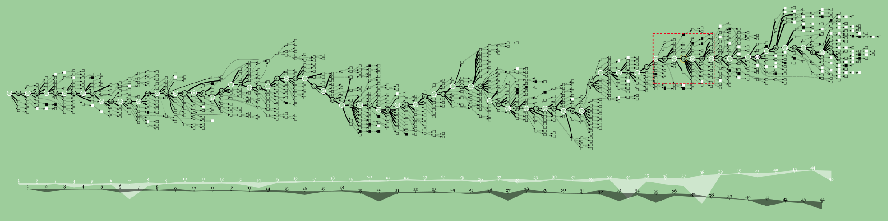
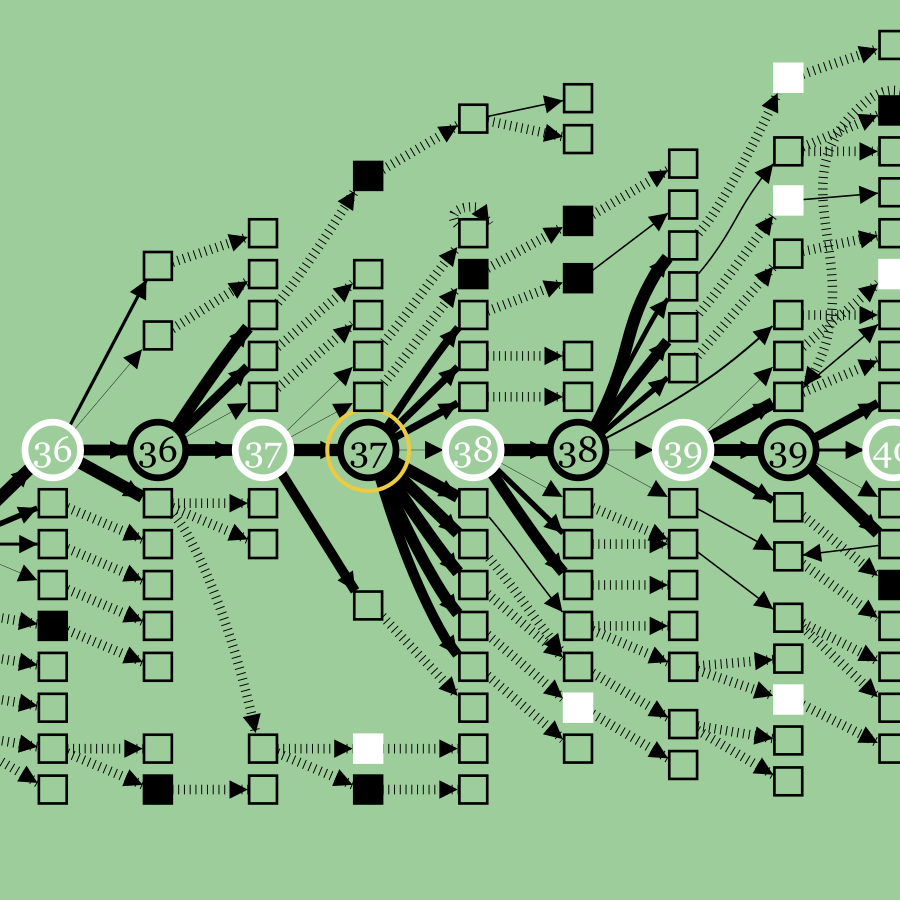
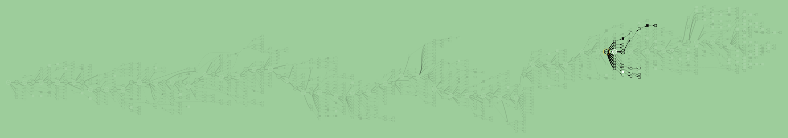

# Making the paper’s rules visible

7 September 2026 · implementation following the [all-figure rulebook](paper-visual-rulebook.md)

Generated diagrams now use larger, clean event squares, dense compressed-arrow ticks, quieter event chains, shared predicted positions and bounded continuation focus. Hidden moves unfold near their branch. The board still uses the selected occurrence’s complete legal history.

**This image is generated app output.** It uses the previously saved Stockfish 18 lite analysis, not the authors’ original search. The [published Figure 7](images/figure7-source.png) remains a separate reference. The new graph is closer in visual vocabulary and exposes more relationships, but its exact branching, evaluations and mate population still differ.

## Implemented contract

| Area               | Result and source relationship                                                                                                                                                                                                                                                                                                                        |
| ------------------ | ----------------------------------------------------------------------------------------------------------------------------------------------------------------------------------------------------------------------------------------------------------------------------------------------------------------------------------------------------- |
| Marks              | Circle diameter is twice the square side. Filled event squares take the event colour at the boundary. Quiet squares remain hollow with black boundaries. Circle boundaries retain side-to-move meaning; shared played glyphs retain the played number when an alternative history is selected. A small original red king silhouette marks legal mate. |
| Compressed arrows  | Constant width `2.345` for a `6.8` square, with dash/gap `0.2345 / 1.1725`. These preserve the measured Figure 5 proportions. Compression texture carries no score or ply-count meaning.                                                                                                                                                              |
| Solid arrows       | Same-parent candidate quality remains normalized locally. Played mistakes can remain thin. Direct moves and compressed routes between the same displayed endpoints remain separate edges. Graphviz’s actual arrow tips now place SVG arrowheads at node boundaries.                                                                                   |
| Compression        | Keep the played sequence, events, roots, junctions and occurrence leaves. Preserve first candidate moves at searched forks so their solid widths remain comparable. Permit quiet single-parent/single-child replies between later checks to disappear. Every suppressed occurrence remains in its ordered edge path.                                  |
| Shared positions   | Merge predicted positions across plies using pieces, turn, castling and en-passant rights. Redirect actual move paths through the shared glyph. Each occurrence keeps its FEN, clocks, legal draw status and full moves. Repeated played instants retain separate numbered anchors for the chart and replay.                                          |
| Returns            | A predicted move can return into an earlier shared glyph; its path contains the real intervening moves. The separate dashed relationship for repeated **played** instants remains a documented timeline adaptation. Backward move edges do not impose forward rank constraints.                                                                       |
| Draw-related glyph | Grey when at least one currently visible member is a legal draw. Earlier histories can retain forward alternatives. The route picker and inspector explain this; no draw status is copied into another occurrence or engine request. A twofold repetition alone is not promoted to a terminal draw.                                                   |
| Focus              | A searched occurrence illuminates only its own retained paths. An unsearched interior occurrence illuminates the suffixes of retained paths containing that exact occurrence. Shared glyphs never cause traversal into another history or a later independent search. Edges require matching path steps, not merely a highlighted endpoint.           |
| Local unfolding    | Find a nearby horizontal row with clear node space, preserving existing junctions and routes. Crowded neighborhoods may need more distant space. A short movement transition reveals the hidden nodes; reduced-motion preferences disable it. Closing restores the original graph.                                                                    |
| Chart              | Outlined actual-score circles and equal `0.498` band opacity for both sides. The existing signed logarithmic score transform, same-root candidate selection, mate indication and graph/chart alignment remain.                                                                                                                                        |
| Reading help       | A collapsible illustrated key explains circles, fills, arrows, local thickness, returns and score bands. Yellow selection rings remain separate from tactical fills.                                                                                                                                                                                  |

### Where the source leaves gaps

**Checks are now an explicit display choice.** The default “Checks in retained lines” fills legal checks in the retained continuations, except those locally assessed as inferior. “Locally evaluated checks” fills only the existing within-0.50-pawn proxy. Unknown checks retain their `unassessed` data status in both modes. Neither choice certifies the paper’s unspecified material/king-position concession criterion. Highlighting a retained check is our readable exploration convention, not a recovered effective-check classifier.

**Compression follows the finished event chains.** The paper’s blanket neighbour caption conflicts with Figures 2c, 3, 5 and 8. The production choice permits hidden quiet replies; the literal-caption variant remains available to the research script. Keeping sampled first moves at decision forks is an explicit compromise to preserve meaningful solid-arrow comparisons.

**Repeated played moves retain chronology.** Predicted paths use a relational graph like Figures 6 and 9, while actual move numbers keep their own chart positions. This hybrid avoids making replay jump to a different historical instant. It is not a claim that the authors used the same rule.

**Layout keeps Graphviz’s native layered routing.** We retain the measured natural ordering and 5:1 preference for played edges. The paper and its cited method reverse the real/virtual `k` factors; no extra factors are multiplied into Graphviz on speculation. Raw/merged/shortened structure is now independently selectable in `layoutEvolution`, so future solver experiments can hold topology fixed. Exact author spacing, factor interpretation and the `log1p` score-width adaptation remain documented choices.

## Frozen full-game comparison

Input: [saved depth-20 analysis](deepblue-depth20-analysis.json.gz), 90 roots, all reached depth 20. Uncompressed SHA-256: `f6f60f7a79d0fab27d94e426392bb8858088a4c299783c5145584a54d65e4046`.

These three variants use identical retained occurrence data and the **new mark sizes**. They isolate structure; the first row is not a screenshot of the old committed renderer.

| Structural policy               | Occurrences | Visible glyphs | Compressed edges | Shared glyphs | Redirected returns |
| ------------------------------- | ----------: | -------------: | ---------------: | ------------: | -----------------: |
| Neighbours + same-ply merging   |       7,132 |          1,235 |              562 |           106 |                  0 |
| Event chains + same-ply merging |       7,132 |          1,038 |              601 |           101 |                  0 |
| Event chains + shared positions |       7,132 |          1,052 |              621 |           131 |                  8 |

Compression alone removes 197 quiet glyphs. Broader merging exposes additional junctions: the final glyph count rises slightly even as more occurrences share positions. This is why “fewer nodes” is not a sufficient fidelity measure. There are 124 displayed check-bearing glyphs versus 127 in the same-ply versions; shared positions account for the difference. No legal check occurrence was removed from the data.

The retained sample still contains **zero legal mates**. Six previously returned mate-scored lines fell outside the selected candidate policy. We did not add them to manufacture the paper’s eleven crowns. Different search/retention outcomes remain visible.

Full [machine-readable measurements](visual-rule-measurements.json) include bounds and counts. These measurements establish the changes and input identity; they are not a numerical similarity score against unpublished graph data.

## Verification

- `pnpm check`: type check, lint, formatting and **38 unit tests passed**.
- New legal fixtures cover same-side checks with folded replies, raw/merged/shortened stages, a predicted repetition cycle with a forward option, path-by-path legal replay, source-bounded focus and local unfolding. DOM assertions cover event-square boundaries and constant compressed texture.
- `pnpm test:e2e`: **9 Chromium tests passed**, including real Stockfish, imports, replay, shared-route selection, unfolding, exploration, the new highlight selector and reading key, cached studies, and mobile layout. Two opt-in external-service import tests were skipped.
- `pnpm build` passed.
- Generated frozen-analysis overview and move-37 detail were visually reviewed in the browser. Desktop and mobile application screenshots were reviewed separately. Mobile verification establishes layout/controls; the captured promotion example was still preparing its analysis.
- The independent static Figure 5 comparison remains unchanged: colour difference `0.0899472083`, ink precision `0.9696951476`, ink recall `0.9232532595`. That validates the static reconstruction separately from this generated graph.

## Reproduce and review

Run `node scripts/research-fidelity.mjs` with the repository dependencies installed. It reconstructs the graph from the committed compressed analysis, calls the production SVG components, and writes variants, a graph snapshot, measurements and a comparison page under `artifacts/paper-research/fidelity/`. No engine search is run. With Vite running, open `/artifacts/paper-research/fidelity/index.html`.

The committed PNG evidence rasterizes the script’s production SVG exports. Source artwork and generated output are labelled separately. The [figure atlas](paper-figure-atlas.html) and [rulebook](paper-visual-rulebook.md) preserve the observations, source conflicts and unresolved historical details behind these decisions.
