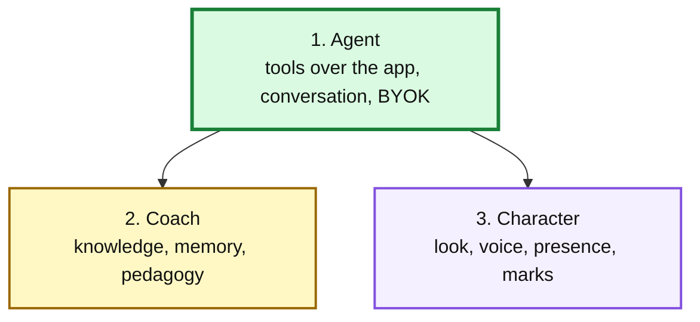
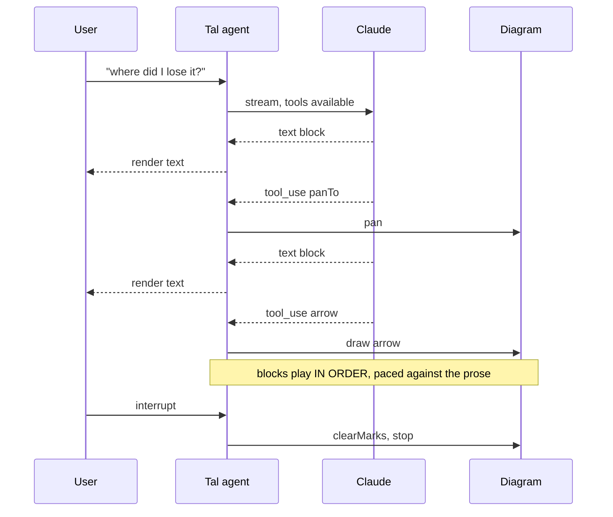

# Tal: design for an in-app agent

Status: proposed. Nothing here is built beyond the stub described in §1.
Written 2026-09-14, against `main` at `1845861`.

This document supersedes the narration feature shipped in PR #9 as a direction,
not as a criticism of it: that was built inside a seventy-minute window and did
its job. The evidence behind several decisions here lives in the
[build-day dossier](https://github.com/jeanluciradukunda/personal-brain)
(personal vault, `docs/demo-days/2026-09-12-claude-fable-51-cape-town/`).

---

## 1. What exists today, stated plainly

`src/fixtures/tal-narration.json` is **a lookup table of thirty pre-generated
strings**, keyed by game id then node id, covering ten hand-picked nodes in each
of three bundled games. `src/components/TalPanel.tsx` (26 lines) renders the
string for the selected node, or nothing.

It is not an agent. It cannot answer a question, cannot say anything about a
game you imported, has no memory, and cannot look at the diagram. Clicking any
of the other ~600 nodes in a game produces silence.

What *is* worth keeping from that work:

| Asset | Verdict |
|-------|---------|
| `src/fixtures/analysis/*.json` | **Keep.** Seeds IndexedDB so bundled games open in ~3s instead of ~25s. Unrelated to narration and independently valuable |
| `src/lib/tal.ts` (101 lines) | **Keep and grow.** The payload builder is the foundation of the read tools |
| `src/lib/san.ts` | **Keep.** UCI to SAN conversion is load-bearing everywhere |
| `scripts/generate-tal.mjs` | **Repurpose.** Becomes the offline evaluation harness, not a content pipeline |
| `src/fixtures/tal-narration.json` | **Demote.** See §8 |

## 2. What Tal becomes

Three layers, built in dependency order. The order is about dependency, not
importance: the character track can be authored in parallel from day one.

Building 3 before 1 produces a puppet: a beautiful animated character reading a
lookup table. Do not.

## 3. The design principle

> **Tal's tools are the app's own actions. If a person cannot do it by clicking,
> Tal cannot do it either.**

He selects nodes, presses Explore, unfolds a branch, steps the replay, pans the
diagram. Three consequences, each of which resolves a problem that otherwise
needs solving separately:

**He cannot invent.** A tool call returns real application state or nothing, so
his claims are anchored to the same data the user can see. This is a far better
answer to confabulation than prompt rules, which were the previous defence.

**There is no second implementation.** No parallel "Tal rendering" path to drift
from the real one.

**Watching him is a tutorial.** "Press Explore here, I want to see further"
teaches the app while he coaches the chess.

The principle has one deliberate consequence, handled in §6: if Tal draws arrows
on the diagram, then **arrows must become a user feature**, not a Tal power.

## 4. The tool surface

Four kinds. Names are indicative.

### Read

| Tool | Returns |
|------|---------|
| `getPosition(nodeId)` | FEN, SAN, side to move, check/mate/draw, legal replies, piece placement (see §4.1) |
| `getAnalysis(nodeId)` | Retained candidates with SAN, rank, score, achieved depth, PV |
| `getPath(nodeId)` | Moves from the root, in SAN |
| `findNodes(criteria)` | Node ids matching: outside-the-shortlist, eval swing above N, checks, shared junctions, branch endpoints |
| `getGame()` | Headers, result, move count, analysis status |

`findNodes` is the tool that makes "where did I go wrong?" answerable. Without
it Tal can only discuss what the user already clicked.

### Act

`select(nodeId)`, `replayTo(ply)`, `unfold(nodeId)`, `setCheckMode(mode)`.

### View

`panTo(nodeId)`, `zoomTo(region)`, `fitToBranch(nodeId)`.

Pan and zoom already exist as scroll and drag, so these are wiring rather than
new capability.

### Mark (ephemeral, see §5)

`arrow(fromId, toId)`, `circle(nodeId)`, `label(nodeId, text)`,
`emphasise(nodeIds)`, `clearMarks()`.

Every node carries `x` and `y` from the Graphviz layout, so marks are paths in
the existing SVG coordinate space.

### Spend

`explore(nodeId, depth)` runs a **deeper engine search**. It is the only tool
that costs the user compute, and the only one that should ask before acting.

It is also the most interesting tool in the set. Tal asking for a deeper search
because he does not believe a depth-13 number is completely in character, and it
is the application's actual answer to the shallow-depth problem that nearly sank
the demo: rather than arguing from a 400 ms result, he can go and look.

### 4.1 One real gap

The app **discards piece identity**. `chess.js` returns `.piece`, `.captured`
and `.flags`; `src/lib/evolution.ts:62` keeps only `.san`. Piece placement
survives only inside the raw FEN string.

A commentator can work from SAN. A coach talking about what is happening on the
squares cannot. `getPosition` must return structured placement, recovered by a
chess.js replay. This is cheap and it is a prerequisite, not a nice-to-have.

## 5. Output is a timeline, not a message

**This is the most important architectural decision in the document.**

A chatbot returns a block of text. Tal performs a walkthrough:

> *"Look at move 21."* → **pan** → *"He gives the knight here."* → **arrow** →
> *"The engine hates it for four plies."* → **circle three nodes** →
> *"Then it doesn't."*

Text, mark, pause, pan, text: interleaved and **ordered**. That ordering is the
difference between someone showing you something and someone captioning it.

The API streams content blocks in order, so the implementation is to **play them
sequentially**, pacing marks against the prose, rather than collecting the whole
response and applying every tool call at once.

Retrofitting ordering onto a collect-then-apply implementation is painful. Build
it this way from the start.

If voice arrives later, the same timeline drives it, so the arrow lands on the
word.

## 6. Marks are ephemeral, and annotation is a user feature

**Ephemeral.** Marks live and die with the walkthrough. They are React state,
cleared when it ends or the user interrupts. Nothing persists.

This is a deliberate scope decision and it removes a large branch of complexity:
no data model change, nothing to save, share or migrate, and no coupling into
the platform design in `docs/platform/`. A walkthrough is a performance, not a
document.

**But annotation itself ships as a user feature.** Per §3, Tal may not have
powers the user lacks. So the mark layer is built for people first, and Tal is
its first power user. Users get to mark up their own game; Tal uses the same
surface. This costs little and keeps the principle honest.

## 7. What this overrides in SPEC.md

Recorded deliberately rather than drifted into. `SPEC.md` §1 "Not goals" lists:

| Non-goal | Status |
|----------|--------|
| LLM commentary | **Overridden.** Already overridden by PR #9; this extends it |
| Annotation editing / commenting / authoring | **Overridden** for ephemeral marks; persistent annotation remains a non-goal |

`SPEC.md` §1 also carries the Visual priority rule, which forbids "ornamental
animation that makes the graph less like Figure 5". A floating animated
character is in obvious tension with it. The tension is **not resolved by this
document** and is the main open question in §11.

## 8. What happens to the thirty strings

`src/fixtures/tal-narration.json` cannot survive as-is: a static string has no
tool calls, so it can never produce a walkthrough.

**Decision: demote it to the keyless taster, do not delete it.**

- **With a key**: the agent runs. Real walkthroughs, questions, marks, any game.
- **Without a key**: the existing panel shows the pre-generated line for the ten
  curated nodes per bundled game, with a clear "bring a key and Tal will talk
  about your own games" affordance.

This keeps the public deployment useful to someone who lands on it with no key,
which is most visitors, and it keeps `scripts/generate-tal.mjs` alive with a
narrower job.

`generate-tal.mjs` additionally becomes the **offline evaluation harness**: run
the agent against known positions and check its claims against the data. That
matters because the unresolved question from the build day is whether Tal is
*right* or merely fluent, and only a harness answers it.

## 9. Build order

Each slice ends demoable and committed. Gates, not phases.

| Slice | Work | Ends when |
|-------|------|-----------|
| **S1** | `getPosition` with structured piece placement (§4.1), plus read tools over the existing payload builder | Tal answers a question about a selected node with real data, plain text, no marks |
| **S2** | Agent loop: tool definitions, streaming, conversation state, BYOK key handling in `sessionStorage` | Multi-turn. "Why?" works |
| **S3** | `findNodes` | "Where did I go wrong?" answered without the user clicking first |
| **S4** | Mark layer as a **user feature**: arrows, circles, labels over the SVG | A person can mark up their own diagram |
| **S5** | Timeline player: ordered playback of interleaved text and tool calls, with interrupt | Tal performs a walkthrough |
| **S6** | View tools and `explore`, with confirmation on spend | Tal drives the app |
| **S7** | Character: sprite, speech bubble, proactive triggers | Tal has a face |
| **S8** | Voice, via the Web Speech API for input and output | Tal listens and speaks |

S7 can be **authored** in parallel from the start; it merely must not be
**built into the app** before S5.

## 10. Notes for implementation

- Model, browser header, and the parameters that return 400 on Fable 5.1 are
  recorded in `artifacts/TAL-BRIEF.md` §4. They are verified; do not correct
  them from memory.
- Forced `tool_choice` returns 400 on this model. Tools must be `auto`.
- Voice input and output are free and native via the Web Speech API. No key, no
  cost. Default synthesis voices are flat, so a real Tal voice needs a third
  party.
- The app is browser-only with no backend. BYOK is the only key model, and it is
  consistent with the README's existing promise that nothing leaves the device.

## 11. Open questions

| # | Question | Why it matters |
|---|----------|----------------|
| Q1 | Does Tal live inside the paper aesthetic, or break it? | Decides the sprite, the bubble, the mark styling, and how much of the Visual priority rule is torn up. Unresolved, and it blocks S7, not S1 |
| Q2 | Direct action or propose-and-confirm? | Leaning: direct for view changes, confirm for `explore`, which spends compute |
| Q3 | What is in the knowledge layer? | Layer 2 is undesigned. Openings, Tal's own published annotations, pattern vocabulary. Note that the Tal books in `~/Downloads` are pirated copies and are not a usable source for anything published |
| Q4 | Is Tal right, or fluent? | Still unanswered from the build day. §8's harness is the only way to find out, and it should exist before the character work makes it harder to change his voice |
