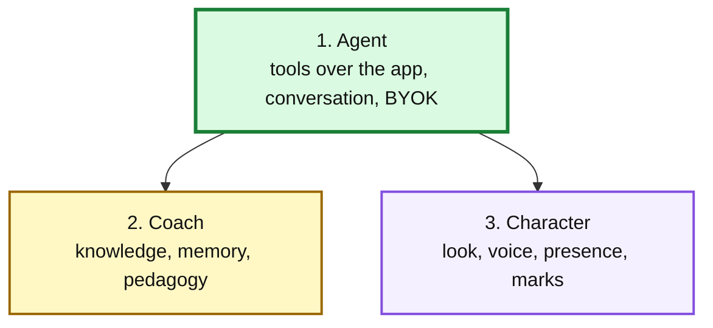
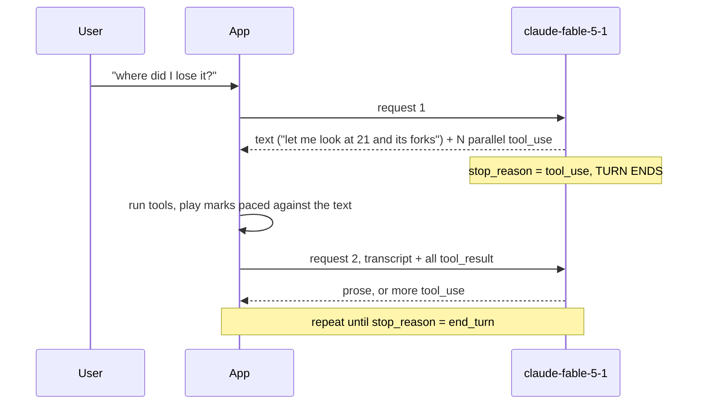

# Tal: design for an in-app agent

Status: proposed, and **substantially corrected** after an adversarial review on
2026-09-15 that ran a live experiment against the model. Written against `main`
at `1845861`. Nothing beyond the read tools in PR #14 is built.

The first draft of this document was wrong about how the Messages API works, and
several of its numbers were wrong. Corrections are marked in §12 rather than
quietly edited, because the reasoning that produced them is worth not repeating.

---

## 1. What exists today

`src/fixtures/tal-narration.json` holds **thirty pre-generated strings**, ten per
bundled game, all on trunk nodes. `src/components/TalPanel.tsx` (26 lines)
renders the one matching the selected node, or nothing.

It cannot answer a question, cannot speak about an imported game, has no memory,
and cannot see the diagram.

| Asset                                         | Verdict                                                                                                                                                                                                                  |
| --------------------------------------------- | ------------------------------------------------------------------------------------------------------------------------------------------------------------------------------------------------------------------------ |
| `src/fixtures/analysis/*.json`                | **Keep**, with a caveat: every one of the 220 bundled searches ran at 400 ms and **219 of 220 failed to reach the requested depth 20** (achieved 10–19). The seed makes bundled games open fast by freezing them shallow |
| `src/lib/tal.ts`, `src/lib/san.ts`            | **Keep**                                                                                                                                                                                                                 |
| `src/lib/talTools.ts`, `talAgent.ts` (PR #14) | **Keep, with the fixes in §10**                                                                                                                                                                                          |
| `scripts/generate-tal.mjs`                    | **Repurpose**, see §8                                                                                                                                                                                                    |
| `src/fixtures/tal-narration.json`             | **Demote**, see §8                                                                                                                                                                                                       |

## 2. What Tal becomes

Dependency order, not importance. Building 3 first produces a puppet.

## 3. The rule (demoted from a principle)

The first draft said: _"Tal's tools are the app's own actions. If a person cannot
do it by clicking, Tal cannot either."_

**That is false in this design's own terms.** `findNodes` has no user equivalent,
and the draft advertised exactly that as its selling point. `explore(nodeId,
depth)` takes a depth argument no click can express; the UI offers a two-option
millisecond profile. So the principle was a slogan that generated scope.

The narrower version is checkable and worth keeping:

> **Tal may only reference application state a user can also reach.**

Every move Tal names must correspond to a node in `graph.byId` that is actually
drawn. §10 makes that a test rather than an aspiration, which is the only
enforcement it will ever have.

## 4. The tool surface

### Read

`getGame`, `getPosition`, `getPath`, `getAnalysis`, `findNodes`.

### Act

`select`, `replayTo`, `unfold`, `setCheckMode`.

### View

`panTo`, `zoomTo`, `fitToBranch`.

### Mark (ephemeral)

`arrow`, `circle`, `label`, `emphasise`, `clearMarks`.

### Spend

`explore(nodeId)`. **Depth is not an argument.** It matches the app's own
profile, because the app has no per-search depth control to expose.

### 4.1 Piece identity — closed

The app discards `.piece`, `.captured` and `.flags`, keeping only `.san`
(`src/lib/evolution.ts:62`, and again at `src/lib/san.ts:9`). PR #14 recovers it
at the read layer by replaying from `game.initialFen` (`talTools.ts:23-28`),
which is the same pattern `ChessBoard.tsx:61` already uses. Closed.

### 4.2 Coordinates do not imply a glyph

The first draft claimed marks are trivial because "every node carries x and y".
Coordinates exist for nodes that are **never drawn**. Three gates decide whether
a glyph exists: pruning (`evolution.ts:93-94`), the vertex keep set and
degree-two compression (`evolutionLayout.ts:98-128`), and `visibleAt`
(`EvolutionMarks.tsx:36-39`). Merged vertices make the rendered `data-position`
depend on the current selection (`EvolutionMarks.tsx:43-45`).

**A mark must therefore resolve to a drawn glyph, not to a node id**, and fail
visibly when it cannot. The score chart has its own Y space
(`EvolutionDiagram.tsx:153`) and is not the same coordinate system.

### 4.3 Where marks live

Open PR #12 moves the graph to WebGL. An SVG overlay with an identical `viewBox`
survives in **both** modes, pinned by `src/lib/webgl/viewBox.ts`, with a working
precedent at `EvolutionDiagram.tsx:125-135`. So marks stay SVG, drawn in graph
units, with `pointerEvents="none"` or they break the drag guard at `:97`.

Note the naming collision: `src/components/EvolutionMarks.tsx` already exists and
is the glyph renderer. The mark layer needs a different name.

## 5. How a walkthrough actually works

**The first draft was wrong here, and this is the correction that matters most.**

It claimed one stream carrying text, then a tool call, then more text, in order.
The Messages API does not do that. `stop_reason: "tool_use"` **ends the assistant
turn**; prose after a tool call requires a new request seeded with `tool_result`.
And multiple `tool_use` blocks in one turn are **parallel calls**, not an ordered
script.

Confirmed live on `claude-fable-5-1`:

| Observation                    | Result                                                  |
| ------------------------------ | ------------------------------------------------------- |
| Tool use works                 | `stop_reason=tool_use`, clean input, 3/3 runs           |
| Turn 1 for a one-tool question | **Tool only. No text at all**                           |
| Parallel blocks in one turn    | 2, 3 and 4 observed                                     |
| Block ordering within a turn   | Strictly nested, never interleaved across indices       |
| Text with a prompt instruction | Streams progressively over ~926 ms, then the tool calls |

So a walkthrough is **several round trips**, each re-sending the transcript:

Two consequences the first draft missed:

**Interleaving is bought with a prompt, not with architecture.** One system line,
_"first write one short sentence saying what you are about to look up"_, produces
text-then-tools instead of tools-only. Without it the first turn is silent.

**Streaming does not solve perceived latency.** Measured: 13.1 s, 19.4 s and
14.1 s to first prose at `effort: "low"`, and the paragraph then arrives in a
burst over 2–134 ms. The user watches a dead panel, then gets everything. The
holding state has to be designed, not hand-waved at with "we stream it".

**Playback must be decoupled from ingestion.** Running tools inside the SSE read
loop means a paused consumer stops draining the HTTP response. With `explore`
that is up to a 60 s search plus a Graphviz re-layout while the connection is
held open. Drain the stream into an ordered queue; play from the queue.

## 6. Marks are ephemeral

Marks live and die with the walkthrough. No persistence, no data model change,
no coupling to `docs/platform/`.

**The honest caveat**, which the first draft omitted: ephemerality also conceals
two real problems. `explore` can delete the very nodes a mark points at
(`evolution.ts:80`, `:93-94`), and a re-layout moves coordinates. A mark that
vanishes in ten seconds hides that; a saved one would not.

Annotation as a persistent _user_ feature is therefore **out of scope here**, not
merely deferred. PGN already has `[%cal]` and `[%csl]` for it, and doing it
properly means interop, not React state. §9's slice is Tal's marks only.

## 7. What this overrides

| Source                   | Item                                                                             | Status                                                                                                                                                                   |
| ------------------------ | -------------------------------------------------------------------------------- | ------------------------------------------------------------------------------------------------------------------------------------------------------------------------ |
| `SPEC.md:108`            | "LLM commentary"                                                                 | Overridden, already by PR #9                                                                                                                                             |
| `SPEC.md:106`            | "Annotation editing / commenting / authoring"                                    | **Not overridden.** Tal's marks are ephemeral, not annotation                                                                                                            |
| `SPEC.md:125-127`        | Visual priority rule                                                             | **Unresolved.** See Q1                                                                                                                                                   |
| `artifacts/TAL-BRIEF.md` | "Let the model return node ids to highlight" is its **first** "do not build" row | **Overridden, deliberately.** The brief cut it for a 70-minute window, citing three silent failure modes. §4.2 and §10's test address those; the time constraint is gone |
| `artifacts/TAL-BRIEF.md` | "Compute the judgement, ask the model to narrate it"                             | **Partially reversed today** by `getAnalysis` shipping raw `scoreCp`. §10 restores it                                                                                    |

## 8. The thirty strings, and the harness

A static string has no tool calls, so it can never produce a walkthrough.
**Demote, do not delete**: keyless visitors keep the pre-generated line on the
curated nodes; a key unlocks the agent.

`scripts/generate-tal.mjs` becomes the **scored evaluation harness**, and this is
a slice (S0b), not a footnote. Its current `ask` mode is not that harness: it
pre-appends every saved analysis up front, so its context shows roughly 8%
engine coverage where the running app shows 1.7% at first click. An eval built
on it would systematically overstate what Tal can see.

## 9. Build order

Every slice names **a component and a user gesture**, not a module. The first
draft named modules in the Work column and user outcomes in the exit column,
which is why PR #14 shipped libraries with nothing on screen.

| Slice   | Work, including the component                                                                                          | Ends when                                                                    |
| ------- | ---------------------------------------------------------------------------------------------------------------------- | ---------------------------------------------------------------------------- |
| **S0a** | Fix `talAgent.ts` per §10. No new feature                                                                              | The failure modes in §10 have tests                                          |
| **S0b** | Scored harness in `generate-tal.mjs`: run Tal over known positions, check every SAN against `graph.byId`, score claims | **Q4 is answered with a number**                                             |
| **S1**  | `TalPanel.tsx` gains a question box and a key field (`sessionStorage`); wire `talTools` to live `useAnalysis` state    | A person types a question in the app and Tal answers about the selected node |
| **S2**  | Transcript view in `TalPanel.tsx`; conversation state                                                                  | "Why?" works in the app                                                      |
| **S3**  | `findNodes`, surfaced as suggested questions in the panel                                                              | "Where did I go wrong?" answered without clicking first                      |
| **S4**  | `TalMarkLayer` sibling of `HitMarks` in `EvolutionDiagram.tsx`; resolve ids to drawn glyphs per §4.2                   | Tal's arrow lands on a glyph, and fails visibly when it cannot               |
| **S5**  | Queue and player; camera lifted out of `EvolutionDiagram`                                                              | Tal performs a walkthrough and can be interrupted safely                     |
| **S6**  | `explore` with confirmation                                                                                            | Tal spends compute only with a click                                         |
| **S7**  | Character                                                                                                              | Blocked on Q1                                                                |
| **S8**  | Voice                                                                                                                  | Chrome-only; verify before scoping                                           |

**S0a and S0b come before S1.** Q4 cannot be answered after the voice is fixed.

## 10. Required fixes to PR #14

Each is a real failure observed or measured, not a style note.

| Fix                                                                                         | Evidence                                                                                                                                                                                                                                             |
| ------------------------------------------------------------------------------------------- | ---------------------------------------------------------------------------------------------------------------------------------------------------------------------------------------------------------------------------------------------------- |
| Push tool results regardless of `stop_reason`, and drop `tool_use` blocks that never closed | `max_tokens` truncation mid-parallel-call leaves unanswered `tool_use` in history; replaying returns **400 `tool_use` ids were found without `tool_result` blocks`**. Answering only the complete ones still 400s. The conversation is unrecoverable |
| Raise `max_tokens` well above 2048                                                          | One `effort: "low"` call spent **all 4096 output tokens on thinking** and produced no text. `effort` does not bound thinking                                                                                                                         |
| Route `repliesFromHere` through `candidates()` (`semantics.ts:5-12`)                        | Measured **80 of 94** analysed nodes hand Tal 8 candidates where the graph draws 4–5. `TAL-BRIEF.md` forbids this in writing                                                                                                                         |
| Add a test asserting every SAN the tools return resolves to a node in `graph.byId`          | The only mechanical enforcement §3 will ever have                                                                                                                                                                                                    |
| Never emit UCI in a field named `san`                                                       | `talTools.ts:114` falls back to `line.moves[0]`                                                                                                                                                                                                      |
| `try`/`catch` around `replay()` and the `JSON.parse` of partial tool input                  | Neither is guarded; both throw out of the generator                                                                                                                                                                                                  |
| Return `is_error: true` on tool errors                                                      | `{"error":"No node p999"}` is currently indistinguishable from data                                                                                                                                                                                  |
| Handle `stop_reason` of `refusal` and `max_tokens`                                          | Neither is checked                                                                                                                                                                                                                                   |
| Emit history on abort                                                                       | Interrupt currently loses the transcript                                                                                                                                                                                                             |
| Restrict Tal to nodes with engine data                                                      | **92% of addressable ids** return null for both `decision` and `repliesFromHere`. A coach saying "I can't see that" on 92% of clicks is worse than silence                                                                                           |

## 11. Open questions

| #   | Question                                                                                                                                                                                                                                                                                                                              | Blocks                                             |
| --- | ------------------------------------------------------------------------------------------------------------------------------------------------------------------------------------------------------------------------------------------------------------------------------------------------------------------------------------- | -------------------------------------------------- |
| Q1  | Does Tal live inside the paper aesthetic or break it?                                                                                                                                                                                                                                                                                 | S7 only                                            |
| Q2  | Direct action, or propose and confirm?                                                                                                                                                                                                                                                                                                | S5. Leaning direct for view, confirm for `explore` |
| Q3  | What is in the knowledge layer? No tool returns Tal's games, his annotations, or an opening name, and the prompt forbids saying anything a tool did not return. **As written, "Tal" cannot say anything Tal-shaped**, which leaves two catchphrases                                                                                   | Layer 2 entirely                                   |
| Q4  | Is Tal right, or fluent?                                                                                                                                                                                                                                                                                                              | **S1 onward.** S0b answers it                      |
| Q5  | Why `claude-fable-5-1` at $10/$50 per MTok, with no `cache_control` and the full transcript re-sent each turn, for four sentences? Sonnet 5 is $2/$10                                                                                                                                                                                 | S1                                                 |
| Q6  | Is a coach the right investment at all? The engine reaches depth 10–19 and missed its requested depth in 219 of 220 bundled searches, whilst Lichess cloud eval is free at depth 40+. There is no `_headers` file in any branch; COOP/COEP plus multi-threaded Stockfish is about a day and sits upstream of every claim Tal can make | S5–S8                                              |

## 12. Corrections to the first draft

| Claim                                                                      | Correction                                                                                                                                                                              |
| -------------------------------------------------------------------------- | --------------------------------------------------------------------------------------------------------------------------------------------------------------------------------------- |
| "~600 other nodes"                                                         | Wrong figure and wrong game. 619 is the unbundled control. Bundled games draw 684–1,315 glyphs over 2,568–5,422 addressable ids                                                         |
| "~3s instead of ~25s"                                                      | Unsourced. Recorded unseeded times are 24.6 / 35.8 / 47.1 s                                                                                                                             |
| Pan and zoom are "wiring"                                                  | No programmatic API exists. `camera` is private `useState`; a repo-wide grep for `createContext`, `forwardRef`, `useImperativeHandle` and `dispatchEvent` returns zero hits             |
| §5's single ordered stream                                                 | Wrong about the API. Turns end at `tool_use`; multiple blocks are parallel                                                                                                              |
| "Retrofitting ordering is painful, build it this way"                      | Advice against a non-problem, and it produced the fused ingest/playback shape that now needs undoing                                                                                    |
| Marks are trivial because nodes carry x,y                                  | Coordinates exist for undrawn nodes. See §4.2                                                                                                                                           |
| BYOK "consistent with the README's promise that nothing leaves the device" | `README.md:46` reads "No sign-in, API key or backend… analysis and cached games stay on your device." BYOK contradicts both halves. **The README must change before a key field ships** |
| Voice is "free and native, no key, no cost"                                | Chrome-only in practice, and Chrome's recognition is server-backed, so speech leaves the device. Verify before S8                                                                       |
| `generate-tal.mjs` "becomes" the harness                                   | It became an interactive REPL, which is the opposite. Now S0b                                                                                                                           |
